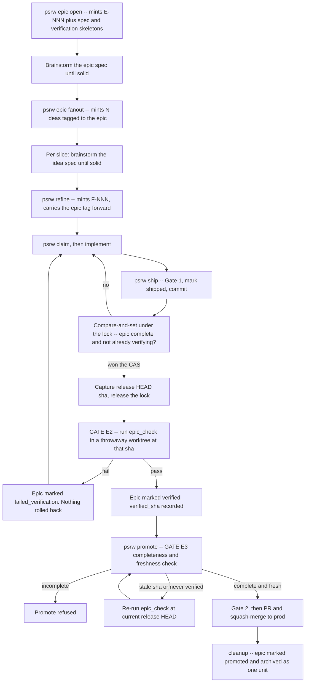

# EPIC workflow for ps-release-workflow

<div class="callout idea">
<strong>Goal (verbatim, unchanged throughout):</strong> Design an EPIC workflow skill on top of ps-release-workflow that delivers multiple features under one epic and verifies the epic as a unit within its own workflow.
</div>

## TL;DR <span class="topic-chip">summary</span>

ps-release-workflow has **no epic concept** — the pipeline is strictly one idea → one feature → one worktree → one branch. This design adds an <mark>epic layer</mark> above the existing flow: an epic **fans out into N ideas** (not features — that preserves the brainstorm-before-refine discipline), each idea refines into a feature carrying an `epic` tag, and two new gates check the epic **as a unit** and stop it reaching production **in pieces**.

The headline problem it fixes: **today a half-epic ships to prod silently.**

<div class="metric-grid">
<div class="metric-tile"><strong>0</strong><br/>mentions of "epic" in the engine + all 13 skills</div>
<div class="metric-tile"><strong>1:1:1</strong><br/>idea → feature → branch, no fan-out anywhere</div>
<div class="metric-tile alarm"><strong>0</strong><br/>checks preventing a partial epic reaching prod</div>
<div class="metric-tile"><strong>1 / 2</strong><br/>new verbs / new skills</div>
</div>

<div class="callout warn">
<strong>Revision history — this design has been rebuilt twice.</strong><br/>
<strong>v1 → v2</strong> (adversarial audit, 3 blockers): the epic gate ran <em>inside</em> <code>ship</code> under the global lock and rolled the merge back on failure. That erased the catalog write recording the failure, made the re-run test a tree emptied of the failing code, and would have stalled every verb in every session for the suite's duration.<br/>
<strong>v2 → v3</strong> (quality &amp; efficiency review, verdict <em>needs rework</em>): the gate still ran in the <strong>shared</strong> <code>_release</code> tree that concurrent ships mutate, and <code>verified</code> had no anchor, so it decayed into a stale label. v3 verifies a <strong>captured sha in a throwaway detached worktree</strong>, anchors <code>verified</code> to <code>verified_sha</code>, replaces a hand-wavy timestamp with a <strong>compare-and-set</strong>, and <strong>cuts <code>slice_count</code> and one of the three skills</strong> as unearned. §11 lists every finding from both rounds and its disposition.
</div>

---

## 1. The problem, stated precisely <span class="topic-chip">why</span>

Real work arrives as an outcome ("multi-account risk limits"), not as a single shippable slice. Today the only way to express that is several unrelated ideas plus a hopeful naming convention. Nothing in the tool knows they belong together, so three failures are possible and none are detected.

<div class="callout danger">
<strong>F1 — Half-epic to production (the one that matters).</strong> <code>cleanup()</code> sweeps entries where <code>release_version == &lt;v&gt;</code> and <code>status in (shipped, promoted)</code> (<code>promote_release.py:405-410</code>). If feature 3 of an epic shipped and features 1–2 did not, feature 3 alone is marked <code>promoted</code>, archived, and its worktree and branch deleted. Features 1–2 keep <code>release_version: None</code> and roll silently into the next release. Production runs half a feature set and <em>no artifact anywhere records it</em>.
</div>

<div class="callout warn">
<strong>F2 — Siblings never see each other until the release branch.</strong> <code>init_work_refined_backlog.py:130</code> cuts every <code>feat/F-NNN</code> off <strong>main</strong>, not off <code>release/&lt;v&gt;</code>. Gate 1's post-merge re-run in <code>_release</code> is the only integration check that ever sees two siblings together.
</div>

<div class="callout warn">
<strong>F3 — No outcome-level verification exists.</strong> Gate 1 verifies one feature's tree. Gate 2 verifies the whole release. Nothing asks "does the thing this epic promised actually work end to end?"
</div>

---

## 2. Baseline: what exists today (read from source) <span class="topic-chip">baseline</span>

| Layer | Fact | Where |
|---|---|---|
| Idea entry | `{id, title, created_at, promoted_to}` — **no epic param on the constructor** | `lib/catalog.py:53` |
| Feature entry | `{id, title, from_idea, created_at, claimed_by, status, release_version}` — **no epic param either** | `lib/catalog.py:66` |
| Refine call site | `add_refined_entry(ref_cat, idea_id=idea_id, title=idea["title"])` — drops anything not in that signature | `promote_idea_to_refined.py:264` |
| Feature states | `open → claimed → shipped → promoted`, plus `claimed → open` via unclaim | `catalog.py`, `unclaim.py:111` |
| Catalog path helper | `get_backlog_catalog_path(repo, kind)` builds `<_release>/.claude/<kind>_backlog/_catalog.json` — **generic; only the docstring says `{idea, refined}`** | `lib/backlog_paths.py:37-40` |
| Cleanup catalogs | `<repo>/.claude/refined_backlog/_catalog.json` in the **main checkout**, archive at `_archive/<version>/` | `promote_release.py:400-403` |
| Write safety | `mutate_state` (flock + tmp-replace) inside `file_lock(_release)` | `lib/state.py:18-29` |
| Lock scope | keys on the resolved `_release` path — **ship, claim, refine, unclaim and idea share it** | `init_work_refined_backlog.py:157,285`, `unclaim.py:116`, `new_idea.py:73` |
| Ship mutates the shared tree | merge `--no-ff`, possible `reset --hard HEAD~1`, `commit_all` — all in `_release` | `ship_current_work_to_release.py:112-145` |
| Gate 1 | `precheck.sh` twice: pre-merge in the feature worktree, post-merge in `_release`; failure after merge → rollback | `ship_current_work_to_release.py:120-133` |
| Gate 2 | `integration.sh` in `_release`, then push + PR to main; human squash-merge = prod deploy | `promote_release.py:219-243` |
| PR body | written by `gh pr create` only — the **adopt** branch never updates an existing PR's body | `promote_release.py:99-123` |
| Hook names | `resolve_hook` **hard-rejects unknown keys** — a new gate must be in `DEFAULT_HOOKS` | `lib/hooks.py` |
| CLI | `bin/psrw` is a pure dispatcher, one `VERBS` entry per script | `bin/psrw:37-48` |
| Skill limits | body ≤ 40 non-blank lines; `Mechanics:` anchor from a fixed set of five | `verify.sh:189-205` |

<div class="callout info">
<strong>Live config:</strong> <code>~/ps-skills/.release.json</code> has no <code>hooks</code> block, and neither <code>precheck.sh</code> nor <code>integration.sh</code> exists on disk. Today Gate 1 warns-and-skips and Gate 2 refuses to promote. The epic gate must behave the same: <strong>loud, skippable when absent, never silently green.</strong>
</div>

---

## 3. Data model <span class="topic-chip">schema</span>

A third catalog, plus one optional key on the child.

```
<_release>/.claude/epic_backlog/_catalog.json      # working copy
<repo>/.claude/epic_backlog/_catalog.json          # main checkout, what cleanup reads
<repo>/.claude/epic_backlog/_archive/<version>/    # where a promoted epic lands
<_release>/.claude/epic_backlog/E-NNN-<slug>/
    spec.md            # the outcome. frontmatter: title, id, status: epic
    verification.md    # what "this epic works" means, in prose (see 5.4)
```

```json
{
  "id": "E-001",
  "title": "Multi-account risk limits",
  "created_at": "2026-09-18T...Z",
  "status": "open",
  "release_version": null,
  "verified_sha": null,
  "verified_at": null,
  "split_approved_by": null
}
```

Epic states: `open → verifying → verified → promoted`, with `failed_verification` as a recorded, recoverable failure.

Membership lives **only on the child** — one optional key on idea and feature entries:

```json
{ "id": "I-022", "epic": "E-001", "promoted_to": "F-014", ... }
{ "id": "F-014", "from_idea": "I-022", "epic": "E-001", ... }
```

<div class="callout success">
<strong>Why child-side membership:</strong> a <code>children: []</code> array on the parent duplicates state the child already holds and drifts the first time an unclaim or manual edit happens. Membership derived by filtering is correct by construction.
</div>

<div class="callout success">
<strong>Cut in v3: <code>slice_count</code> and the <code>fanned_out</code> state.</strong> v2 stored a declared slice count as the completeness anchor. It is not needed — completeness condition 2 below ("every idea tagged <code>E</code> has been refined") already catches the unrefined-slice hole it was introduced for, and fan-out is all-or-nothing so the idea count equals the slice count by construction. All a stored count adds is a drift mode: hand-delete an idea folder and the epic can never complete, with no verb to un-stick it. <code>fanned_out</code> was likewise derivable from "has ≥1 tagged idea". <strong>A stored field that can disagree with reality is a defect, not a safeguard.</strong>
</div>

<div class="callout warn">
<strong>Rejected: <code>E-NNN</code> rows inside the refined catalog.</strong> <code>status.py</code> counts every entry by <code>status</code> and <code>claim --next</code> takes the first row with <code>status == "open"</code> — an epic row there would corrupt counts and could be claimed as a feature. The separate catalog is nearly free: <code>get_backlog_catalog_path</code> already accepts any <code>kind</code>, so the cost is a docstring.
</div>

Absent `epic` key = legacy entry. **No migration required, and none should be written.**

---

## 4. Lifecycle <span class="topic-chip">flow</span>



<div class="callout idea">
<strong>The load-bearing decision: fan out into <em>ideas</em>, not features.</strong> Minting <code>F-NNN</code> directly would break the <code>from_idea</code> invariant every feature holds, and would auto-chain idea → refine, which your own skill docs explicitly forbid ("Refine ONLY an idea that already has a solid, approved spec — never auto-chain idea → refine → claim"). Fanning out to ideas keeps the brainstorm gate in front of every slice while recording from minute one that the slices are one outcome.
</div>

---

## 5. Verification — the "verify in its workflow" half <span class="topic-chip">gates</span>

### 5.1 Definition of epic completeness

An epic `E` is **complete for release `<v>`** when all three hold:

1. at least one idea is tagged `epic: E` (an un-fanned epic is not vacuously complete);
2. every idea tagged `epic: E` has `promoted_to != null` — every slice became a feature;
3. every one of those features has `status in (shipped, promoted)` **and** `release_version == <v>`.

<div class="callout warn">
Condition 3 keys on <code>status</code> as well as <code>release_version</code> deliberately. <code>unclaim.py:112-118</code> clears <code>claimed_by</code> and <code>claimed_at</code> but <strong>leaves <code>release_version</code> set</strong>, so a shipped → reclaimed → unclaimed sibling reads as <code>open</code> with a release version still attached. A rule keyed on <code>release_version</code> alone misclassifies it as shipped.
</div>

### 5.2 G-E2 — epic verification gate at ship time (early signal, non-blocking)

<div class="schematic">
ship_current_work()
  |
  +-- [under file_lock(_release)]  merge --no-ff, post-merge Gate 1, mark_shipped, commit_all
  |                                 ... unchanged, not one line touched ...
  +-- [NEW, same lock] ONE mutate_state compare-and-set on the epic catalog:
  |        if epic complete for &lt;v&gt; AND status in (open, failed_verification):
  |            status = verifying ; capture sha = git rev-parse HEAD of release/&lt;v&gt;
  |            -> this caller WON the CAS
  |        else: no transition, this caller does nothing further
  +-- [LOCK RELEASED]
  +-- [NEW, CAS winner only]
           git worktree add --detach &lt;tmp&gt; &lt;sha&gt;      # throwaway, immutable snapshot
           run hooks.epic_check   cwd = &lt;tmp&gt;
           git worktree remove --force &lt;tmp&gt;
           [brief lock] pass -> verified, verified_sha = sha, verified_at, release_version = &lt;v&gt;
                        fail -> failed_verification, release_version = &lt;v&gt;
           commit the epic catalog. NOTHING is rolled back.
</div>

Four properties, each closing a review finding:

- **The suite runs on an immutable snapshot, not the shared tree.** `_release` is mutated by every concurrent `ship` under the lock — merge, possible `reset --hard HEAD~1`, commit. Running a multi-minute suite in that tree yields false failures, or a pass against a tree that is then reset. A detached worktree at a captured sha cannot be moved under the suite's feet.
- **No rollback.** The epic catalog is a tracked file in the same tree, so a `reset --hard` would erase the write recording the failure — and ship's only `commit_all` is on the success path. Removing the rollback removes the problem. A failing epic stays on `release/<v>`; that is safe because **`release/<v>` is not production** — main is, and G-E3 guards the way there.
- **The global lock is not held during the suite.** `file_lock` is shared by ship, claim, refine, unclaim and idea. The gate holds it only for the CAS and for the millisecond status write.
- **Compare-and-set, not a timestamp.** Two sessions shipping the last two siblings concurrently both see completeness; exactly one wins the CAS and runs the check. A stale `verifying` left by a crashed run is cleared by `psrw epic verify --force` — **there is no time threshold anywhere**, because "recent" is not implementable without inventing a number nobody can defend.

### 5.3 G-E3 — completeness and freshness gate at promote (the blocking gate)

In `promote_release()`, **before** Gate 2, reading `get_backlog_catalog_path(repo, "epic")` — which resolves inside the `_release` worktree, where the populated catalogs live. Hard error if `_release` is absent.

For each epic with at least one feature shipped into this release:

| Epic state | G-E3 behaviour |
|---|---|
| `split_approved_by` set | **Exempt, permanently.** Disclosed in the PR body; never re-prompts in later releases. |
| Not complete for `<v>` | **Refuse.** Names the unrefined ideas or unshipped features. This is the direct fix for **F1**. |
| Complete, `verified`, `verified_sha == release HEAD` | **Pass.** |
| Complete, but never verified / `failed_verification` / `verified_sha != release HEAD` | **Re-run `epic_check`** at the current release HEAD (same throwaway-worktree mechanism), then pass or refuse on the result. |
| `epic_check` script absent | **Loud warn, pass.** Completeness is still enforced; only outcome-checking degrades. |

<div class="callout danger">
<strong>Why <code>verified</code> must be anchored to a sha.</strong> Any later ship changes the release tree. Without <code>verified_sha</code>, an epic verified on Monday still reads <code>verified</code> after a week of unrelated merges — "verified as a unit" becomes a stale label that means nothing at the only moment it matters. Anchoring it means the answer is always about the tree actually being promoted.
</div>

<div class="callout danger">
<strong>The split disclosure must survive PR adoption.</strong> <code>_create_or_adopt_pr</code> (<code>promote_release.py:99-123</code>) passes <code>pr_body</code> only to <code>gh pr create</code>; the adopt branch never updates an existing PR's body. A second promote would drop the split-epic disclosure entirely — reproducing the silent half-epic this design exists to kill. The adopt path must call <code>gh pr edit --body</code>. <strong>Required change to existing code, not a nicety.</strong>
</div>

`cleanup()` gains the mirror rule: mark the epic `promoted`, archive `E-NNN-<slug>/` under `<repo>/.claude/epic_backlog/_archive/<version>/`, and refuse to archive an incomplete epic unless `split_approved_by` is set. It runs against the **main checkout** after the squash-merge, because the `_release` worktree is removed later in the same call.

### 5.4 The `epic_check` contract <span class="topic-chip">contract</span>

<div class="callout action">
<strong><code>verification.md</code> is prose for humans; <code>epic-check.sh</code> is the executable.</strong> The markdown states what "this epic works" means and is what a reviewer reads; the script implements it, exactly as <code>precheck.sh</code> and <code>integration.sh</code> are repo-authored today. The toolkit never parses <code>verification.md</code>.<br/><br/>
<strong>Registration:</strong> <code>epic_check</code> in <code>lib/hooks.py:DEFAULT_HOOKS</code>, default <code>scripts/epic-check.sh</code>. <code>resolve_hook</code> rejects unknown keys, so this is mandatory.<br/>
<strong>cwd:</strong> the root of the throwaway detached worktree.<br/>
<strong>Environment:</strong> <code>PSRW_EPIC_ID</code> = <code>E-NNN</code> · <code>PSRW_EPIC_FEATURES</code> = comma-separated <code>F-NNN</code>, ascending, no spaces · <code>PSRW_EPIC_DIR</code> = absolute path to the epic folder · <code>PSRW_EPIC_SHA</code> = the sha under test · <code>PSRW_RELEASE_VERSION</code> = <code>&lt;v&gt;</code>.<br/>
<strong>Exit codes:</strong> 0 = pass · non-zero = fail · file absent = warn loudly and skip.<br/>
<strong>The script commits nothing.</strong> psrw makes the catalog commit; the worktree is deleted afterwards, so any writes inside it are discarded.
</div>

<div class="callout warn">
<strong><code>epic_check</code> must not re-run the N feature prechecks.</strong> The repo's own notes record a ~6-minute test budget swinging 70% on environment alone; re-running every sibling's suite blows any wall-clock budget and gets the gate disabled. It runs outcome-level assertions only.
</div>

<div class="callout metric">
Coverage: feature correctness (Gate 1) · outcome correctness (G-E2) · release integration (Gate 2) · <strong>completeness and freshness (G-E3)</strong> — the axis with no check today.
</div>

---

## 6. Surface: verbs and skills <span class="topic-chip">surface</span>

The 2026-08-08 surface-reduction design sets a **one-`psrw`-command-per-skill rule** and fixes the architecture at "13 skills, one command each". It does *not* forbid new verbs — that same spec added `hotfix` — but it forbids collapsing a chain behind a verb (`full-promote`'s precedent: a chain keeps inline commands and gets no verb).

**Settled: one verb, three subcommands, two skills.**

| Command | Skill | Triggering moment |
|---|---|---|
| `psrw epic open "<title>"` | `ps-release-workflow-epic-open` | "this is bigger than one feature" |
| `psrw epic fanout E-NNN "a" "b" "c"` | `ps-release-workflow-epic-fanout` | the epic spec is solid, slices are known |
| `psrw epic verify E-NNN [--force]` | **no skill** | surfaced in the ship skill's "After this skill" line and in G-E3's refusal message |

<div class="callout success">
<strong>Why <code>verify</code> gets no skill (cut in v3).</strong> A skill exists to trigger an agent at a moment it would otherwise miss. <code>verify</code> is never that moment — it is a re-run hint after a failure or a refusal, and both of those already print the command. Giving it a skill would add surface to the very thing the surface-reduction design exists to shrink. Skill count 13 → <strong>15</strong>, not 16.
</div>

**Registration cost — every item verified as required, or a test goes red:**

- `bin/psrw` — `"epic": Verb("epic.py", "<summary>", True)`.
- `scripts/epic.py` — argparse, `prog="psrw epic"`, three subparsers.
- `tests/test_scripts_runnable.py:20` — add `epic.py` to `RUNNABLE_SCRIPTS`.
- `tests/test_psrw_cli.py:43-50` — the bidirectional verb / `NON_VERBS` assertion.
- `verify.sh:81` — verb count 10 → 11, plus the hardcoded verb loop at `:89`.
- `verify.sh:187` — skill count 13 → 15.
- `lib/catalog.py:53,66` — optional `epic` parameter on **both** entry constructors.
- `promote_idea_to_refined.py:264` — read the idea's `epic` and pass it through; the current call drops any key not in the signature.
- `lib/hooks.py` — register `epic_check` in `DEFAULT_HOOKS`.
- `lib/backlog_paths.py:38` — docstring `{idea, refined}` → `{idea, refined, epic}`; the code is already generic.
- `promote_release.py:99-123` — `gh pr edit --body` on the adopt path.
- Two `SKILL.md` files in `~/ps-skills/skills/`, each ≤ 40 non-blank lines, `Mechanics:` anchor from the permitted five (`state-layout`), no `/ps-release-workflow:` slash form. Then re-run `~/ps-skills/install.sh`.

<div class="callout info">
<strong>On <code>argparse_safe</code> and the mutating subcommand.</strong> <code>bin/psrw</code> decides <code>--help</code> forwarding per verb, not per subcommand, and <code>fanout</code> mutates. This is safe: argparse handles <code>--help</code> and exits during parsing, before any handler runs. <code>argparse_safe=True</code> is required regardless, or the dispatcher swallows <code>--help</code>.
</div>

---

## 7. Edge cases <span class="topic-chip">traps</span>

| Case | Behaviour |
|---|---|
| Two sessions ship the last two siblings at once | The CAS resolves it: completeness evaluation and the `→ verifying` transition happen in **one** `mutate_state` under the lock, so exactly one caller runs the check. |
| A crashed run leaves `verifying` | Cleared only by `psrw epic verify --force`. No timeout, no heuristic. |
| Unclaim a sibling after the epic verified | Epic demotes to **`open`** — never to `verifying`, which would collide with the CAS and strand the epic forever. Implemented in `unclaim.py`, covered by Phase 4. |
| Unclaim leaves `release_version` set | Known (`unclaim.py:112-118`). Completeness keys on `status` **and** `release_version`, never the latter alone. |
| Unrelated feature ships after verification | `verified_sha` no longer matches release HEAD, so G-E3 re-runs the check at promote. No manual step needed. |
| Split-approved epic, remainder ships next release | Once `split_approved_by` is set the epic is **permanently exempt** from G-E3. Otherwise condition 3 could never hold for `v+1` and the operator would re-approve the same split every release — an override that decays into a rubber stamp. |
| Epic with one slice | Legal, and the cheapest first test case. |
| Double quotes in an epic title | The repo's known-issues file records that quotes in titles break YAML in skeletons and identity rewrites. Epic titles take the same path — **sanitize on the way in**. |
| Rollup assumes `plan.md` exists | It must not. "All three files always exist" is explicitly **not** an invariant (F-015 has no `plan.md`). |
| Fan-out fails partway | All-or-nothing: roll back every minted id, per the existing pattern in `promote_idea_to_refined`. The known `FileExistsError`-on-retry bug multiplies by N here. |
| An idea carries an `epic` key | `status.py` reads idea entries for counts only and ignores unknown keys; Phase 6 adds the rollup without changing existing counts. |
| Sibling blindness (F2) | **Unchanged by default.** Cutting epic branches off `release/<v>` would drag unrelated in-flight release work into a feature. Mitigation: `psrw status` warns when two siblings are claimed at once. `claim --from-release` is a follow-up, not part of this design. |

---

## 8. Implementation plan <span class="topic-chip">phases</span>

Every phase ends with the full gate: **implement → verify by running it with visible output → independent adversarial review of that phase's diff → refactor → re-verify.** No phase advances on an unclean review.

**Phase 1 — Data layer and tag propagation.** Epic catalog (both paths + archive root), optional `epic` key on idea and feature entries, `epic` parameter on `add_idea_entry` and `add_refined_entry`, tag pass-through at `promote_idea_to_refined.py:264`, `backlog_paths` docstring, the completeness predicate. *Verify:* unit tests for the predicate only, plus legacy entries with no `epic` key — **not** a re-test of `mutate_state`, which already has its own.

**Phase 2 — `epic open` + `epic fanout`, fully registered.** Folders and skeletons, all-or-nothing fan-out with rollback, title sanitizing — **and in the same phase** the `bin/psrw` entry, `RUNNABLE_SCRIPTS`, the bidirectional CLI test, and the `verify.sh` verb count and loop. *Verify:* `verify.sh` green **within this phase** (v2 deferred registration to Phase 5, which would have made Phase 2's own gate go red); fan out 3 slices in a scratch repo, kill it mid-way, confirm no orphan ids.

**Phase 3 — G-E2.** `epic_check` in `DEFAULT_HOOKS`, the CAS transition, the throwaway detached worktree, the status write, `psrw epic verify [--force]`. *Verify:* a deliberately failing `epic-check.sh` leaves the epic `failed_verification` with the merge **still standing**; a concurrent second ship does **not** run a second check; `git worktree list` is clean afterwards.

**Phase 4 — G-E3, unclaim, cleanup.** Promote refusal table, `--allow-split-epic` with permanent exemption, `gh pr edit --body` on the adopt path, epic demotion to `open` in `unclaim.py`, epic archiving in `cleanup()`. *Verify:* promote with one slice unrefined must refuse; promote twice with `--allow-split-epic` must leave the disclosure on the PR **both** times; a stale `verified_sha` must trigger a re-run.

**Phase 5 — Skills.** Two `SKILL.md` files, `verify.sh` skill count 13 → 15, installer re-run. *Verify:* `verify.sh` green, `psrw epic --help` and each subcommand's `--help` work.

**Phase 6 — `status.py` rollup.** Epic section, per-epic slice and feature progress, concurrent-sibling warning. *Verify:* `tests/test_status.py` extended and green.

**Phase 7 — Docs.** `docs/lifecycle.md` epic section under a permitted anchor; `known-issues.md` entries for anything found. *Verify:* `verify.sh` anchor check green.

<div class="callout warn">
Phase 4 is the riskiest: it is the only phase that modifies existing behaviour (<code>promote_release.py</code>, <code>unclaim.py</code>, <code>cleanup()</code>). Review it hardest.
</div>

---

## 9. Remaining open decisions <span class="topic-chip">decide</span>

- ~~**D1 — skill granularity.**~~ **Settled:** two skills, one command each; `verify` gets none (§6).
- **D2 — Is G-E3 blocking by default?** Recommendation: **yes**, with `--allow-split-epic` as the recorded, permanent escape. Warn-only reproduces the silent failure this design exists to kill.
- **D3 — Must an epic own its release?** Recommendation: **no**. Forcing epic-only releases makes epics expensive and people stop declaring them.
- **D4 — Sibling blindness (F2):** accept the `status` warning, or add `claim --from-release`? Recommendation: accept now, file the flag as a follow-up.
- **D5 — Where does this work itself live?** `~/ps-skills` is an opted-in repo with `in_progress: false`. Shipping this through ps-release-workflow's own flow means opening a release line first — an R1 action needing your say-so.

---

## 10. Immediate next action <span class="topic-chip">handoff</span>

<div class="callout action">
<strong>1. Claim this document before acting on it</strong> (file-level lock — <code>ListAgents</code> alone does not prevent a race):<br/>
<code>mkdir "/Users/pasitnusso/workspace/tools/research/2026-09-18-psrw-epic-workflow-design.md.claim" 2>/dev/null &amp;&amp; echo "$(whoami) $(date -Iseconds)" &gt; "/Users/pasitnusso/workspace/tools/research/2026-09-18-psrw-epic-workflow-design.md.claim/owner"</code><br/>
If that <code>mkdir</code> fails, someone holds it — read <code>.claim/owner</code> and message them instead of proceeding.<br/><br/>
<strong>2. Settle D2–D5</strong> (D1 is settled).<br/><br/>
<strong>3. Write the implementation plan</strong> from §8 and execute it phase by phase with the quality gate.
</div>

<div class="callout info">
<strong>Nothing has been changed in <code>~/ps-skills</code>.</strong> No release opened, no worktree created, no catalog touched, no code edited. This document is design only.
</div>

---

## 11. Review disposition <span class="topic-chip">review</span>

Two independent review rounds. Every finding is listed below with its disposition; none were dropped.

### Round 1 — adversarial audit of v1 (3 blockers)

| Sev | Finding | Disposition |
|---|---|---|
| **BLOCKER** | Gates saw only features, so an unrefined idea slice made the epic look complete — F1 survived | **Fixed** — completeness condition 2 (§5.1) |
| **BLOCKER** | `reset --hard` erased the `failed_verification` write; no commit on the failure path | **Fixed structurally** — rollback removed (§5.2) |
| **BLOCKER** | Re-running verify tested a tree the rollback had emptied, so it could pass falsely | **Fixed** by the same change |
| HIGH | `verify.sh:187` skill-count assertion missed from the registration list | **Fixed** — 13 → 15 (§6) |
| HIGH | `--allow-split-epic` disclosure lost on the PR *adopt* path | **Fixed** — `gh pr edit --body` required (§5.3) |
| HIGH | `epic_check` held the workflow's global lock for the suite's duration | **Fixed** — gate runs outside the lock (§5.2) |
| HIGH | `cleanup()` reads the main checkout; epic had no main path or archive root | **Fixed** — both paths (§3), cleanup rule (§5.3) |
| MEDIUM | `release_version` on the epic was never written | **Fixed** — G-E2 writes it (§5.2) |
| MEDIUM | Unclaim leaves `release_version` set, so a `release_version`-keyed rule misclassifies | **Fixed** — completeness keys on `status` too (§5.1) |
| MEDIUM | `status.py` rollup promised but in no phase | **Fixed** — Phase 6 |
| MEDIUM | Verb/skill count contradicted the subcommand design | **Fixed** — settled in §6 |
| LOW | `--help` safety unanalysed for a verb carrying a mutating subcommand | **Answered** — argparse exits during parsing (§6) |

### Round 2 — quality and efficiency review of v2 (verdict: needs rework)

| Axis | Finding | Disposition |
|---|---|---|
| **QUALITY** | `epic_check` ran in the **shared** `_release` tree that concurrent ships mutate → false fails, or a pass against a tree then reset | **Fixed** — throwaway detached worktree at a captured sha (§5.2) |
| **QUALITY** | `verified` had no anchor; any later ship left it a stale label | **Fixed** — `verified_sha`, and G-E3 re-runs when stale (§5.3) |
| **QUALITY** | "skip if `verifying` with a recent timestamp" was unimplementable — no field, no threshold, never written | **Fixed** — compare-and-set, no timestamp anywhere (§5.2) |
| **QUALITY** | Unclaim demoting to `verifying` would strand the epic forever under a CAS | **Fixed** — demotes to `open` (§7) |
| **QUALITY** | Missing `epic-check.sh` was self-contradictory: warn-and-skip, yet G-E3 refused anything not `verified` | **Fixed** — absent script warns and passes; completeness still enforced (§5.3) |
| **QUALITY** | A split-approved epic could never complete in `v+1`, re-prompting every release | **Fixed** — split approval is permanent (§7) |
| **EFFICIENCY** | `slice_count` was a stored field that could drift, and earned nothing | **Cut** (§3) |
| **EFFICIENCY** | `fanned_out` state was derivable | **Cut** (§3) |
| **EFFICIENCY** | Third catalog — **judged justified**, and nearly free | Kept, with the reasoning recorded (§3) |
| **EFFICIENCY** | `epic-verify` did not earn a skill | **Cut** — 3 skills → 2 (§6) |
| **EFFICIENCY** | Phase order broken: Phase 2 created the script, Phase 5 registered it → Phase 2's own gate would go red | **Fixed** — registration moved into Phase 2 (§8) |
| **EFFICIENCY** | Phase 1 re-tested existing `mutate_state` | **Fixed** — tests the new predicate only (§8) |
| **IMPLEMENTER** | The `epic_check` contract was the single most underspecified part | **Fixed** — full contract, env, exit codes, cwd (§5.4) |
| **IMPLEMENTER** | Tag propagation named no file and no phase | **Fixed** — both constructors + call site, Phase 1 (§6, §8) |
| **IMPLEMENTER** | G-E3 did not say which catalog or tree it reads | **Fixed** — `get_backlog_catalog_path(repo,"epic")` in `_release`, before Gate 2 (§5.3) |
