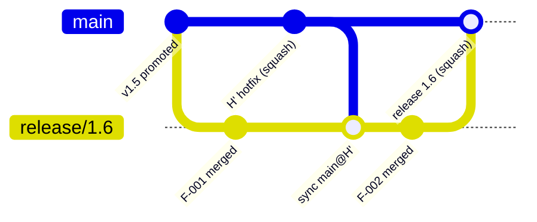
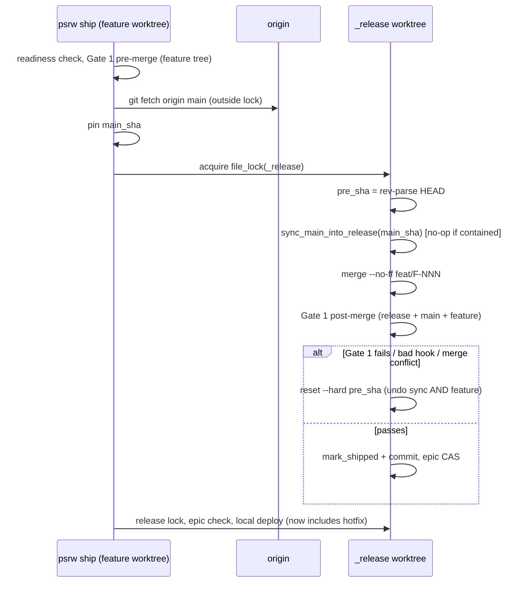

# Hotfix to release sync: making release/<v> absorb main automatically

<div class="callout success">
<strong>Recommendation (TL;DR).</strong> Use <strong>Option D, defense in depth</strong>, built around one shared primitive, <code>sync_main_into_release()</code>. <code>psrw ship</code> calls it automatically under <code>file_lock(_release)</code> before it merges the feature. The existing post-merge Gate 1 then verifies <em>feature + hotfix + release</em> together, with no extra gate runs. <code>psrw promote</code> calls the same primitive and <strong>requires</strong> <code>release/&lt;v&gt;</code> to contain <code>origin/main</code> before G-E3 and Gate 2. <code>--babysit</code> checks this again right before the squash-merge. A new explicit verb, <code>psrw sync-main</code>, isolates hotfix breakage. <code>psrw status</code> shows how far the release is behind main. Feature branches are <strong>not</strong> auto-synced.
</div>

<div class="metric-grid">
<div class="metric-tile"><strong>0</strong><br>extra Gate 1 runs per ship (the sync rides inside the existing post-merge check)</div>
<div class="metric-tile"><strong>1</strong><br>new shared primitive (<code>lib/main_sync.py</code>)</div>
<div class="metric-tile"><strong>1</strong><br>new verb (<code>psrw sync-main</code>)</div>
<div class="metric-tile alarm"><strong>3</strong><br>existing <code>reset --hard HEAD~1</code> rollbacks that must become <code>reset --hard &lt;pre_sha&gt;</code></div>
</div>

## 1. Problem and current behavior <span class="topic-chip">context</span>

`psrw hotfix` cuts `hotfix/<slug>` from `main` in a sibling worktree. The fix then lands on `origin/main` through a GitHub **squash-merge**. After that, nothing in the toolkit moves the fix toward the release:

| Step | Tree it verifies | Has the hotfix? |
| --- | --- | --- |
| `ship`, pre-merge Gate 1 | `feat/F-NNN` (cut from `main` at claim time) | Only if claimed after the hotfix landed |
| `ship`, post-merge Gate 1 | `release/<v>` + feature | **No** |
| `ship`, local deploy | `release/<v>` | **No**, so the local env silently *regresses* the prod fix |
| `promote`, G-E3 + Gate 2 | `release/<v>` | **No** |
| Release PR squash-merge | GitHub 3-way merge of `release/<v>` into `main` | Combined only at merge time, **never verified** |

<div class="callout danger">
<strong>The real risk is not a merge conflict.</strong> A conflict is loud, and GitHub blocks the PR. The dangerous case is a <em>clean</em> 3-way merge where the hotfix and a release feature touch different lines but interact semantically. Examples: the hotfix adds an auth check, and a feature adds a new endpoint that bypasses it. Or two independent Alembic migrations share one parent revision. Prod then runs a combination that no gate ever executed.
</div>

Verified facts about the code today (checked 2026-09-24):

- `lib/git_ops.fetch_and_ff_main()` exists, but it runs `git checkout main` in the *main checkout*. Only `new-release` uses it. **It is not safe to call from ship**: that checkout may be dirty, or on another branch.
- `promote --cleanup-only` already fetches `origin/main` and adopts it with `reset --hard` (`promote_release.py:652-680`). So the "origin/main is the truth, local main is stale" model is already established.
- `ship` rolls back a failed post-merge Gate 1 with `reset --hard HEAD~1`. So does the bad-hook path, and `epic.py:216` documents the same assumption. **This breaks once ship makes two commits** (the sync merge plus the feature merge).
- `epic sync` (`epic.py:380`) already merges `release/<v>` into a feature branch under `file_lock(_release)`, with abort-on-conflict. That is exactly the pattern to reuse for feature branches.

## 2. Git mechanics <span class="topic-chip">deep dive</span>

### 2.1 Squash-merge SHAs

The hotfix branch holds commit `H`, and main receives `H'`: a different SHA and parent, with the same tree delta. Consequences:

- **Merging `main` into `release/<v>` is correct and safe.** The release never contained `H`, so git applies the `H'` delta through a normal 3-way merge against `merge-base(release, main)`. No duplicate-commit problem can arise.
- **Do not merge `hotfix/<slug>` itself into the release** (Option A's naive form). The release would then hold `H`, main holds `H'`, and the next sync sees *both sides changed the same lines*. When the changes are byte-identical, git resolves them cleanly. When anything touched those lines afterwards (a follow-up fix on main, a feature edit on the release), you get a spurious conflict. Always sync **from main**, never from the hotfix branch.
- **What happens at release-PR time after a sync:** the release now contains a merge commit whose second parent is `M = origin/main@sync`. The PR's merge-base therefore becomes `M`, and the squash diff *excludes* everything already on main. The release squash lands cleanly, cannot re-apply or revert the hotfix, and the sync merge commits disappear into the squash, so main's history is not polluted.



### 2.2 Which "main" to sync from: remote vs local

Hotfix and release PRs advance **only `origin/main`**. The local `main` in the main checkout is stale by design (the guard keeps it read-only). Rules:

| Situation | Sync source | Behavior |
| --- | --- | --- |
| `origin` exists and `git fetch origin main` succeeds | `origin/main`, **pinned to its SHA** right after the fetch | Normal path |
| `origin` exists, fetch fails (offline, auth) | **ship**: last-known `origin/main` ref, with a loud warning. **promote**: refuse | Local ship must not be blocked by wifi. Promote is where correctness is contractual |
| No `origin` (local-only repo, test suite) | local `main` | Same code path. Keeps the existing tests working |
| Local `main` ahead of `origin/main` (unpushed commits) | Still `origin/main` when origin exists | Unpushed main commits are not "prod". Print a note |

<div class="callout warn">
<strong>Never check out or fast-forward the main checkout from ship.</strong> Use <code>git fetch origin main</code>, which only updates <code>refs/remotes/origin/main</code>, then merge the <em>pinned SHA</em> inside <code>_release</code>. Pinning the SHA also closes a small race: another process fetching between our read and our merge cannot change what we merge.
</div>

### 2.3 Protected paths: D11 state must never flow from main

Main's `.release.json` and backlog catalogs deliberately differ from the release's (D11: main's catalog is `[]`). Since cleanup runs *before* `new-release` cuts the branch, main's copies do not normally change after the cut, and the 3-way merge keeps the release's side. But if a hotfix (or a human) touched them on main, a *clean* merge could silently mix main's state into release state. That is the worst kind of failure, because nothing reports it.

**Rule:** before merging, run `git diff --name-only <merge-base> <main_sha>`. If the result intersects `.release.json`, `.claude/idea_backlog/`, `.claude/refined_backlog/`, `.claude/epic_backlog/`, or `.claude/state/`, refuse the auto-sync (`ProtectedPathSyncError`) and print manual instructions. This fails closed and should essentially never fire in normal use.

### 2.4 A blind spot git cannot see: migrations

A hotfix that carries an Alembic, Prisma, or TypeORM migration, merged into a release that has its own migrations, merges **cleanly** in git but produces **two migration heads**. Git cannot detect that. The only place to catch it is Gate 1.

💡 Recommend (outside this change) that repo `precheck.sh` scripts assert a single migration head. I will note this in the proposal's follow-ups and not build it into psrw.

## 3. Options evaluated <span class="topic-chip">options</span>

| | A. Eager backport at hotfix completion | B. Lazy sync in `ship` | C. Lazy sync/enforce in `promote` | **D. B + C + tooling** |
| --- | --- | --- | --- | --- |
| Release sees hotfix | When the human remembers the second PR | At the next ship | Only at promote | Next ship, guaranteed by promote |
| Local deploy has the fix | Yes (if done) | Yes, auto | No, until promote | Yes |
| Gate 1 verifies the combination | Only via the backport's own gate | **Yes**, the existing post-merge run | No | Yes |
| Gate 2 verifies the combination | Yes (if done) | Only if a ship happened after the hotfix | **Yes, enforced** | **Yes, enforced** |
| Manual steps | 2nd PR, 2nd CI, 2nd review | None | None | None (the explicit verb is optional) |
| Squash-SHA hazard | **Yes** (§2.1) unless done as a sync-from-main | No | No | No |
| Works with zero ships after the hotfix | Yes | **No** | Yes | Yes |
| Timing of hotfix × release incompatibility | Early | Early (at ship) | **Late** (at promote, under deadline) | Early, with a backstop |

**Why not A.** It requires a moment when "the hotfix PR has merged" is observable. `psrw hotfix` ends before the PR even exists, and babysitting is done by an agent or a human with `gh`, not by psrw. Making it eager means a second PR per hotfix, double CI cost, and a human remembering to do it, which is the exact failure mode we are fixing. An optional *manual* trigger survives as `psrw sync-main` (§4.3).

**Why not B alone.** A hotfix that lands after the last ship is never absorbed. Promote must be the backstop.

**Why not C alone.** It fails the user's "local ship is auto" requirement. The local deploy keeps regressing the prod fix for the whole release, and incompatibilities surface at promote time, when they are most expensive.

## 4. Design (Option D) <span class="topic-chip">design</span>

### 4.1 The shared primitive: `lib/main_sync.py`

```python
@dataclass
class MainSyncResult:
    synced: bool            # a merge commit was created
    main_sha: str | None    # the pinned main SHA we compared/merged
    source: str             # "origin/main" | "origin/main (stale: fetch failed)" | "main (no origin)"
    behind: int             # commits of main not in release before sync
    files: list[str]        # files main changed since merge-base (for diagnostics)

class MainSyncConflictError(RuntimeError): ...   # carries .files, .main_sha, recovery text
class ProtectedPathSyncError(RuntimeError): ...
class MainUnreachableError(RuntimeError): ...    # strict mode + fetch failed

def resolve_main_sha(repo: Path, *, strict: bool) -> tuple[str, str]:
    """Fetch origin main (if origin exists) and return (pinned_sha, source label).
    Never touches the main checkout's HEAD or index."""
    if not has_origin(repo):
        return rev_parse(repo, "main"), "main (no origin)"
    cp = git_run(repo, "fetch", "origin", "main", check=False)
    if cp.returncode != 0:
        if strict:
            raise MainUnreachableError(...)
        warn("⚠️ fetch origin main failed — syncing from last-known origin/main")
        return rev_parse(repo, "origin/main"), "origin/main (stale: fetch failed)"
    return rev_parse(repo, "origin/main"), "origin/main"

def sync_main_into_release(repo, rel_wt, release_branch, main_sha, source) -> MainSyncResult:
    """CALLER MUST HOLD file_lock(rel_wt). Merges main_sha into rel_wt HEAD if
    not already contained. On any failure the tree is left exactly as it was."""
    if is_dirty(rel_wt):
        raise DirtyTreeError(...)
    if is_ancestor(rel_wt, main_sha, "HEAD"):
        return MainSyncResult(synced=False, main_sha=main_sha, source=source, behind=0, files=[])
    base = git_run(rel_wt, "merge-base", "HEAD", main_sha).stdout.strip()
    files = diff_names(rel_wt, base, main_sha)
    if hits := [f for f in files if _is_protected(f)]:
        raise ProtectedPathSyncError(hits, main_sha)
    behind = count(rel_wt, f"HEAD..{main_sha}")
    cp = git_run(rel_wt, "merge", "--no-ff", "--no-edit", "-m",
                 f"chore(release): sync main@{main_sha[:12]} into {release_branch}",
                 main_sha, check=False)
    if cp.returncode != 0:
        conflicted = unmerged_files(rel_wt)          # before abort
        git_run(rel_wt, "merge", "--abort", check=False)
        raise MainSyncConflictError(conflicted, main_sha, base)
    return MainSyncResult(True, main_sha, source, behind, files)
```

Design choices:

- **`--no-ff` always.** It creates a named merge commit, so it is visible in `git log` and easy to identify in rollback diagnostics. It disappears in the release squash anyway.
- **The fetch runs *outside* the lock; the pin + merge runs *inside*.** A fetch can take seconds, and it only writes a remote-tracking ref. Concurrent fetches can collide on the ref lock (`cannot lock ref`), so retry once, then fall back to non-strict. The ancestry check runs under the lock, so of two concurrent ships the second sees `synced=False`.
- **Idempotent.** Calling it N times with the same `main_sha` produces at most one merge commit.

### 4.2 `psrw ship`: the "local ship is auto" flow



Changes to `ship_current_work()`:

```python
main_sha, source = (None, None) if no_sync_main else resolve_main_sha(repo, strict=False)

with file_lock(rel_wt):
    pre_sha = git_run(rel_wt, "rev-parse", "HEAD").stdout.strip()
    sync = None
    if main_sha:
        try:
            sync = sync_main_into_release(repo, rel_wt, release_branch, main_sha, source)
        except (MainSyncConflictError, ProtectedPathSyncError) as e:
            raise GateFailedError(render_sync_failure(e, release_branch, feature_id))  # nothing merged
    try:
        git_run(rel_wt, "merge", "--no-ff", "-m", ..., feat_branch)
    except GitError as e:
        git_run(rel_wt, "merge", "--abort", check=False)
        _rollback(rel_wt, pre_sha)                  # also undoes the sync
        raise GateFailedError(...)
    try:
        rc = _run_precheck(rel_wt)
    except GateFailedError:
        _rollback(rel_wt, pre_sha); raise
    if rc not in (None, 0):
        _rollback(rel_wt, pre_sha)
        raise GateFailedError(gate1_failure_msg(sync))   # names the sync if one happened
    ...
```

**Rollback is atomic: either both the sync and the feature land, or neither does.** The alternative, keeping the sync when the feature fails, would leave a release that has never passed Gate 1 as a combination. It would also make the failure's cause ambiguous for the next shipper. When a failed Gate 1 included a sync, the error names both suspects and points to the tie-breaker:

```
❌ Gate 1 failed on the combined release — rolled back to a1b2c3d (sync + feature undone).
   This run ALSO absorbed 3 commits from origin/main@9f8e7d6 (hotfix sync).
   To tell whether the hotfix or F-012 broke it:
     psrw sync-main          # syncs main alone + runs Gate 1 on the release
   If that passes, the failure is F-012 against the updated release:
     psrw sync               # (in the feature worktree) pull release into feat/F-012, fix, re-ship
```

A merge conflict during the sync refuses the ship before anything is merged:

```
❌ Ship refused — release/1.6 cannot absorb origin/main@9f8e7d6 automatically.
   Conflicting files: src/auth/guard.py, migrations/versions/0042_x.py
   Nothing was merged; F-012 remains claimed and unshipped.
   Resolve once, by hand, in the _release worktree:
     cd .claude/worktrees/_release
     git merge --no-ff 9f8e7d6        # resolve, then: git add -A && git commit
     ./scripts/precheck.sh            # verify the resolution
   Then re-run: psrw ship
   (Escape hatch, NOT recommended: psrw ship --no-sync-main — promote will still refuse later.)
```

The guard allows edits in `_release` silently, so the manual resolution is not blocked by our own tooling.

**Output on success** (one line, only when a sync happened):
`↻ Absorbed 2 commits from origin/main@9f8e7d6 into release/1.6 before merging F-012.`
The JSON result gains `"main_sync": {"synced": true, "main_sha": ..., "source": ..., "behind": 2}`.

**New flag:** `--no-sync-main`, for emergencies only. It prints a warning, and promote will still enforce the sync.

### 4.3 New verb: `psrw sync-main`

Run it from anywhere in the repo. It takes the same lock and runs the same primitive, then runs **Gate 1 on `_release`** and rolls back to `pre_sha` if Gate 1 fails. Uses:

1. Absorb a hotfix right after its PR merges, so the release is fixed before the next ship. This covers Option A's value without Option A's second PR.
2. Disambiguate a failed ship (above).
3. Finish a manual conflict resolution: it detects that `_release` already contains `main_sha` and just runs Gate 1.

Flags: `--strict` fails if origin is unreachable, and `--deploy` runs the local deploy after a successful sync.

### 4.4 `psrw promote`: the enforcing backstop

The sync happens **first**, before G-E3, the deploy, and Gate 2, because every later gate must see the tree that will reach main:

```python
main_sha, source = resolve_main_sha(repo, strict=use_pr)   # PR mode: origin is the contract
with file_lock(rel_wt):
    pre_sha = rev_parse(rel_wt, "HEAD")
    sync = sync_main_into_release(...)                      # conflict → refuse promote, nothing changed
    if sync.synced:
        rc = _run_precheck(rel_wt)                          # Gate 1 on the new combination
        if rc not in (None, 0):
            _rollback(rel_wt, pre_sha)
            raise Gate2FailedError("Gate 1 failed after absorbing main — rolled back; see psrw sync-main")
check_epics(...)          # a sync changes content ⇒ _verification_is_fresh() is False ⇒ epic re-verified. Correct.
deploy / Gate 2 ...       # now verifies release + hotfix
```

- **Epic interaction (intended):** any real content change makes `_verification_is_fresh()` return False, so a hotfix sync re-runs the epic outcome check. This costs time, and it is the correct behavior: the hotfix could break the epic's outcome.
- **The PR body gains** `- Synced with main@9f8e7d6 before Gate 2 (N commits absorbed).`
- **`--babysit`: re-check before merging.** After `gh pr checks --watch`, fetch again. If `origin/main` is no longer an ancestor of `release/<v>` (a hotfix landed during CI), **do not merge**. Refuse and tell the user to re-run `psrw promote`, which re-syncs, re-gates, and re-pushes; the existing PR is adopted. Never auto-sync inside babysit without re-running Gate 2.
- **Non-babysit PR mode:** a human may merge the PR hours later. Recommend enabling GitHub's *"Require branches to be up to date before merging"* on `main`. That setting enforces the same invariant on the host side, and psrw cannot enforce it once it has handed off.
- `--direct` mode: same sync, same enforcement.
- **No `--no-sync-main` on promote.** Shipping a release that was never verified with prod's current code is exactly what this change removes. If an override is truly needed, it is `--allow-stale-main`, which is printed in the PR body as `⚠️ UNVERIFIED against main@...`, mirroring `--allow-missing-gate2`.

### 4.5 `psrw hotfix`: better hints, no behavior change

Replace the checklist tail with:

```
     7. clean up: git worktree remove <wt>
     8. release/1.6 is in progress — the hotfix reaches it automatically at the
        next `psrw ship` / `psrw promote`. To absorb it now: psrw sync-main
```

Only print step 8 when `read_release_state()` reports a release in progress.

### 4.6 `psrw status`: drift visibility

Add to the release line: `release/1.6 is 3 behind origin/main (hotfix pending sync — auto at next ship)`. Use the **cached** `origin/main` ref with no fetch, so status stays read-only, fast, and works offline. Mark it `(as of last fetch)`.

### 4.7 Feature branches: deliberately not auto-synced

Syncing `release/<v>` is **sufficient for correctness**. The authoritative Gate 1 is the post-merge run on `release + main + feature`, and the pre-merge run is only an early check. Auto-merging main into `feat/F-NNN` would rewrite a developer's branch underneath them, possibly while they are editing in that worktree. Instead:

- **Generalize `psrw epic sync` into `psrw sync`** (keep `epic sync` as an alias). It merges `release/<v>` HEAD into the current feature branch, and that HEAD transitively contains the hotfix after any ship or sync-main. It is already lock-safe and abort-on-conflict.
- **Pre-merge hint in ship:** if files touched by `feat/F-NNN` (since its merge-base) overlap files main changed since the release's merge-base, print `ℹ️ F-012 and the pending hotfix both touch src/auth/guard.py — run psrw sync first to resolve in your own worktree`. Advisory only.

## 5. Concurrency <span class="topic-chip">locking</span>

- **Sync + merge + Gate 1 + rollback form one critical section** under `file_lock(_release)`, extending the one ship already holds. Two concurrent ships: A syncs and merges; B waits, then finds `main_sha` already contained and skips the sync. If A rolls back, B's ancestry check runs *after* A's rollback, so B re-syncs itself. The check is always made against the current HEAD under the lock.
- **Fixing `reset --hard HEAD~1`.** Replace all three sites (ship's Gate 1 failure, ship's bad-hook path, and the assumption documented at `epic.py:216`) with `reset --hard <pre_sha>`, recorded under the lock. `HEAD~1` would undo only the feature merge and leave an **unverified sync standing**. This is a correctness prerequisite, not a cleanup.
- **`epic sync` / `psrw sync`** already takes the same lock, so it can never merge a half-rolled-back release.
- **Lock hold time grows** by one merge (less than 1s) and nothing else: the fetch stays outside the lock, and Gate 1 was already inside.
- **Cross-machine:** `file_lock` is a local `flock`. Two machines each shipping to the same `release/<v>` have always needed a push/pull story, which is out of scope and unchanged here.

## 6. Failure matrix <span class="topic-chip">recovery</span>

| Failure | Where | State after | Exit | User instruction printed |
| --- | --- | --- | --- | --- |
| Sync conflict | ship / sync-main / promote | Merge aborted, HEAD = pre_sha | 1 | Conflicting files, plus the manual merge recipe (§4.2) |
| Protected path changed on main | any | Untouched | 1 | Lists the paths; "reconcile D11 state by hand, then re-run" |
| Gate 1 fails after sync + feature | ship | Reset to pre_sha | 1 | "Absorbed N commits; run `psrw sync-main` to isolate" |
| Gate 1 fails after sync alone | sync-main / promote | Reset to pre_sha | 1 | "The hotfix is incompatible with release/<v>: fix it in a feature, or a hotfix follow-up on main" |
| Fetch fails | ship / sync-main | Uses last-known origin/main | 0 + ⚠️ | "Offline: synced to the last fetched main" |
| Fetch fails | promote (PR mode) | Untouched | 1 | "Cannot confirm release contains prod's main; retry when online" |
| `_release` dirty | any | Untouched | 1 | Existing dirty-tree message, pointing at `_release` |
| Main moved during babysit CI | promote --babysit | PR open, not merged | 1 | "main advanced to X during CI; re-run `psrw promote`" |
| Crash mid-merge (kill -9) | any | `MERGE_HEAD` present in `_release` | next run 1 | Detect `MERGE_HEAD` at lock entry; print "`git merge --abort` in _release, then re-run" |

## 7. Implementation blueprint <span class="topic-chip">plan</span>

📁 **Files touched**

| File | Change |
| --- | --- |
| `engine/ps-release-workflow/lib/main_sync.py` | **New.** `resolve_main_sha`, `sync_main_into_release`, errors, `render_sync_failure`, `_is_protected` |
| `engine/ps-release-workflow/lib/git_ops.py` | Add `has_origin`, `is_ancestor`, `unmerged_files`, `rev_parse`. Move promote's private `_has_origin` here |
| `engine/ps-release-workflow/scripts/ship_current_work_to_release.py` | Sync inside the lock, `pre_sha` rollback, `--no-sync-main`, `main_sync` in the JSON, success/failure messages |
| `engine/ps-release-workflow/scripts/promote_release.py` | Strict sync before `check_epics`, Gate 1 on sync, PR-body line, babysit pre-merge ancestry check, `--allow-stale-main` |
| `engine/ps-release-workflow/scripts/sync_main.py` | **New verb** `psrw sync-main` (sync + Gate 1 + rollback, `--strict`, `--deploy`) |
| `engine/ps-release-workflow/scripts/epic.py` | `sync` alias → generic `psrw sync`; fix the `HEAD~1` assumption |
| `engine/ps-release-workflow/scripts/hotfix.py` | Step-8 hint when a release is in progress |
| `engine/ps-release-workflow/scripts/status.py` | "N behind origin/main" drift line (cached ref) |
| `psrw` dispatcher | Register `sync-main`, `sync` |
| `docs/lifecycle.md` | New "Main sync" section under Gates; update the promote sequence |
| `skills/ps-release-workflow-{ship,promote,hotfix,status}/SKILL.md` | Flags + "hotfixes flow in automatically" |
| `README.md` | New verb, flags, behavior change (rule 7) |

🧪 **Tests to add** (real git repos in `tmp_path`, with a bare repo as `origin`)

1. `test_main_sync.py`:
   - no-op when the release already contains main
   - merges a squash-merged hotfix (simulate: commit on hotfix, then `merge --squash` onto main); the release PR squash-merged afterwards applies cleanly and main keeps the hotfix content
   - pins the SHA: advancing main after the pin does not change what is merged
   - conflict: aborted, HEAD == pre, no `MERGE_HEAD`, conflicted files reported
   - protected path: `.release.json` edited on main → `ProtectedPathSyncError`, tree untouched
   - no-origin repo uses local `main`
   - fetch failure: non-strict falls back with a warning, strict raises
   - idempotent: second call → `synced=False`
2. `test_ship_current_work_to_release.py`:
   - hotfix on origin/main is absorbed before the feature merge, and Gate 1 sees both (the precheck stub asserts both files exist)
   - Gate 1 failure resets to `pre_sha` (sync *and* feature gone)
   - bad `hooks.precheck` resets to `pre_sha`
   - sync conflict: ship refused, feature not merged, catalog not marked shipped
   - `--no-sync-main` skips the sync with a warning
   - two ships in sequence: the second is a sync no-op
   - local main checkout HEAD/branch **unchanged** after ship
3. `test_promote_release.py`:
   - promote syncs before Gate 2 (the integration stub sees the hotfix file)
   - PR mode + fetch failure → refuse
   - sync invalidates epic freshness → epic re-checked
   - babysit: main advances during checks → no merge, clear error
   - PR body contains the sync line
4. `test_sync_main.py`: Gate 1 failure rolls back; completes a manual resolution by only running Gate 1.
5. `test_hotfix.py`: step-8 hint present iff a release is in progress. `test_status.py`: behind-count line.

### Phases (each ends with verify, review, refactor, re-verify, per rule 7)

1. **Rollback correctness** (`pre_sha` everywhere). It stands alone, and it fixes a latent bug even before sync exists.
2. **`lib/main_sync.py` + git_ops helpers**, with unit tests.
3. **Ship integration** plus `psrw sync-main`.
4. **Promote enforcement** plus babysit re-check.
5. **UX surface:** hotfix hint, status drift, `psrw sync`, docs, SKILL.md files, README.

## 8. Risks, assumptions, reversibility <span class="topic-chip">dissent</span>

<div class="callout warn">
<strong>Blast radius.</strong> Ship now performs a write that the user did not explicitly name: a merge of main into the release. If the ancestry check or rollback is wrong, a release could hold an unverified sync. Mitigations: the atomic <code>pre_sha</code> rollback, Gate 1 always runs after any sync, and <code>--no-sync-main</code> exists. Promote remains the enforcing backstop regardless.
</div>

- **Assumption: releases are always cut from main, and main is the only upstream.** If a repo ever runs two releases in parallel, "sync from main" is still right, since each release absorbs prod. Nothing here assumes a single release beyond what psrw already assumes.
- **Assumption: main's D11 state files do not change after the release is cut.** This is enforced by the protected-path refusal, not assumed silently.
- **Blind spot: semantic conflicts that Gate 1 does not test** (for example, migration heads). psrw can only guarantee that the combination was *run through the gates*, not that the gates are good enough. Follow-up: a single-migration-head check in repo `precheck.sh` templates.
- **Blind spot: a hotfix merged after babysit's final check.** The window is seconds. Branch protection's "require up to date" rule closes it on GitHub's side.
- **Reversibility: R1.** The behavior change sits behind code, not data. Reverting the commits restores today's behavior. Sync merge commits already on a release branch are harmless and get squashed away at promote.
- **Cost:** epic outcome checks re-run after each sync at promote. This is expected; the alternative is promoting an epic verified against a stale prod base.

## 9. Follow-ups (not in scope)

- A single-migration-head assertion template for `precheck.sh` in consumer repos.
- An optional `psrw hotfix --finish <pr>` that babysits the hotfix PR, then calls `sync-main`. It is only worth building if manual `sync-main` usage shows demand.
- A cross-machine `_release` push/pull story (pre-existing gap).
