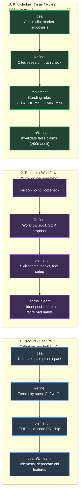
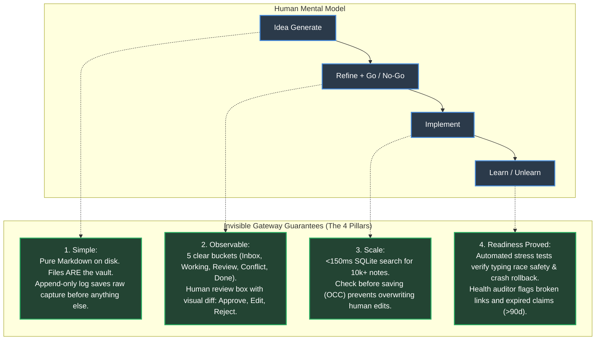

# Agentic Second Brain — Lifecycle Blueprint

**Document ID:** `SPEC-DET-2026-09-28`  
**System Purpose:** An agent-assisted operating system to move thinking through 4 Big Phases across 3 Core Categories with zero file corruption, zero lost ideas, and human-in-the-loop control.  
**Parent Architecture Spec:** [2026-09-28-agentic-second-brain-design.md](file:///Users/pasitnusso/ps-skills/docs/superpowers/specs/2026-09-28-agentic-second-brain-design.md)  
**Status:** Unified Lifecycle & Category Architecture  

---

## 1. The 4 Big Lifecycle Phases & 3 Core Categories

Every piece of knowledge in the Second Brain flows through **4 Big Phases** across **3 Categories**:

```mermaid
flowchart TD
    subgraph Phases["The 4 Big Phases"]
        P1["Phase 1: Idea Generate\n(Capture, sparks, clips, raw observations)"]
        P2["Phase 2: Refine + Go / No-Go\n(Deep research, stress-test, Human Gate: Go vs Kill)"]
        P3["Phase 3: Implement\n(Execution, task tracking, safe gateway commit)"]
        P4["Phase 4: Learn / Unlearn\n(Retrospective, feedback loop, updating rules, retiring stale claims)"]
    end

    P1 -->|Initial Classification| P2
    P2 -->|Go (Approved)| P3
    P2 -->|No-Go (Killed / Parked)| Archive["_archive/\n(Preserved for lessons learned)"]
    P3 -->|Shipped & Verified| P4
    P4 -->|New Feedback / Updated Rule| P1

    classDef phase fill:#2b3a4a,stroke:#4a90e2,stroke-width:2px,color:#fff;
    classDef gate fill:#4a3224,stroke:#e67e22,stroke-width:2px,color:#fff;
    classDef archive fill:#333333,stroke:#7f8c8d,stroke-width:2px,color:#fff;

    class P1,P3,P4 phase;
    class P2 gate;
    class Archive archive;
```

---

## 2. Category Matrix (3 Lanes × 4 Phases)

Knowledge is organized into three distinct tracks. Each track answers a specific question:



### Detailed Breakdown by Category

| Category | Phase 1: Idea Generate | Phase 2: Refine + Go / No-Go | Phase 3: Implement | Phase 4: Learn / Unlearn |
|---|---|---|---|---|
| **Product / Feature**<br>*(Software, tools, components)* | Raw idea in `01_Ideas/`, voice memo, or feature request. | Agents (Bestie/Philip) analyze market & technical feasibility. **Human Decision:** Go vs No-Go. | Tasks broken down into `02_Projects/<p>/tasks/`. Safe atomic commits via Gateway. | Post-ship review: Did it solve the user problem? Sunset unused code. |
| **Process / Workflow**<br>*(Pipelines, team SOPs, agent rules)* | Friction observed during a coding run or release bottleneck. | Stress-test the new workflow. Compare against failure history (`rule-history.md`). | Update hooks, install skills, configure agent tools (`skills/`, `settings.json`). | Post-mortem after incidents: Why did the process fail? Unlearn soft rules. |
| **Knowledge Thesis / Rules**<br>*(Principles, market theses, laws)* | Bookmark, research paper, ArXiv PDF in `_sources/`, trading thesis. | Multi-agent synthesis: Check claims against evidence. Flag contradictions. | Promoted to standing rules (`CLAUDE.md`, `GEMINI.md`) or `04_Knowledge/`. | 90-day staleness audit: Retire invalidated assumptions and debunked theses. |

---

## 3. How the Gateway Enforces the 4 Pillars Across Every Phase

The technical engine acts as the invisible safety net so you can focus on thinking and building:



1. **Simple (Zero Fluff):**
   * Notes stay as regular `.md` files in your folders (`01_Ideas`, `02_Projects`, `03_Areas`, `04_Knowledge`).
   * No heavy databases or proprietary formats.
2. **Scale (10,000+ Notes Smoothly):**
   * Fast SQLite FTS5 search index responds in under 150ms.
   * Large attachments (PDFs, images) are content-addressed and stored once in `_sources/_blobs/`.
3. **Observable (Everything Visible):**
   * The human sees **5 clear buckets**: `Inbox`, `In Progress`, `Needs Review`, `Conflicts`, and `Done`.
   * The review modal shows exact line-by-line diffs with cited evidence before any change touches disk.
4. **Readiness Proved (Battle-Tested):**
   * **Typing Race Test**: Proves human typing in Obsidian is never overwritten by an agent.
   * **Sudden Crash Test**: Proves pre-write snapshot automatically rolls back if power fails mid-save.
   * **Duplicate Flood Test**: Proves identical incoming clips never produce duplicate notes.
   * **10k Performance Test**: Proves searches stay lightning fast under heavy scale.

---

## 4. Master Specification Index

Each detailed module specifies how the gateway supports this lifecycle:

| Module | Link | Plain English Description |
|---|---|---|
| **00 — Master Index** | [`00-INDEX.md`](file:///Users/pasitnusso/ps-skills/docs/superpowers/specs/2026-09-28-agentic-second-brain/00-INDEX.md) | The 4 Big Phases, 3 Core Categories, Jargon Decoder, and 4 Pillars. |
| **01 — Gateway Engine** | [`01-GATEWAY-OCC-ENGINE.md`](file:///Users/pasitnusso/ps-skills/docs/superpowers/specs/2026-09-28-agentic-second-brain/01-GATEWAY-OCC-ENGINE.md) | Safe saving, instant backup snapshots, and collision prevention. |
| **02 — Capture Pipeline** | [`02-CAPTURE-INGEST-PIPELINE.md`](file:///Users/pasitnusso/ps-skills/docs/superpowers/specs/2026-09-28-agentic-second-brain/02-CAPTURE-INGEST-PIPELINE.md) | Black-box raw logging, duplicate prevention, and folder taxonomy. |
| **03 — Multi-Agent Adapters** | [`03-MULTI-AGENT-ADAPTERS.md`](file:///Users/pasitnusso/ps-skills/docs/superpowers/specs/2026-09-28-agentic-second-brain/03-MULTI-AGENT-ADAPTERS.md) | Single contract governing Claude, Codex, and Gemini with zero direct writes. |
| **04 — Supervision & UI** | [`04-HUMAN-SUPERVISION-DASHBOARD.md`](file:///Users/pasitnusso/ps-skills/docs/superpowers/specs/2026-09-28-agentic-second-brain/04-HUMAN-SUPERVISION-DASHBOARD.md) | The 5 review buckets, visual diff inspection card, and CLI commands. |
| **05 — Health & Privacy** | [`05-RECONCILIATION-HEALTH-SECURITY.md`](file:///Users/pasitnusso/ps-skills/docs/superpowers/specs/2026-09-28-agentic-second-brain/05-RECONCILIATION-HEALTH-SECURITY.md) | Broken link detection, 90-day claim retirement, and Git privacy quarantine. |
