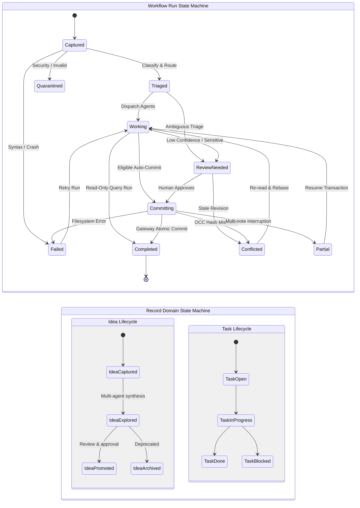

# Module 01: Vault Gateway, OCC & Atomic Storage Engine

**Document ID:** `SPEC-DET-01-GATEWAY`  
**System Name:** Vault Gateway Write Authority, OCC Engine & Journal Recovery  
**Part of:** [Agentic Second Brain Detailed Design](file:///Users/pasitnusso/.gemini/antigravity-cli/brain/20b80620-0123-47f3-a9ca-a347e893c6c8/detailed-design/00-INDEX.md)  

---

## 1. Gateway Write Architecture & Lifecycle

The **Vault Gateway** is the sole authorized writer of canonical Markdown notes for all autonomous agents. Agents propose changes against a specific pinned note revision; the gateway validates schema constraints, checks optimistic concurrency hashes, snapshots the target note, replaces the file atomically, and journals the transaction.

```mermaid
flowchart TD
    Start(["Receive ChangeProposal"]) --> ValContract["1. Validate Contract Version\n& Actor Capabilities"]
    ValContract --> CheckOp{"Operation Type?"}

    CheckOp -->|CREATE| CheckExists{"File Already\nExists?"}
    CheckExists -->|Yes| ErrExists["Fail: OCCConflictError\n(File already exists)"]
    CheckExists -->|No| SnapInit["No Snapshot Needed"]

    CheckOp -->|PATCH or ARCHIVE| ReadCurrent["2. Read Target File from Disk"]
    ReadCurrent --> HashCalc["Calculate current SHA-256"]
    HashCalc --> OCCCmp{"current_sha256 ==\nproposal.base_sha256?"}
    
    OCCCmp -->|Mismatch (Human edited mid-run)| FlagConflict["3. Raise OCCConflictError\nPause Note & Route to 'conflicted'"]
    OCCCmp -->|Match| CreateSnap["3. Create Pre-write Snapshot\n(_meta/snapshots/{run}_{time}_{file}.bak)"]

    SnapInit --> WriteTemp["4. Write Proposed Content to\nAtomic Temporary File (.tmp)"]
    CreateSnap --> WriteTemp

    WriteTemp --> AtomicReplace["5. Atomic Filesystem Rename\nos.replace(tmp_path, target_path)"]
    AtomicReplace --> SuccessCheck{"Replace\nSucceeded?"}

    SuccessCheck -->|Error / Disk Full| TriggerRollback["Trigger Rollback Engine\nRestore from Snapshot"]
    TriggerRollback --> MarkFailed["Record Run State: FAILED"]

    SuccessCheck -->|Success| AppendJournal["6. Append CommitEvent to Journal\n(_meta/journal/events.jsonl)"]
    AppendJournal --> SyncFTS["7. Enqueue Async Reindex\n(Search Index & Dashboard Projections)"]
    SyncFTS --> ReturnSuccess(["Return CommitEvent\nRun State: COMPLETED"])

    classDef normal fill:#2b3a4a,stroke:#4a90e2,stroke-width:2px,color:#fff;
    classDef branch fill:#3b2d54,stroke:#9b51e0,stroke-width:2px,color:#fff;
    classDef success fill:#234433,stroke:#27ae60,stroke-width:2px,color:#fff;
    classDef error fill:#4a2222,stroke:#e74c3c,stroke-width:2px,color:#fff;

    class Start,ValContract,ReadCurrent,HashCalc,CreateSnap,WriteTemp,AtomicReplace,AppendJournal,SyncFTS normal;
    class CheckOp,CheckExists,OCCCmp,SuccessCheck branch;
    class ReturnSuccess,SnapInit success;
    class ErrExists,FlagConflict,TriggerRollback,MarkFailed error;
```

---

## 2. Concurrency & Race Condition Scenarios

### Scenario A: Clean Multi-Agent Proposal Commit

In the clean path, the agent reads the note at revision `R1` (hash `H1`), computes new findings, generates a `ChangeProposal` with `base_sha256 = H1`, and the gateway successfully commits the mutation.

```mermaid
sequenceDiagram
    autonumber
    actor Human as Human (Obsidian)
    participant Note as Note on Disk (Idea.md)
    participant Agent as Agent (Claude / Codex)
    participant GW as Vault Gateway
    participant Snap as Snapshot Manager
    participant Journal as Commit Journal
    participant Dash as Dashboard & Views

    Human->>Note: Last edit committed (State: H1)
    Agent->>Note: Read note contents & compute base_sha256 (H1)
    Note-->>Agent: Pinned snapshot (H1)
    Note-->>Agent: Begin analysis & synthesis...
    Agent->>GW: submit_proposal(target="Idea.md", base_sha256="H1", content="...")
    GW->>Note: Read current disk content & compute hash
    Note-->>GW: Current hash is H1 (Match!)
    GW->>Snap: create_snapshot(target="Idea.md", run_id="RUN-100")
    Snap-->>GW: Snapshot stored at _meta/snapshots/RUN-100_Idea.md.bak
    GW->>Note: Atomic replace os.replace(tmp, "Idea.md")
    Note-->>GW: Replaced successfully (New Hash: H2)
    GW->>Journal: Append CommitEvent(prior=H1, new=H2, status=COMMITTED)
    Journal-->>GW: Durably flushed
    GW->>Dash: Refresh projections (as-of revision H2)
    GW-->>Agent: Commit finalized (Status: COMPLETED)
    Dash-->>Human: Dashboard updates queue & views
```

---

### Scenario B: Concurrent Human Obsidian Edit (Preventing Silent Overwrite)

Obsidian allows direct human file edits. Because Obsidian does not coordinate with the gateway's lock, a human may type and save while an agent is generating findings. The gateway detects this hash divergence and **aborts immediately**, preventing the human's work from being clobbered.

```mermaid
sequenceDiagram
    autonumber
    actor Human as Human (Obsidian)
    participant Note as Note on Disk (Idea.md)
    participant Agent as Agent (Claude)
    participant GW as Vault Gateway
    participant Dash as Dashboard

    Agent->>Note: Read note at revision H1 (base_sha256 = H1)
    Note-->>Agent: Return content
    Note-->>Agent: Agent begins 30-second deep research...
    
    rect rgb(60, 30, 30)
        Note over Human,Note: Concurrent Human Edit in Obsidian
        Human->>Note: Edit paragraph & save
        Note-->>Note: Disk content changes! (New hash = H_human)
    end

    Agent->>GW: submit_proposal(target="Idea.md", base_sha256="H1", content="Agent rewrite...")
    GW->>Note: Check current disk hash
    Note-->>GW: Current hash is H_human
    Note over GW: OCC Check: H1 != H_human (DIVERGENCE DETECTED!)
    
    GW-->>Agent: Reject with OCCConflictError(expected H1, found H_human)
    GW->>Dash: Register run in 'failed_conflicted' queue (State: CONFLICTED)
    GW->>Dash: Surface diff between H_human and Agent proposal for Human resolution
    Dash-->>Human: Alert: "Conflict on Idea.md. Review both revisions in Dashboard."
```

---

### Scenario C: Crash Recovery Between Note Write and Event Journal

If the process crashes or loses power immediately after `os.replace()` updates the note but before the `CommitEvent` is written to `events.jsonl`, the system recovers deterministically upon reboot.

```mermaid
sequenceDiagram
    autonumber
    participant GW as Vault Gateway
    participant Note as Note on Disk (Idea.md)
    participant Snap as Pre-write Snapshot
    participant Journal as Transaction Journal
    participant Recov as Startup Reconciler

    GW->>Journal: begin_transaction(tx_id="TX-501", run_id="RUN-501")
    GW->>Snap: create_snapshot(target="Idea.md")
    Snap-->>GW: Saved Idea.md.bak (hash = H1)
    GW->>Note: os.replace(tmp, "Idea.md") -> Note updated to H2
    
    rect rgb(70, 20, 20)
        Note over GW,Journal: CRASH / POWER LOSS OCCURS HERE!
        Note over GW,Journal: (Note has H2, but events.jsonl has no commit record)
    end

    Note over Recov: System Restarts -> Startup Reconciler Executes
    Recov->>Journal: Scan open transactions in journal
    Journal-->>Recov: Found unfinalized TX-501 (Status: PENDING)
    Recov->>Note: Inspect current hash of Idea.md (Found: H2)
    Recov->>Snap: Verify pre-write snapshot exists (Found: Idea.md.bak, H1)
    
    alt Reconciler Completes Transaction
        Recov->>Journal: Synthesize CommitEvent(tx_id="TX-501", status="COMMITTED_RECOVERED")
        Journal-->>Recov: Transaction finalized
        Note over Recov: System healthy, zero audit data lost
    else Reconciler Rolls Back
        Recov->>Snap: Copy Idea.md.bak -> Idea.md (Restore H1)
        Recov->>Journal: Record CommitEvent(tx_id="TX-501", status="ROLLED_BACK")
    end
```

---

## 3. Concrete Data Schemas & Contracts

### 3.1 `ChangeProposal` Data Contract

All mutations proposed by any agent or CLI adapter must adhere to this JSON Schema / Pydantic contract:

```python
from enum import Enum
from typing import Optional
from pydantic import BaseModel, Field, model_validator

class ProposalOperation(str, Enum):
    CREATE = "create"    # New note creation
    PATCH = "patch"      # Update existing note content
    ARCHIVE = "archive"  # Move note to _archive/

class ChangeProposal(BaseModel):
    proposal_id: str = Field(description="Unique proposal identifier, e.g. PROP-2026-00123")
    run_id: str = Field(description="Associated workflow run identifier, e.g. RUN-2026-00456")
    actor: str = Field(description="Agent or human submitting proposal, e.g. 'claude-code', 'codex', 'human'")
    contract_version: str = Field(default="v1", description="Contract version of the submitting adapter")
    operation: ProposalOperation
    target_path: str = Field(description="Relative vault path to the target note, e.g. 01_Ideas/distributed-actors.md")
    base_sha256: str = Field(default="", description="Cryptographic SHA-256 of the note when the agent read it")
    proposed_content: str = Field(description="Complete proposed Markdown text for the target file")
    reason: str = Field(description="Explanation of why this mutation is being proposed")
    idempotency_key: str = Field(description="Client-supplied idempotency key")
    confidence: float = Field(default=1.0, ge=0.0, le=1.0, description="Model confidence score [0.0 - 1.0]")
    evidence_refs: list[str] = Field(default_factory=list, description="List of source IDs or note links supporting this change")

    @model_validator(mode="after")
    def validate_occ_invariants(self):
        if self.operation in (ProposalOperation.PATCH, ProposalOperation.ARCHIVE):
            if not self.base_sha256.strip():
                raise ValueError("base_sha256 is strictly required for PATCH and ARCHIVE operations")
        elif self.operation == ProposalOperation.CREATE:
            if self.base_sha256.strip():
                raise ValueError("base_sha256 must be empty for CREATE operations")
        return self
```

### 3.2 `CommitEvent` Audit Stream Contract

Every mutation committed to canonical notes is logged to `_meta/journal/events.jsonl` as an immutable audit record:

```python
from datetime import datetime
from pydantic import BaseModel, Field

class CommitEvent(BaseModel):
    event_id: str = Field(description="Unique event identity, e.g. EVT-2026-00987")
    tx_id: str = Field(description="Transaction context identity, e.g. TX-2026-00543")
    run_id: str = Field(description="Associated workflow run identity, e.g. RUN-2026-00456")
    proposal_id: str = Field(description="The proposal that generated this commit")
    actor: str = Field(description="The actor who initiated the change")
    timestamp: str = Field(default_factory=lambda: datetime.utcnow().isoformat() + "Z")
    target_path: str = Field(description="Canonical path modified")
    operation: ProposalOperation
    prior_sha256: str = Field(description="SHA-256 of the file before commit (empty for CREATE)")
    new_sha256: str = Field(description="SHA-256 of the file after commit")
    snapshot_path: Optional[str] = Field(default=None, description="Path to pre-write snapshot for recovery")
    reason: str = Field(description="Audit reason for the change")
```

---

## 4. Dual State Machine Separation

The design enforces a strict separation between **Workflow Run State** and **Record Domain State**:



> [!IMPORTANT]
> **Decoupling Invariant:** A workflow run completing (`RunState.COMPLETED`) does **NOT** approve or promote an idea (`IdeaState.PROMOTED`) or mark a task as done (`TaskState.DONE`). The dashboard projects run progress and record progress separately.
