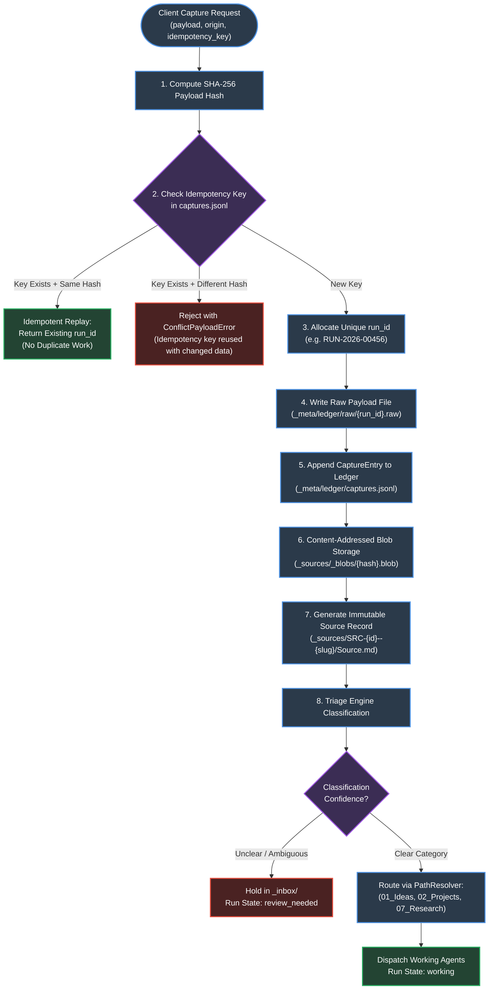
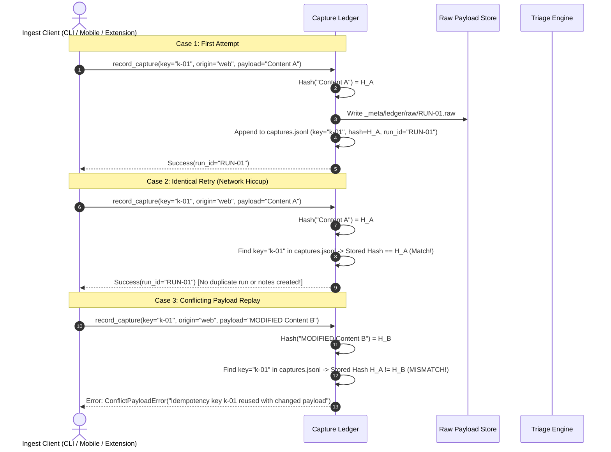

# Module 02: Capture Ledger, Ingestion & Source Provenance

**Document ID:** `SPEC-DET-02-CAPTURE`  
**System Name:** Durable Capture Ledger, Source Storage & Purpose-Based Routing  
**Part of:** [Agentic Second Brain Detailed Design](file:///Users/pasitnusso/.gemini/antigravity-cli/brain/20b80620-0123-47f3-a9ca-a347e893c6c8/detailed-design/00-INDEX.md)  

---

## 1. End-to-End Ingestion Flow

The ingestion pipeline guarantees that **no captured data is ever lost or corrupted**. Before any folder routing, idea classification, or note modification takes place, the raw capture payload and its cryptographic hash are durably recorded in the append-only capture ledger.



---

## 2. Idempotency & Conflict Replay Scenarios

### Scenario A: Clean Idempotent Retry vs Conflicting Payload Replay



---

## 3. Concrete Data Schemas & Contracts

### 3.1 `CaptureEntry` Schema

```python
from datetime import datetime
from pydantic import BaseModel, Field

class CaptureEntry(BaseModel):
    run_id: str = Field(description="Globally unique workflow run identity, e.g. RUN-2026-00456")
    idempotency_key: str = Field(description="Client-provided idempotency key")
    source_origin: str = Field(description="Capture origin channel, e.g. 'web-clipper', 'voice-transcription', 'cli'")
    payload_sha256: str = Field(description="Cryptographic SHA-256 hash of the exact raw text or binary payload")
    raw_payload_path: str = Field(description="Relative path to stored raw payload file, e.g. _meta/ledger/raw/RUN-2026-00456.raw")
    timestamp: str = Field(default_factory=lambda: datetime.utcnow().isoformat() + "Z")
    client_metadata: dict = Field(default_factory=dict, description="Arbitrary client metadata (headers, source URL, device info)")
```

### 3.2 `SourceManifest` Contract (`Source.md`)

Each captured external document is cataloged under `_sources/SRC-<id>--<safe-slug>/Source.md`:

```markdown
---
schema: vault-source-v1
id: SRC-2026-000123
title: "Agentic Knowledge Vault Architecture"
source_type: "pdf"
origin: "https://arxiv.org/abs/2609.12345"
captured_at: 2026-09-28T10:15:30Z
payload_sha256: 3a7b9c1d2e...f8
rights: "cc-by-4.0"
sensitive_flag: false
---

# Agentic Knowledge Vault Architecture

## Preamble for Future Agents
- **Origin**: ArXiv Paper on autonomous vault architectures.
- **Payload Reference**: `_sources/_blobs/3a7b9c1d2e...f8.blob`
- **Key Focus**: OCC protocols and conflict resolution across multiple LLM clients.

## Executive Summary
This paper outlines the core invariants required to coordinate autonomous agents over portable Markdown files without data corruption...
```

---

## 4. Purpose-Based Folder Routing Taxonomy

The vault strictly uses a small, purpose-based folder map. No skills or agents may invent arbitrary root collections or dump unassigned items into vague catch-all directories:

| Logical Record Kind | Canonical Vault Path | Routing & Naming Invariants |
|---|---|---|
| **Daily Notes** | `05_Daily/YYYY/YYYY-MM-DD.md` | Single calendar note per day. Formats ISO-8601 date. |
| **Ideas** | `01_Ideas/<slug>.md` | Raw or explored candidate concepts with immutable ID in frontmatter. |
| **Projects** | `02_Projects/<project-slug>/index.md` | Active outcome-driven initiatives. |
| **Project Tasks** | `02_Projects/<project-slug>/tasks/<task-slug>.md` | Stable task record owned by a specific project. |
| **Project Decisions** | `02_Projects/<project-slug>/decisions/<dec-slug>.md` | Local architectural decision records (ADRs) tied to a project. |
| **Areas** | `03_Areas/<area-slug>/index.md` | Long-term operational realms (e.g. `AreaFinance`, `AreaHealth`). |
| **Area Tasks** | `03_Areas/<area-slug>/tasks/<task-slug>.md` | Ongoing operational tasks owned by an area. |
| **Area Decisions** | `03_Areas/<area-slug>/decisions/<dec-slug>.md` | Operational policies owned by an area. |
| **Durable Knowledge** | `04_Knowledge/<category>/<topic>.md` | Evergreen, promoted concepts and reference documentation. |
| **Global Decisions** | `04_Knowledge/decisions/<dec-slug>.md` | Cross-cutting architectural decisions affecting multiple projects. |
| **People** | `06_People/<person-slug>.md` | Person profiles (disabled until privacy gate passes). |
| **Research Synthesis** | `07_Research/<dated-slug>.md` | Source-bound working investigations and comparative analyses. |
| **Original Evidence** | `_sources/SRC-<id>--<safe-slug>/Source.md` | Immutable source manifests. Blobs stored in `_sources/_blobs/`. |
| **Unresolved Triage** | `_inbox/<item-slug>.md` | Captured items requiring human classification or additional context. |
| **Archived Records** | `_archive/<orig-path>` | Deprecated or retired notes preserved for historical audit. |
| **System State** | `_meta/` | Schemas, capture ledger, commit journal, snapshots, index cache. |

### Path Resolution Logic (`PathResolver`)

```python
from datetime import date
from typing import Optional
from engine.vault.contracts import RecordKind

class PathResolver:
    @staticmethod
    def sanitize_slug(text: str) -> str:
        import re
        s = re.sub(r"[^\w\s-]", "", text).strip().lower()
        return re.sub(r"[-\s]+", "-", s)[:40] or "untitled"

    def resolve(
        self,
        kind: RecordKind,
        slug: Optional[str] = None,
        owner: Optional[str] = None,
        date_val: Optional[date] = None,
        stable_id: Optional[str] = None,
        safe_slug: Optional[str] = None,
    ) -> str:
        clean_slug = self.sanitize_slug(slug or "record")

        if kind == RecordKind.DAILY:
            d = date_val or date.today()
            return f"05_Daily/{d.year}/{d.isoformat()}.md"

        if kind == RecordKind.SOURCE:
            sid = stable_id or "SRC-UNKNOWN"
            sslug = safe_slug or clean_slug
            return f"_sources/{sid}--{sslug}/Source.md"

        if kind == RecordKind.TASK:
            if owner:
                if owner.startswith("Area"):
                    return f"03_Areas/{owner}/tasks/{clean_slug}.md"
                return f"02_Projects/{owner}/tasks/{clean_slug}.md"
            return f"_inbox/tasks/{clean_slug}.md"

        if kind == RecordKind.DECISION:
            if owner:
                if owner.startswith("Area"):
                    return f"03_Areas/{owner}/decisions/{clean_slug}.md"
                return f"02_Projects/{owner}/decisions/{clean_slug}.md"
            return f"04_Knowledge/decisions/{clean_slug}.md"

        if kind == RecordKind.IDEA:
            return f"01_Ideas/{clean_slug}.md"
        if kind == RecordKind.PROJECT:
            return f"02_Projects/{clean_slug}/index.md"
        if kind == RecordKind.AREA:
            return f"03_Areas/{clean_slug}/index.md"
        if kind == RecordKind.RESEARCH:
            return f"07_Research/{clean_slug}.md"
        if kind == RecordKind.PERSON:
            return f"06_People/{clean_slug}.md"

        return f"_inbox/{clean_slug}.md"
```
