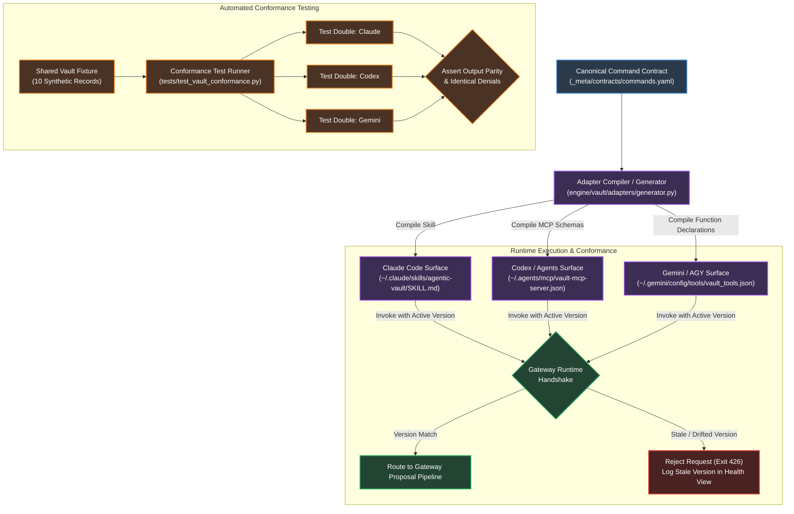
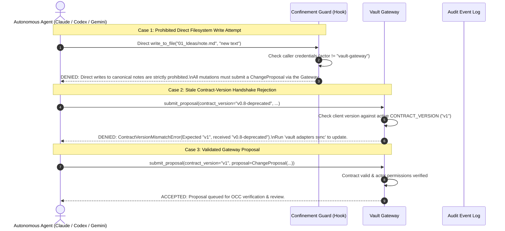

# Module 03: Multi-Agent Adapters & Contract Governance

**Document ID:** `SPEC-DET-03-ADAPTERS`  
**System Name:** Multi-CLI Adapter Architecture, Code Compilation & Conformance Verification  
**Part of:** [Agentic Second Brain Detailed Design](file:///Users/pasitnusso/.gemini/antigravity-cli/brain/20b80620-0123-47f3-a9ca-a347e893c6c8/detailed-design/00-INDEX.md)  

---

## 1. Cross-CLI Compilation Architecture

To prevent behavior drift between different LLM runtimes (Anthropic Claude Code, OpenAI Codex, Google Gemini CLI / AGY), all tool declarations, parameters, system instructions, and routing invariants compile from a **Single Source of Truth** (`_meta/contracts/commands.yaml`).



---

## 2. Runtime Contract Handshake & Direct-Write Denial

Every mutating invocation initiated by an agent adapter is validated against the active gateway schema version. Furthermore, any attempt by an agent or script to perform an unmediated direct filesystem write to canonical Markdown notes is strictly intercepted and blocked by the **Confinement Guard**.



---

## 3. Canonical Command Specification Matrix

The canonical commands available across all CLIs are defined as follows:

| Command Name | Description | Mutation Type | Required Parameters | Review Policy |
|---|---|---|---|---|
| `vault_capture` | Ingest external raw text, link, or note | Append to Ledger | `payload`, `origin`, `idempotency_key` | Unattended / Immediate |
| `vault_find` | Bounded lexical/semantic search across vault | Read-Only | `query`, `limit` (max 20), `threshold` | Read-Only |
| `vault_recall` | Retrieve cited context for session boot | Read-Only | `context_level` (`L0`-`L3`), `topic` | Read-Only |
| `vault_propose_idea` | Propose new or updated idea note | ChangeProposal | `target_slug`, `base_sha256`, `content`, `reason` | Human Review Required |
| `vault_propose_task` | Create or update project/area task | ChangeProposal | `owner`, `task_slug`, `base_sha256`, `content` | Human Review Required |
| `vault_propose_decision` | Record an architectural decision | ChangeProposal | `owner`, `dec_slug`, `base_sha256`, `content` | Human Review Required |
| `vault_synthesize` | Reconcile working research into knowledge | Multi-note Proposal | `source_id`, `target_notes`, `evidence_diffs` | Human Review Required |
| `vault_health` | Diagnostic scan of links, orphans, versions | Read-Only | `level` (`summary` / `deep`) | Read-Only |

---

## 4. Conformance Test Specification

Every adapter generated by `AdapterGenerator` must pass the identical conformance suite in `tests/test_vault_conformance.py`. The suite exercises:

1. **Parameter Serialization Parity:** Ensures that Claude's YAML frontmatter, Codex's JSON parameters, and Gemini's function call arguments map to identical Python `ChangeProposal` instances.
2. **Denial Equivalence:** Verifies that all adapters trigger identical error types (`ContractVersionMismatchError`, `OCCConflictError`, `WritePermissionDenied`) when presented with malformed or stale requests.
3. **Evidence Requirement Verification:** Verifies that when an agent produces a finding without an explicit citation (`evidence_refs` empty), the gateway rejects or downgrades the confidence to `review_needed`, never accepting an invented score.

```python
# Conformance Test Invariant Assertion
def assert_adapter_conformance(adapter_output: dict, expected_proposal: ChangeProposal):
    assert adapter_output["contract_version"] == expected_proposal.contract_version
    assert adapter_output["operation"] == expected_proposal.operation.value
    assert adapter_output["target_path"] == expected_proposal.target_path
    assert adapter_output["base_sha256"] == expected_proposal.base_sha256
    assert adapter_output["confidence"] == expected_proposal.confidence
    assert len(adapter_output["evidence_refs"]) > 0, "Agent proposal missing required evidence citations"
```
