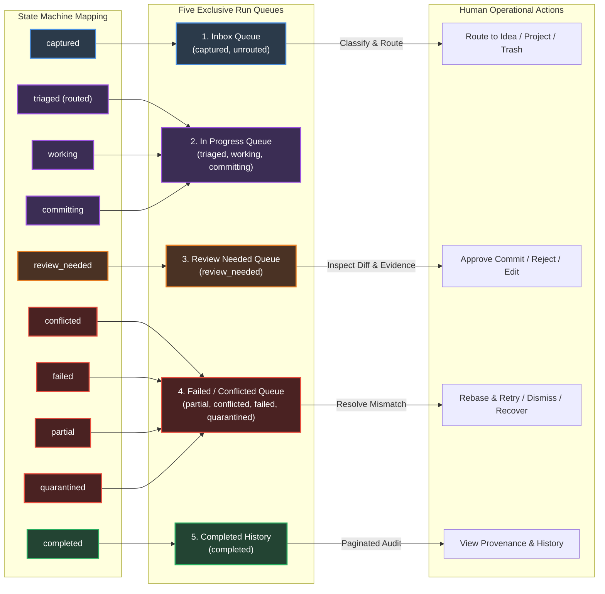

# Module 04: Human Supervision, Dashboard & CLI Surfaces

**Document ID:** `SPEC-DET-04-SUPERVISION`  
**System Name:** Human Review Interface, 5 Exclusive Run Queues & CLI Toolset  
**Part of:** [Agentic Second Brain Detailed Design](file:///Users/pasitnusso/.gemini/antigravity-cli/brain/20b80620-0123-47f3-a9ca-a347e893c6c8/detailed-design/00-INDEX.md)  

---

## 1. Five Exclusive Dashboard Queues

The human supervision surface projects workflow runs into **five mutually exclusive queues**. Every run belongs to exactly one queue based on its current `RunState`:



---

## 2. Proposal Review Modal Interface Specification

When a run enters `review_needed`, the Obsidian plugin renders an interactive review modal allowing the human to inspect the proposed mutation before the gateway writes to disk:

```
+----------------------------------------------------------------------------------------------------+
|  PROPOSAL REVIEW: PROP-2026-00456 (Run: RUN-2026-00892)                                      [X]   |
+----------------------------------------------------------------------------------------------------+
| Target Note: 01_Ideas/distributed-actor-mesh.md                                                    |
| Proposing Actor: claude-code (Skill v1)                                                            |
| Operation: PATCH  |  Base Hash: 7c9a...12 (Current: MATCHED)  |  Confidence: [ 85% ]               |
+----------------------------------------------------------------------------------------------------+
| Evidence & Citations:                                                                              |
| - [SRC-2026-0012] ArXiv Paper: Distributed Actor Reliability (p. 4, section 2.1)                   |
| - [[02_Projects/ProjectAlpha/decisions/ADR-004]] Core Concurrency Law                              |
+----------------------------------------------------------------------------------------------------+
| Visual Diff View:                                                                                  |
|                                                                                                    |
|    12 | ## System Architecture                                                                     |
|    13 | The system uses an in-memory event bus.                                                    |
|  - 14 | Workers communicate directly over unencrypted TCP sockets.                                 |
|  + 14 | Workers communicate over mutual TLS authenticated mesh channels with lease heartbeats.     |
|    15 |                                                                                            |
|  + 16 | ### Reliability Invariant                                                                  |
|  + 17 | If a worker fails to renew its lease within 10 seconds, it is quarantined.                 |
+----------------------------------------------------------------------------------------------------+
| Reason for Change:                                                                                 |
| "Aligning architectural specification with ADR-004 mutual TLS and lease recovery invariants."      |
+----------------------------------------------------------------------------------------------------+
| [  Reject Proposal  ]        [  Edit Proposed Text  ]        [  APPROVE & COMMIT (Gateway)  ]      |
+----------------------------------------------------------------------------------------------------+
```

---

## 3. Obsidian Dashboard Layout & Bases Integration

The Dashboard is rendered in Obsidian via a dedicated view component (or configured Dataview / Bases view) reading from `_meta/journal/events.jsonl` and the SQLite index:

```
+----------------------------------------------------------------------------------------------------+
| AGENTIC SECOND BRAIN — OPERATIONS DASHBOARD                                                        |
+----------------------------------------------------------------------------------------------------+
| METRIC OVERVIEW:                                                                                   |
| [  Inbox: 3 items  ] [  Active Runs: 2  ] [  Review Needed: 1  ] [  Failed / Conflicted: 1  ]      |
| Index Lag: 0s (up-to-date) | Active Contract: v1 | Gateway Health: Optimal                         |
+----------------------------------------------------------------------------------------------------+
| SECTION 1: RUN QUEUES                                                                              |
|                                                                                                    |
| 1. Review Needed (Action Required):                                                                |
|    - [REVIEW] RUN-00892 | 01_Ideas/distributed-actor-mesh.md (Actor: Claude, Conf: 85%)             |
|                                                                                                    |
| 2. Failed / Conflicted:                                                                            |
|    - [CONFLICT] RUN-00711 | 02_Projects/TradingBot/tasks/t1.md (OCC Mismatch: Human edited note)   |
|      -> Actions: [ Re-read & Rebase ]  [ Dismiss ]  [ View Human vs Agent Diff ]                   |
|                                                                                                    |
| 3. In Progress (Active Agents):                                                                    |
|    - [WORKING] RUN-00910 | Deep research on "High-throughput SQLite WAL concurrency"               |
|      -> Running since: 2m 14s | Assigned: Codex worker                                             |
+----------------------------------------------------------------------------------------------------+
| SECTION 2: KNOWLEDGE DOMAIN PROGRESS (Independent of Run State)                                    |
|                                                                                                    |
| - Ideas by Stage:     12 Captured  |  8 Explored  |  4 Promoted  |  2 Archived                     |
| - Project Alpha:      14 / 18 Tasks Done (78%) | 1 Blocked                                         |
| - Stale Knowledge:    2 notes unverified > 90 days ([[04_Knowledge/API/v1-deprecated]])            |
+----------------------------------------------------------------------------------------------------+
```

---

## 4. Vault CLI Interface Specification

The CLI provides parity for headless, terminal-based, and CI environments without requiring the Obsidian desktop client:

```bash
# Ingest an item directly into the capture ledger
vault ingest "Research paper notes on actor coordination" --origin "terminal" --key "cli-$(date +%s)"

# Inspect active queues and counts
vault status

# List runs awaiting human approval
vault proposals list --queue review_needed

# Inspect detailed diff for a pending proposal
vault proposals diff PROP-2026-00456

# Approve and commit proposal through the gateway
vault proposals approve PROP-2026-00456 --reason "LGTM reviewed"

# Reject proposal with feedback
vault proposals reject PROP-2026-00456 --reason "Outdated architecture assumption"

# Rebase a conflicted run against current note content
vault runs rebase RUN-2026-00711
```
