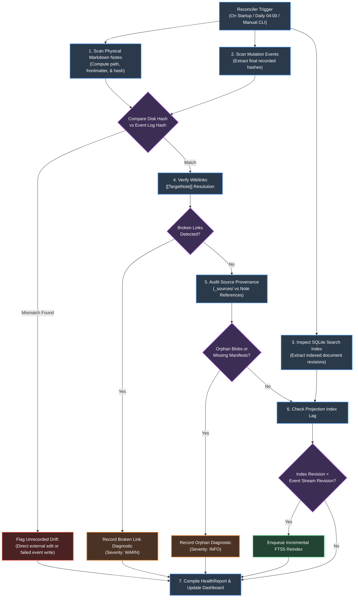
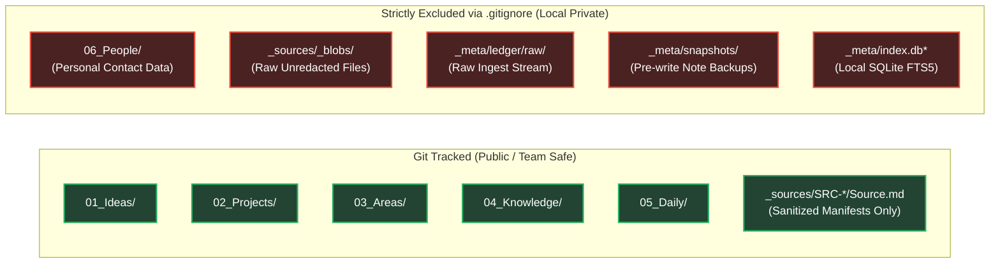

# Module 05: Reconciliation, Health & Privacy Boundary

**Document ID:** `SPEC-DET-05-SECURITY`  
**System Name:** Background Reconciliation, Diagnostic Health Auditor, and Privacy Gates  
**Part of:** [Agentic Second Brain Detailed Design](file:///Users/pasitnusso/.gemini/antigravity-cli/brain/20b80620-0123-47f3-a9ca-a347e893c6c8/detailed-design/00-INDEX.md)  

---

## 1. Background Reconciliation & Health Loop

The **Reconciler** runs continuously or on scheduled triggers to verify convergence between three independent data layers:
1. **Canonical Markdown Files** (Physical notes on disk)
2. **Audit Event Log** (`_meta/journal/events.jsonl`)
3. **Derived Search Index** (SQLite FTS5 / Vector Cache)



---

## 2. Health Diagnostic Rule Catalogue

The health engine categorizes vault anomalies into four clear severity tiers:

| Rule Code | Severity | Anomaly Description | Detection Condition | Remediation Path |
|---|---|---|---|---|
| `DRIFT_UNJOURNALED` | **CRITICAL** | Canonical note modified without gateway event | Disk SHA-256 != Last `CommitEvent.new_sha256` | Synthesize recovery event or prompt human diff review |
| `STALE_ADAPTER_VER` | **HIGH** | Installed agent adapter has outdated contract | Adapter contract version != Gateway `CONTRACT_VERSION` | Run `vault adapters sync` to regenerate surfaces |
| `BROKEN_WIKILINK` | **WARN** | Note links to non-existent document | `[[Target]]` has no matching file on disk | Suggest fuzzy match or prompt to create stub |
| `INDEX_LAG_EXCEEDED` | **WARN** | Search index is behind commit event stream | Current event log offset > Search index last offset | Automatic background batch reindex |
| `ORPHAN_SOURCE_BLOB` | **INFO** | Content blob exists with no referencing manifest | `_sources/_blobs/{hash}.blob` unreferenced in `Source.md` | Mark for garbage collection after 30-day retention |
| `STALE_CLAIM_AGE` | **INFO** | Time-sensitive claim unverified > 90 days | `valid_as_of` date is older than threshold | Enqueue refresh task for research agent |

---

## 3. Sensitive Data & Privacy Boundary

Because the vault synchronizes with Git, confidential personal information and raw unredacted data must be quarantined from repository commits:



### Automated Privacy Gate Verification (`tests/test_privacy_gate.py`)

A continuous verification test runs on every build to guarantee that no quarantined paths can accidentally enter Git:

```python
import subprocess
from pathlib import Path

def test_privacy_gate_enforcement():
    gitignore_path = Path(".gitignore")
    assert gitignore_path.exists(), "Root .gitignore must exist"
    gitignore_text = gitignore_path.read_text(encoding="utf-8")

    # Assert mandatory exclusion patterns
    required_exclusions = [
        "_meta/ledger/raw",
        "_meta/snapshots",
        "_sources/_blobs",
        "06_People",
        "_meta/*.db",
    ]
    for pattern in required_exclusions:
        assert pattern in gitignore_text, f"Missing required .gitignore rule: {pattern}"

    # Assert no tracked files in git match quarantined patterns
    tracked_files = subprocess.check_output(["git", "ls-files"]).decode("utf-8").splitlines()
    for file_path in tracked_files:
        assert not any(p in file_path for p in ["_meta/ledger/raw", "_sources/_blobs", "06_People"]), \
            f"LEAK DETECTED: Quarantined file tracked in Git: {file_path}"
```

---

## 4. 10,000-Note Performance Benchmark & Latency Bounds

The search and dashboard projection layers must support large vaults without degraded interactive performance:

| Operation | Scale Target | Target SLA (p95) | Architecture Enforcement Mechanism |
|---|---|---|---|
| **Lexical Search (`vault_find`)** | 10,000 notes | **< 150 ms** | SQLite FTS5 with Porter stemmer and BM25 ranking (no linear filesystem scans) |
| **Dashboard Queue Calculation** | 10,000 notes / 500 runs | **< 50 ms** | In-memory cache synced from append-only `events.jsonl` |
| **Proposal OCC Hash Verification** | Single note | **< 10 ms** | Single-pass SHA-256 buffer calculation |
| **Atomic Commit & Snapshotting** | Multi-note (up to 5) | **< 80 ms** | Local filesystem `copy` + atomic `os.replace` + journal append |
| **Full Health Audit Scan** | 10,000 notes | **< 2.5 s** | Streaming regex scan with async threadpool workers |
