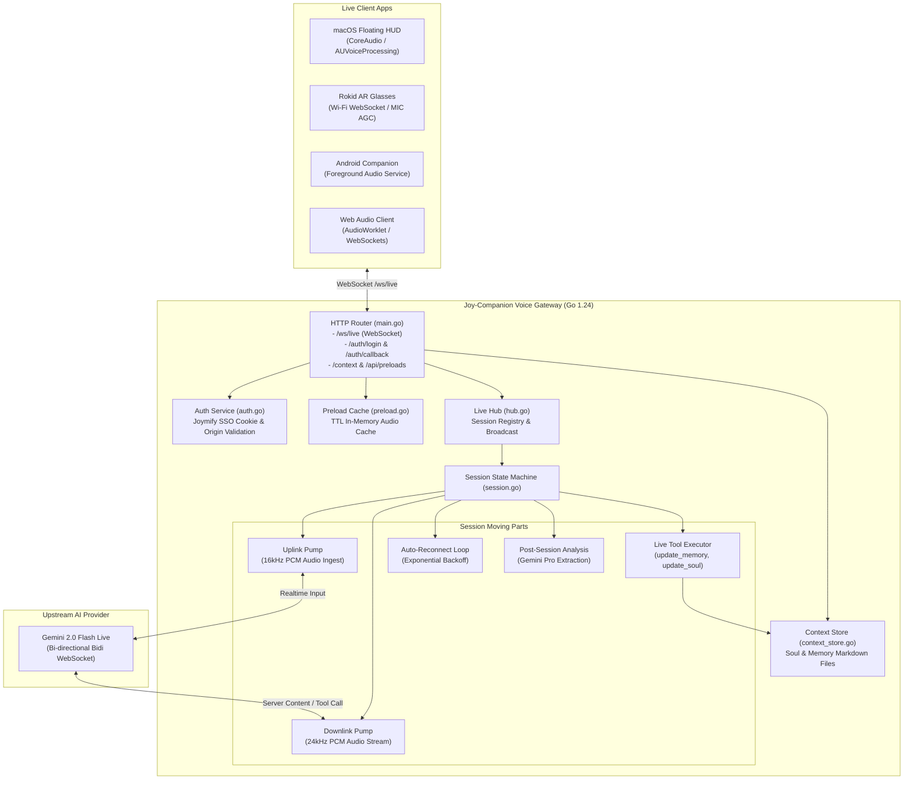

# Reverse Engineering & System Inspection: Joy-Companion

**Target System:** `joy-companion` (`/Users/pasitnusso/workspace/repos/joy-companion`)  
**Architecture:** Real-Time Multimodal Voice & Vision Companion Gateway (Golang 1.24)  
**Live Clients:** macOS Floating HUD (`apps/macos`), Rokid AR Smart Glasses (`apps/rokid`), Android Companion (`apps/android`), iOS Client (`apps/ios`), Web Dashboard (`web/`)  
**Baseline Test Coverage:** **79.2%** statement coverage  

---

## 1. System Topology & Moving Parts

---

## 2. The 3 Categories (Cates) Breakdown

### Category 1: Product / Feature ("What are we building?")
- **Full-Duplex Live Voice:** Ultra-low latency voice streaming over WebSocket `/ws/live` supporting continuous user speech and interruptible AI response.
- **Multimodal Context Injection:** Real-time capture and ingestion of user chat text, screenshot attachments, and persistent memories (`soul.md` and `memory.md`).
- **Client Fleet Integration:** Seamless connection from desktop (`macOS HUD`), wearable (`Rokid Glasses`), and mobile (`Android/iOS`).

### Category 2: Process / Workflow ("How does it operate?")
- **Audio Frame Flow:** Client 16kHz Linear PCM -> `UplinkPump` -> WebSocket Blob -> Gemini Live.
- **Barge-in Interrupt Protocol:** Client detects user speech -> Sends barge-in interrupt signal -> `DownlinkPump` immediately flushes in-flight audio buffers and increments generation tag -> Gemini Live interrupts previous response.
- **Context Persistence Loop:** Agent decides to remember a preference -> Calls `update_memory` or `update_soul` tool -> `ContextStore` atomically writes markdown to disk and broadcasts `context_updated` event to client UI.

### Category 3: Knowledge Thesis / Invariants ("What rules guide us?")
- **Rule 1 (Sampling Contract):** 16 kHz 16-bit mono PCM upstream; 24 kHz 16-bit mono PCM downstream. Zero runtime format renegotiation.
- **Rule 2 (Generation Tagged Barge-In):** Any user speech packet must increment the server generation counter and invalidate all earlier pending audio frames.
- **Rule 3 (Zero Direct Shell):** Companion server strictly sandboxes tool calls to `update_memory` and `update_soul`.

---

## 3. Deep Inspection: Issues Found (Major to Small)

### 🔴 Major Issues

1. **Issue M1: Open Redirect & Host Spoofing in SSO (`auth.go:79-92`)**
   - **Location:** `getAppOrigin(cfg Config, r *http.Request)`
   - **Root Cause:** If `cfg.AppOrigin` is empty, `getAppOrigin` constructs the redirect URI using `r.Host` without validating against an allowed domain list. An attacker sending a crafted `Host: evil.com` header during `/auth/login` can cause the SSO callback to redirect authorization codes to an external domain.
   - **Severity:** High (Security / Auth Flow).

2. **Issue M2: Memory Buffer Pool Reuse under Upstream Network Failure (`session.go:368-376`)**
   - **Location:** `sendUpstreamAudio(data []byte)`
   - **Root Cause:** `putBuf(&upBufPool, bp)` is called synchronously right after `sendLiveRealtimeInput`, before confirming whether the underlying WebSocket writer has fully sent or buffered the slice. If `sendLiveRealtimeInput` buffers asynchronously in an unmonitored queue, buffer contents can be mutated by the next pooled allocation.
   - **Severity:** High (Memory Integrity / Concurrency).

3. **Issue M3: Context Store Directory Creation Race on Container Start (`context_store.go:62-73`)**
   - **Location:** `NewContextStore(dir string)`
   - **Root Cause:** Multiple concurrent worker sessions initializing against a read-only or slow volume mount will attempt `os.MkdirAll` simultaneously without a mutex. If `os.MkdirAll` fails once, it immediately falls back to `/tmp/joy-data` or in-memory mode, causing session memories to be partitioned between disk and ephemeral RAM.
   - **Severity:** High (Data Persistence).

---

### 🟡 Medium Issues

4. **Issue Med1: Candidate Parts Parser Panics or Drops Multi-Modal Text (`session.go:135-155`)**
   - **Location:** `analysisResponseText(resp *genai.GenerateContentResponse)`
   - **Root Cause:** If a candidate part has a nil `Text` pointer or is an inline data blob (e.g. image return), the current parser loop can fail to extract the accompanying text or return an empty string, triggering repeated retry loops (`analysisAttempts = 3`).
   - **Severity:** Medium (LLM Parsing / Reliability).

5. **Issue Med2: Reconnection Cascades without Circuit Breaker (`session.go:386-410`)**
   - **Location:** `reconnect(ctx context.Context, from liveSession)`
   - **Root Cause:** While exponential backoff exists, there is no max failure threshold that cleanly terminates an unrecoverable session. A persistent network failure keeps goroutines polling and attempting reconnects until context cancellation.
   - **Severity:** Medium (Resource Leak).

6. **Issue Med3: Preload Cache Stale Key Accumulation (`preload.go:63-73`)**
   - **Location:** `cleanLocked(now time.Time)`
   - **Root Cause:** Cleanup only runs during `Get()` or `Put()`. If clients stop querying preloads, expired audio payloads stay in RAM indefinitely.
   - **Severity:** Medium (Memory Footprint).

---

### 🟢 Small Issues / Uncovered Edge Cases

7. **Issue S1: `NewInMemoryContextStore` Completely Untested (`context_store.go:39-47`)**
   - Statement coverage is `0.0%`.
8. **Issue S2: `isRequestSecure` Missing Proxy Edge Cases (`auth.go:66-76`)**
   - Only 28.6% statement coverage; missing tests for `X-Forwarded-Proto` with `.local` hostnames and custom port forwarders.
9. **Issue S3: Tool Execution Error Branches Untested (`session.go:630-674`)**
   - Nil context store, unknown tool names, and store update errors have 0% branch coverage.
10. **Issue S4: Malformed URLs in `normalizeLoginURL` (`auth.go:94-112`)**
    - Only partial coverage; unhandled edge cases for URLs containing complex query parameters and fragments.
