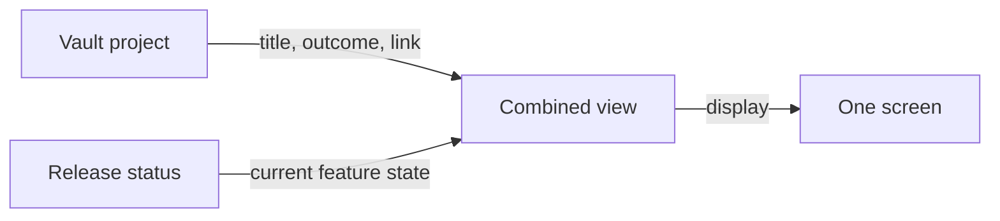

# Vault project + release status view

A small command joins project intent from agentic-vault with delivery progress from ps-release-workflow. Each system remains the writer and source of truth for its own records.

## Outcome

From one vault project ID, a person or agent can see the project's title/outcome and the current status of one linked release feature. The user approved a local CLI slice; it does not publish or deploy anything.

## Ownership and interface

| Data | Owner | Integration command |
|---|---|---|
| Project title, outcome, research, decisions, link metadata | agentic-vault through `vault-engine` OCC commit | `ps-work link` writes through that command; `ps-work show` reads through `read-record` |
| Feature, epic, and release state | ps-release-workflow catalogs and release state | `psrw status --json --repo PATH` reads |
| Combined display | no persisted owner | `ps-work show PROJECT_ID --vault-root PATH` reads both |

The project link uses optional scalar frontmatter fields `release_repo` and `release_feature_id`. The former is the absolute path to the **main checkout root** of an opted-in local repository; linked worktree paths are rejected. The latter is one `F-NNN` ID. One project links to one feature in v1. Existing projects need no migration. The local path is machine-specific; portable repository identity is deferred. Add the optional fields to `project-v1.json` for discoverability. That JSON schema is not currently the Go mutation gate, so `ps-work link` validates the pair when writing, and `ps-work show` validates it when reading.

`psrw status --json` emits a small versioned response: `schema: "psrw-status/v1"`, `opted_in: true`, `release: {version, in_progress}`, `features: [{id, title, status, release_version}]`, and `epics: [{id, title, status}]`. It excludes worktree paths, owners, claim data, and internal hints. A missing/non-opted-in repo emits the same schema with `opted_in: false` and `error: {code: "not_opted_in", message: "..."}`; other collection failures use `status_unavailable`. All modes keep exit code 0, matching the existing SessionStart contract. Text output remains unchanged. `--json` and `--brief` are mutually exclusive.

The standalone `bin/ps-work` command has two operations:

- `ps-work link PROJECT_ID --vault-root PATH --repo MAIN_ROOT --feature F-NNN [--actor NAME]` checks that the repo is an opted-in main checkout and that the feature ID exists in the status snapshot, then reads the project SHA and writes only the two link fields via `vault-engine commit`. It is run by the orchestrator or a human, not a leaf agent.
- `ps-work show PROJECT_ID --vault-root PATH [--json]` reads the project with `vault-engine read-record` and then the linked repository with `psrw status --json --repo`. It never calls a write operation. It displays project ID/title/outcome (using title if outcome is absent), feature ID/title/status, and release version. `--vault-engine` and `--psrw` flags allow nonstandard installations and test fixtures.

Both operations pass `VAULT_ROOT=PATH` in the vault-engine child environment and use subprocess argument arrays, never a shell. They treat `psrw` JSON `opted_in: false` as unavailable despite its zero exit code.

## Flow

The `show` operation does not copy feature state into a vault note. The `link` operation writes only link metadata through the vault's existing optimistic concurrency protocol. No background synchronization is introduced.

## Failure behavior

- No project link: show the project context and a `link_missing` state.
- Malformed link or linked worktree path: show `link_invalid` without launching psrw from `show`; `link` refuses before vault commit.
- Linked feature absent from the live status: show `feature_not_found` with the supplied ID, without title matching.
- Release status unavailable or repo not opted in: show `release_unavailable`; keep project context visible and do not show cached progress.
- Vault record unavailable or not a project: report a clear command error. No release lookup follows.
- Vault OCC conflict on `link`: report the conflict and leave the project unchanged. The user may retry after re-reading.
- `show` reflects one `read-record` response; no lock or write is held.

## Verification

1. Focused tests for `psrw status --json`: versioned success shape, non-opted-in repo, unavailable status, text compatibility, and no identity-state write.
2. Focused tests for `ps-work link/show`: valid link, missing/invalid link, worktree path rejection, missing feature, unavailable release, malformed child output, and OCC conflict. Assert `show` invokes no mutating command.
3. One temporary vault + release-repo fixture exercises the two CLIs and checks source files are unchanged after `show`.
4. Run repository gates, independent code review, fix findings, and re-verify. Ship the feature into release 1.8 only after gates pass.

## Appendix — audit trail

- 2026-09-29 self-grill-audit: verdict safe with fixes. Constrained `release_repo` to a main checkout; passed `VAULT_ROOT` to vault-engine; narrowed JSON to a versioned DTO; specified link-time and read-time validation; mapped the displayed goal to project `outcome` or title. Open: none.
