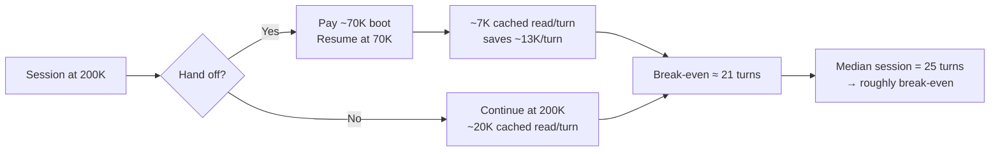

# Handoff Token Economics — Measured Analysis & Solution

**Question asked:** *"Per handoff, I think it will burn more token — do analysis how to reduce token usage and synthesize solution."*

**Verdict:** You are right, but the cost is not where the skill tries to control it. The handoff *document* is negligible (~1.5K tokens). The handoff *act* costs ~70K tokens, because that is what a cold session boot costs before any work happens.

<div class="metric-grid">
<div class="metric-tile alarm"><b>69,796</b><span>median cold-start floor (tokens) — paid before turn 1</span></div>
<div class="metric-tile alarm"><b>34%</b><span>of sessions never exceed that floor</span></div>
<div class="metric-tile"><b>9%</b><span>of sessions actually reach the 200K handoff threshold</span></div>
<div class="metric-tile"><b>~1.5K</b><span>tokens: the handoff doc itself (the thing the skill optimizes)</span></div>
</div>

---

## 1. Measurement method <span class="topic-chip">evidence</span>

All numbers below are measured, not estimated. Sources:

| Metric | Source | n |
|---|---|---|
| Cold-start floor | `cache_creation + cache_read` on first usage block per transcript | 389 sessions |
| Peak context | max `cache_read_input_tokens` per transcript | 390 sessions |
| Handoff doc size | `wc -c /tmp/handoff-*.md` | 83 docs |
| Session volume | `find ~/.claude/projects -name '*.jsonl' -mtime -7` | 1,029 sessions |
| CLAUDE.md weight | `wc -c ~/.claude/CLAUDE.md` | 28,475 chars |

**Stated assumption:** token estimates from byte counts use ~4 chars/token. Cost reasoning assumes the 1-hour prompt-cache TTL noted in the current session, with cache reads at roughly 0.1x base rate.

---

## 2. What the data says

### 2a. The floor dominates everything

```
cold-start floor    median  69,796   mean  61,667   p90  79,938
peak session ctx    median 101,779   mean 124,071   p90 191,483
```

A median session opens at **~70K** and peaks at **~102K**. That means the median session does roughly **32K tokens of actual work** on top of a 70K entry fee — a **69% overhead ratio**.

<div class="callout danger">
<b>The core finding.</b> 34% of sessions (136/390) never exceed 80K peak — they pay the full ~70K boot and then do less than 10K of real work. For that third of all sessions, the session itself is almost entirely overhead, and a handoff into another one is a pure loss.
</div>

### 2b. Handoff frequency is not driven by context pressure

- **83 handoff docs in 6 days** (44 on 2026-09-13 alone).
- But only **9% of sessions (37/390) ever exceed 200K**, the auto-handoff threshold.

So the Stop hook is *not* the main trigger. The 44-in-one-day spike is the multi-lane orchestration pattern — handoff used as an inter-agent message bus, not as context relief. Each of those spawns pays the full 70K floor.

**83 handoffs x ~70K = ~5.8M tokens in 6 days spent purely re-booting sessions.**

### 2c. The skill optimizes the wrong object

The skill's rule 3 says *"Keep the document lean (target ≤ 1KB - 2KB)."*

- Actual doc size: **mean 5,895 bytes, median 5,189, max 13,842**.
- **82 of 83 docs (99%) exceed the 2KB target.**

And it does not matter. At ~1.5K tokens mean, the doc is **2% of the cost of the handoff it triggers**. The lean-doc rule is being violated almost universally with no measurable consequence, while the real 70K cost is unmentioned by the skill.

<div class="callout warn">
<b>Two genuine correctness bugs found (not token bugs, but worth fixing):</b><br>
• <b>Nested handoffs:</b> 15/83 docs reference another handoff file — violating the skill's own "NEVER" rule 1.<br>
• <b>Claim protocol gap:</b> section 0 appears in only 14 docs. Of the ~31 docs written since the rule landed (2026-09-14), roughly half omit the mandatory claim block — the exact race the rule exists to prevent.
</div>

### 2d. Break-even: is a handoff ever worth it?



Handing off at 200K saves ~13K of cached re-read per subsequent turn, against a ~70K one-time boot. **Break-even lands near 21 turns; the median session runs 25.** So on pure token cost, handoff is close to a wash — it only wins if the new session runs long.

<div class="callout info">
<b>Important:</b> the handoff skill's real justification was never tokens — it was <b>attention degradation</b> past ~100K. That benefit is real and this analysis does not dispute it. The conclusion is not "stop handing off." It is "stop paying 70K for it, and stop handing off in the 34% of cases that never needed it."
</div>

---

## 3. Where the 70K floor comes from

Measured, controllable components:

| Component | Size | Tokens | Status |
|---|---|---|---|
| `~/.claude/CLAUDE.md` | 28,475 ch | ~7.1K | **Controllable** |
| — of which rule 6 (DEFAULTS) alone | 9,981 ch | ~2.5K | 35% of the file, mostly incident narrative |
| `coplay-mcp` tool surface | ~100 tools | large | **Loaded globally, unused in most repos** |
| `blender` tool surface | ~35 tools | large | **Loaded globally, unused in most repos** |
| SessionStart hook (superpowers full text) | 3,108 ch | ~0.8K | Controllable |
| `RTK.md` | 961 ch | ~0.2K | Fine |
| Skill listing (~200 entries) + core tool schemas | — | remainder | Partly controllable |

`coplay-mcp` (Unity, ~100 tools) and `blender` (~35 tools) are configured in `~/.claude.json` — **global**, so they load in every session including pure-text repos like `ps-skills` where they are dead weight.

---

## 4. Synthesized solution

Ranked by measured impact. Lever 1 is worth more than Levers 2 and 3 combined, because it helps **all 1,029 sessions**, not just the 83 that hand off.

### Lever 1 — Cut the floor (highest value) <span class="topic-chip">~5–15K tok/session</span>

<div class="callout action">
<b>1a. Scope the MCP servers to the repos that need them.</b> Move <code>coplay-mcp</code> and <code>blender</code> out of global <code>~/.claude.json</code> into project-level <code>.mcp.json</code> for the Unity/Blender repos only. Largest single cut, zero behavior loss elsewhere.<br><br>
<b>1b. Compress CLAUDE.md from 28.5KB toward ~10KB.</b> Keep every <i>rule</i>; move the <i>incident narratives</i> (the "established 2026-XX-XX, here is what went wrong" paragraphs) into a referenced <code>~/.claude/incidents.md</code> that is read on demand, not injected every session. Rule 6 alone is 10KB and is mostly story. Saves ~5K tokens x 1,029 sessions/week.<br><br>
<b>1c. Trim the SessionStart superpowers injection</b> — it duplicates guidance already covered by CLAUDE.md rule 10 (skill routing).
</div>

### Lever 2 — Stop handing off when it cannot pay back <span class="topic-chip">~70K per avoided handoff</span>

<div class="callout action">
<b>2a. Add a floor-aware guard to the skill.</b> Before spawning, check current context. Below ~120K, a handoff cannot amortize its own 70K boot — refuse and say so. This directly targets the 34% of sessions that never exceed the floor.<br><br>
<b>2b. Do not use handoff as a message bus.</b> The 44-in-one-day spike is lane coordination. CLAUDE.md rule 6 already says this: dispatch subagents in one session, hand off via files — not by spawning a fresh 70K session per lane. A subagent costs a fraction of a cold start.<br><br>
<b>2c. Keep the 200K auto-threshold.</b> It fires on only 9% of sessions — it is well-calibrated and is not the problem.
</div>

### Lever 3 — Fix the skill's correctness bugs (not token bugs) <span class="topic-chip">quality</span>

<div class="callout action">
<b>3a. Drop the "≤1KB–2KB" doc-size rule</b> or restate it honestly. It is violated 99% of the time and optimizes 2% of the cost — it trains the agent to shave the one thing that does not matter.<br><br>
<b>3b. Make the claim block mechanical, not prose.</b> Per CLAUDE.md rule 11 (enforcement layer): a rule in a template that the generator can skip is decoration. Have <code>herdr-handoff.sh</code> <i>inject</i> section 0 itself and refuse to spawn a doc that lacks it — then compliance is structural, not remembered.<br><br>
<b>3c. Add a nested-handoff check</b> to the same script: grep the doc for <code>handoff-2026*.md</code> and fail loudly. Catches the 15/83 rule-1 violations at the only point that reads them.
</div>

---

## 5. Lever 1a — EXECUTED AND MEASURED (2026-09-16)

`coplay-mcp` and `blender` were moved from global `~/.claude.json` to `/Users/pasitnusso/workspace/repos/joy-board/.mcp.json` (the only Unity project found among 51 tracked). Controlled A/B, same repo, same print-mode invocation:

| Run | Floor (cache_creation + cache_read) |
|---|---|
| Baseline (servers global) | 44,540 |
| After, run #1 | 39,821 |
| After, run #2 | 41,474 |
| **After, mean** | **40,648** |

<div class="callout warn">
<b>Correction to this document's own estimate.</b> Section 4 predicted the MCP de-scope would be the "largest single cut." <b>It is not.</b> Measured saving is <b>~3,900 tokens per session (~9%)</b> — comparable to, not larger than, the CLAUDE.md compression estimate.<br><br>
<b>Why the estimate was wrong:</b> the reasoning counted ~135 tools and assumed full JSON schemas in context. But those MCP tools are <b>deferred</b> — only tool <i>names</i> load at startup, with schemas fetched on demand via ToolSearch. Names are roughly 30 tokens each, not 300. Tool count was the wrong proxy.
</div>

**Confidence:** run-to-run variance is ~1.6K tokens, and the baseline is n=1, so the true delta is ~4K ± 2K. It is a real saving, but it is a 9% trim, not a step change.

### Revised ranking

Lever 1a is done and banks ~4K/session across ~1,029 sessions/week. But the floor is still **~40K** in print mode (~70K interactive), so the dominant cost is **not** MCP. It lives in the core tool schemas, the ~200-entry skill listing, and CLAUDE.md. That makes **Lever 1b (CLAUDE.md compression, ~5K estimated)** now the largest remaining *controllable* item, and **Lever 2 (refusing handoffs below the floor, ~70K each)** still the biggest per-event win by a wide margin.

---

## 6. What I did not verify

Stated explicitly per the no-magic rule:

- ~~The MCP claim rests on tool counts, not measured token deltas~~ — **now measured** (section 5). The tool-count proxy overestimated by roughly 3x because those tools are deferred (names only, not schemas).
- The remaining split between core tool schemas and the ~200-entry skill listing inside the ~40K residual floor. Claude Code does not persist the system prompt in transcripts, so these can only be measured the same A/B way: change one, re-read the first usage block.
- Baseline floor is n=1; run-to-run variance measured at ~1.6K. A tighter delta needs 3+ runs per arm.
- The break-even model in section 2d uses public cache-pricing ratios, not billing data.

## 7. Operational notes from the change

- **Revert:** `cp ~/.claude.json.bak-20260916-234754 ~/.claude.json` restores the previous global config.
- **First run in `joy-board`** will prompt once to approve project-scoped MCP servers — expected, approve it.
- **Blender assets live outside any repo:** `~/Documents/Joymify/` and `~/Documents/Resources/Blenders/`. If Blender is driven from a repo other than `joy-board`, copy the `blender` block from `joy-board/.mcp.json` into that repo's `.mcp.json`.
- `.mcp.json` is already an established pattern here — 10 repos had one before this change.
