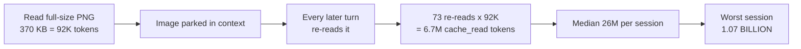

# Token Consumption Analysis

**Question asked:** do auto-handoff, tools, hooks, and skills consume too much token — and can it be optimized?

**Short answer:** three of the four suspects are cheap. The dominant cost is something else entirely — **full-size image reads** — and the rule already banning them has no enforcement mechanism.

<strong>Headline finding.</strong> Image-bearing tool results are <strong>96% of all tool-result weight</strong> in the 12 largest sessions. One full-size image read costs <mark>~92,000 tokens</mark> — 2.3× the entire per-session startup cost — and because it stays in context, it is re-paid on every later turn. A single image read at turn 10 of an 83-turn session can generate <mark>~6.7 million</mark> <code>cache_read</code> tokens by itself.

## Method evidence

Four parallel measurement lanes, all read-only:

| Lane | Source of truth |
|---|---|
| Static context cost | live injected roster + `wc -c` on instruction files |
| Hook overhead | `~/.claude/settings.json` hooks + per-script output measurement |
| Skill bodies | `find -L` over 2,017 `SKILL.md` files |
| **Empirical usage** | `jq` over **2,160 real transcripts / 1.5 GB** in `~/.claude/projects` |

The empirical lane is ground truth and overrides the estimates where they disagree. Estimates use 1 token ≈ 4 chars (prose) / 3.7 chars (JSON).

## Where the tokens actually go

<strong>~92K</strong>tokens per full-size image read

<strong>26M</strong>median cache_read tokens per session

<strong>40.5K</strong>median static baseline per session

<strong>246K</strong>median peak context per session

<strong>~0</strong>per-tool-call hook cost

<strong>~1K</strong>tokens for a handoff doc itself

### Tool-result weight, 12 largest sessions

| Tool | Bytes | Calls | Share of bytes |
|---|---|---|---|
| `Read` — **images** | 43,302,049 | 117 | **79.5%** |
| `mcp__claude-in-chrome` (screenshots) | 8,858,111 | 116 | 16.3% |
| `Bash` | 1,044,641 | **1,674** | 1.9% |
| `Agent` | 302,670 | 202 | 0.6% |
| `Read` — text | 780,546 | 124 | 1.4% |
| `Edit` / `Write` | 80,262 | 333 | 0.1% |

<strong>Read this table twice.</strong> <code>Bash</code> is <strong>60% of all calls but 1.9% of all bytes</strong>. Optimizing command output (which RTK already does well) is rounding error. 233 image-bearing calls out of 2,799 total produce <strong>96%</strong> of the weight.

### Why one image compounds

Median session: 83 assistant turns, ~209K tokens re-processed per turn. That average is *only* explainable by large payloads parked in context — and images are the only payload big enough.

## Verdict per suspect

<strong>Hooks: exonerated.</strong> ~925 tokens once per session start; <strong>genuinely 0 on the common path</strong> — no hook prints on every <code>Bash</code> or <code>Edit</code>. The RTK hook rewrites <code>tool_input</code> and returns a decision, not context prose: effectively free.

<strong>Auto-handoff: mostly exonerated.</strong> The handoff document is ~1K tokens (9.4 KB skill, 2.6 KB avg doc read). Its real cost is indirect: each spawned session re-pays the ~40K static baseline. 84 seeds ≈ <strong>3.4M tokens</strong> — worth fixing via the baseline, not the doc.

<strong>Skills: half-guilty.</strong> Bodies only load on invocation, so the 17 MB / 2,017-file on-disk corpus is <em>not</em> a context cost. But the <strong>roster</strong> — name + description for <strong>147 listed skills</strong> — costs <strong>~7,534 tokens every single session</strong>, and most sessions invoke zero to two skills.

<strong>Tools: half-guilty.</strong> 281 deferred MCP tool names ≈ 2,928 tokens + 1,543 tokens of server prose instructions. <code>coplay-mcp</code> (98 Unity tools) and <code>blender</code> (31 tools) are live in <em>every</em> session regardless of whether the repo has anything to do with Unity or 3D.

## The static baseline, decomposed

Measured median baseline is **40,548 tokens/session**. Component measurement accounts for it almost exactly:

| Component | Est. tokens | Controllable? |
|---|---|---|
| Harness built-in system prompt | ~20,000 | ❌ no |
| Skill roster (147 skills) | 7,534 | ✅ yes |
| `~/.claude/CLAUDE.md` (29 KB) | 7,239 | ✅ yes |
| MCP tool-name manifest (281 tools) | 2,928 | ✅ yes |
| MCP server prose (5 servers) | 1,543 | ✅ partly |
| Agent roster (16 agents) | 1,522 | ✅ yes |
| `RTK.md` | 240 | — |
| **Total** | **~41,006** | **~21,000 controllable** |

Paid on every session start **and re-paid on every `/clear` and every compaction**. Across 2,160 sessions that is roughly **86M tokens spent before any work happened**.

## Ranked optimizations

### Tier 1 — Enforce the image rule (worth millions)

Global rule 12 already says *never read full-size images inline; downscale with `sips -Z 1024` first.* It was violated **117 times in 12 sessions**. Per rule 11: the constraint is written where only a human reads it, so it is decoration.

<strong>IMPLEMENTED &amp; VERIFIED 2026-09-17.</strong> <code>~/.claude/hooks/image-downscale-guard.sh</code>, registered as a <code>PreToolUse</code> hook on <code>Read</code> in <code>settings.json</code> (backup: <code>settings.json.bak-20260917-214815</code>). It mirrors the proven RTK contract — returns <code>permissionDecision: allow</code> plus <code>updatedInput.file_path</code> pointing at a cached downscaled copy.
 <strong>Live end-to-end result:</strong> a 2880×1800 image was served to the model at 1024×640 — <mark>~6,912 tokens → ~873, 87% saved</mark>.

#### Design decisions worth recording

<strong>The first version gated on file bytes, and that was wrong.</strong> Image token cost is ≈ <code>(w × h) / 750</code> — driven by <strong>pixels, not bytes</strong>. The test that caught it: a 2880×1800 screenshot occupying only <strong>17 KB</strong> on disk still costs ~6,912 tokens, and a 200 KB byte-threshold would have waved it straight through. The gate is now <code>max(width, height) &gt; 1024</code>.

Other properties, each covered by a test:

- **Fails open.** Runs on every `Read`; any unexpected condition (bad JSON, missing file, `sips` error, non-macOS) exits 0 silently and the original `Read` proceeds. Never blocks work.
- **No silent degradation.** `permissionDecisionReason` states the downscale, both dimensions, the token saving, and the untouched original path — so exact-pixel work can deliberately re-read the full file.
- **Minimum-gain guard.** Skips when the saving is under 400 tokens (a 1200×700 image saves ~305 and is left alone); churn without benefit is not worth it.
- **Cache correctness.** Key binds path + mtime + size + budget, so editing an image re-keys; a JSON sidecar makes repeat reads a single `cat` instead of two `sips` calls.
- **Cost of the guard itself.** ~0.09s on non-image reads (fast string reject before `jq` spawns), ~0.2s on a cache hit.

<strong>Expected saving:</strong> ~87–98% per image, ≈ <strong>10.6M tokens across the 12 sampled sessions alone</strong>, plus the multiplicative <code>cache_read</code> collapse.

<strong>Still unguarded:</strong> browser screenshot tools (<code>mcp__claude-in-chrome__computer</code> / <code>browser_batch</code>, 8.8 MB / 116 calls) return images <em>inline</em> rather than via a <code>file_path</code>, so a <code>PreToolUse</code> hook cannot downscale them. That path still needs the discipline of batching screenshot iteration inside a subagent.

### Tier 2 — Cut the static baseline (~29% per session)

| Action | Projected | **Actual** | Status |
|---|---|---|---|
| Split `CLAUDE.md`: binding rules stay, post-mortems move out | ~4,200 | **~1,200** | ✅ done |
| Disable zero-usage plugins (24 skills + 3 agents) | ~4,500 | **~1,500** | ✅ done |
| Archive 23 dormant personal skills | — | **~1,180** | ✅ done |
| Disable `coplay-mcp` + `blender` | ~2,400 | **0 — already gone** | ✅ n/a |
| **Total** | **~11,800** | **~3,880** | ⚠️ |

<strong>The ~11,800 projection was optimistic — recording that honestly.</strong> Two reasons it came in lower:
 1. <strong><code>CLAUDE.md</code> is mostly binding text.</strong> 28,955 → 24,119 bytes (17%), not the ~60% assumed. Rule 6 (defaults) and rule 9 (communication style) are almost entirely directives that change behavior; only the dated incident narratives could move. Weakening a rule to save tokens would be a bad trade.
 2. <strong>The roster bloat is the user's OWN skills, not plugins.</strong> Disabling every zero-use plugin removes 24 of 147 roster skills. But <strong>40 of 65 personal skills have never been invoked</strong> — that is where the remaining ~2,050 tokens sit, and those are author-owned, so pruning them is a decision, not a cleanup.

#### Tier 2, as executed

**`CLAUDE.md` split** — 28,955 → 24,119 bytes. All 12 rules present; every load-bearing directive verified still present by grep (R0 classification, the handoff `mkdir` claim command, `AskUserQuestion`, lint-on-save, the render-spec mechanism, the mute hook, `babysit + merge`, `@RTK.md`). Rationale moved to `~/.claude/reference/rule-history.md`, which `CLAUDE.md` now points to with an instruction to read it *before changing any rule* — so the history is loaded exactly when it is load-bearing and never otherwise. Backup: `CLAUDE.md.bak-2026-09-17-215350`.

**Two defects fixed in passing, not copied forward:**

- Rule 12 told agents to use `view_file` with `StartLine`/`EndLine` and to locate symbols with `grep_search` / `find_by_name`. **None of those are Claude Code tools** — they are Windsurf/Cascade names. `Read` takes `offset`/`limit`; location is `Grep`/`Glob`. The rule had been literally unfollowable as written.
- Rule 12's image guidance is now stated as enforced-by-hook rather than as prose, and corrected to say cost tracks **pixels, not file size**.

**Plugins disabled** in `~/.claude/settings.json` → `enabledPlugins` (backup `settings.json.bak-20260917-215655`), all with **zero** Skill-tool invocations across 2,167 transcripts:

| Plugin | Removed from roster | Invocations |
|---|---|---|
| `claude-obsidian` | 15 skills + 3 agents | 0 |
| `mattpocock-skills` | 9 skills | 1 (`grilling` — already muted by the user's own hook) |
| `i-have-adhd` | 0 skills | 0 — but removes a latent 6,848-byte `SessionStart` injection |

`frontend-design` was **kept despite zero invocations**: rule 10 names it as the canonical frontend-design pick, so disabling it would break a documented rule to save ~100 tokens. `superpowers` kept (55 invocations).

<strong>A correction to this document's own earlier claim.</strong> An earlier revision said the <code>ecc</code> marketplace was "partially enabled" because <code>skill-comply</code> appeared both in the active roster and under <code>plugins/marketplaces/ecc/</code>. <strong>That was wrong.</strong> <code>ecc@ecc</code> is <code>false</code> in <code>enabledPlugins</code> and contributes zero roster skills; <code>skill-comply</code> is a <em>personal</em> skill at <code>~/.claude/skills/skill-comply/</code>. The error was inferring enablement from a file existing on disk — the exact failure rule 1 (no magic) names. The original measurement lane was right.

<strong>Verification limit, stated plainly:</strong> the skill roster is assembled at session start, so the roster reduction cannot be confirmed from inside the session that made the change. Confirm in the next session by checking that no <code>claude-obsidian:*</code> or <code>mattpocock-skills:*</code> entries appear in the skill listing.

<strong>Do not blanket-delete the <code>ecc</code> marketplace.</strong> A measurement lane reported that no <code>ecc</code> skill appears in the active roster. <strong>That is wrong</strong> — <code>skill-comply</code> is an <code>ecc</code> skill and <em>is</em> active. <code>ecc</code> is partially enabled: 884 skills on disk, mirrored byte-identically a second time in <code>plugins/cache/ecc/</code> (15.2 MB combined, 89% of the whole corpus, ~1,038 of them locale-translated duplicates). Prune selectively, verify the roster shrinks, keep what is used.

The `CLAUDE.md` split is the cleanest win: much of its 29 KB is *narrative about why a rule exists* ("this rule used to say… that failed on 2026-08-09…"). Valuable history, but it does not need to be re-parsed 2,160 times. The binding sentence stays; the post-mortem moves to a linked file.

### Tier 3 — Hygiene

- **Drop the superpowers `SessionStart` hook.** It injects the full 3.4 KB `using-superpowers` skill text on every start/`clear`/**compact** (~862 tokens each time). Global rule 10 already governs skill routing; this is redundant.
- **Clean stale handoffs.** 85 docs / 495 KB accumulated in `/tmp` over 6 days, never removed. Add an age-based sweep.
- **De-duplicate on disk.** The `ecc` double-mirror and the 3× copies of each `motion-*` skill do not cost context tokens, but they slow every discovery scan.

<strong>The pattern across all three tiers:</strong> every real cost here is a payload the harness re-processes on every turn, and every stated rule that would have prevented it lives in prose rather than in config. Fixing the enforcement layer (rule 11) is what makes the saving stick.

### The MCP picture, resolved both blind spots closed

Both unknowns from the first pass are now settled, and both were smaller than feared.

**`coplay-mcp` and `blender` were already gone.** Neither appears in any live config; the only
reference is `~/.claude.json` → `.projects["…/quant"].disabledMcpServers`. They are present in
*this* session only because its process (started 2026-09-15) predates their removal — two
Sep-17 sessions spawn neither. **The ~2,400-token MCP saving was already banked before this work
started**, which is also why the transcript-derived baseline slightly overstates what a new
session actually pays.

**`obsidian-vault`: 13 tools, 5,537 bytes, ~1,496 tokens** — measured by a real MCP
`initialize` + `tools/list` handshake, not estimated. But it has **zero calls in any transcript**
and is probably not loading at all: `claude mcp list` cannot see it, which suggests Claude Code
does not honor `mcpServers` in `settings.json`. Do not budget 1,496 tokens against it without a
fresh-session check.

#### Verified MCP control mechanisms

| Need | Mechanism |
|---|---|
| Disable a local/stdio server | `~/.claude.json` → `.projects["<cwd>"].disabledMcpServers` (per-project; written by the `/mcp` toggle) |
| claude.ai connectors | **Opt-in**, not opt-out: `.projects["<cwd>"].enabledMcpServers` |
| Kill all 7 connectors at once | `disableClaudeAiConnectors: true` in settings, or `ENABLE_CLAUDEAI_MCP_SERVERS=0` |
| Remove permanently | `claude mcp remove <name>` — there is no enable/disable subcommand |

**Real MCP usage across all 261 transcripts:** `claude-in-chrome` **1,425** · `graft` **50** ·
`Claude_Docs` **42** · `Notion` **6** · `Context7` **5** · `Slack` **1** · **everything else 0** —
including Gmail, Google Drive, and Google Calendar.

<strong>Deliberately NOT done:</strong> the global connector kill switch would save the most in one
line, but it is all-or-nothing and would take out <code>Claude_Docs</code> (42 calls) and
<code>Context7</code> (5) along with the dead weight. The per-project <code>disabledMcpServers</code>
route only helps one directory at a time. Cutting the four zero-use Google/Slack connectors
globally is not currently expressible in config — worth raising upstream rather than hacking around.

## Filed, not chased

One-line findings discovered during this work, deliberately not pursued (rule 4):

- **The mermaid validator in `render-spec-md.sh` reports false failures.** `mmdc` cannot find its
  Chrome binary, so it exits non-zero on *every* diagram and every rendered doc is labelled
  "broken". Diagrams still render client-side. Fix: `npx puppeteer browsers install chrome-headless-shell`.
- **Deferred MCP tool names are re-serialized into every transcript turn** — `coplay-mcp` tool
  names appear 355,990 times as raw text across transcripts, Gmail 108,516. Long-lived stale
  sessions pay for servers they never call.
- **85 handoff docs (495 KB) accumulate in `/tmp`** over ~6 days with no cleanup sweep.
- **The `ecc` marketplace is mirrored twice on disk** (`plugins/marketplaces/ecc/` and
  `plugins/cache/ecc/`, 15.2 MB, 89% of the whole `SKILL.md` corpus) while disabled and
  contributing nothing. Disk hygiene only — zero context cost.
- **`~/.claude/commands/` holds 14 slash commands with ~1 total invocation** between them
  (`vault`, `log`, `capture`, `checkpoint`, `retro`, …). Small roster cost; left alone as
  author-owned.
