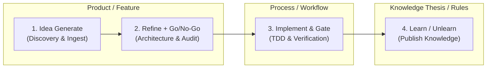

# Agentic Vault Protocol

This skill enforces strict, ultra-deterministic interaction with the autonomous Obsidian knowledge vault (`agentic-vault`).

---

## 🔒 The Non-Negotiable Invariants

1. **Zero Direct File Writes to Canonical Notes:**
   - **LLMs propose; `vault-engine` authorizes, validates, commits, and audits.**
   - Never use direct file editing tools (`replace_file_content`, `write_to_file`, `fs.writeFile`, `sed`, `echo >`) to modify canonical notes under `01_Ideas/`, `02_Projects/`, or `03_Areas/`.
   - All mutations must pass through `vault-engine commit` with optimistic concurrency control (OCC).
2. **The OCC Triangle (Read → Think → Commit):**
   - **Step 1 (Read):** Run `vault-engine read-record <id>` to retrieve the JSON envelope and current SHA-256 hash.
   - **Step 2 (Think):** Conduct model reasoning, research, or evaluation offline without holding any locks.
   - **Step 3 (Commit):** Run `vault-engine commit <id> <expected-sha> <actor> '<mutation-json>' [idempotency-key] [reason]`.
   - **Rejection on Conflict:** If another agent or human modified the note during inference, the commit is rejected with `OCC_CONFLICT`. The agent must re-read and reconcile.
3. **Strict Privilege Ceiling on Recruited Agents:**
   - Recruited subagents (`agent-bestie`, `agent-philip`, domain experts) are leaf workers.
   - They may only produce research artifacts in `_inbox/agent/<name>/`.
   - Only the orchestrator (`agent-olivier` / root orchestrator) or authorized automation may execute commits.

---

## 🛠️ CLI Command Reference (`vault-engine`)

The engine binary is located at `_meta/bin/vault-engine` inside the vault root (or in `$PATH`):

| Command | Usage | Description |
|---|---|---|
| `search` | `vault-engine search <query>` | Instant keyword search across knowledge, projects, and ideas |
| `read-record` | `vault-engine read-record <id>` | Universal record reader (Ideas, Projects, Areas, Knowledge) returning JSON + SHA-256 |
| `commit` | `vault-engine commit <id> <sha> <actor> '<json>' [key] [reason]` | Atomic OCC commit with OS process flock + fsync |
| `publish-knowledge` | `vault-engine publish-knowledge <file> [cat] [by]` | Transactionally validates & publishes a knowledge note with audit event |
| `ingest` | `vault-engine ingest <file_path>` | Ingests raw inbox note, assigns sequence ID `IDEA-YYYY-NNNNNN` |
| `validate` | `vault-engine validate <file_path>` | Validates note YAML frontmatter against JSON Schema |
| `rebuild-index` | `vault-engine rebuild-index` | Rebuilds `_meta/indexes/` (`ideas.jsonl`, `projects.jsonl`, `knowledge.jsonl`) |
| `lock` | `vault-engine lock <id> <agent> <op>` | Acquires explicit task lock |
| `unlock` | `vault-engine unlock <id>` | Releases explicit task lock |
| `validate-dag` | `vault-engine validate-dag <file>` | Validates workflow DAG acyclicity and reachability |
| `validate-agent` | `vault-engine validate-agent <manifest>` | Validates agent recruitment manifest against privilege escalation rules |

---

## 🔄 The Compounding Knowledge Loop (4-Phase Lifecycle)



### 1. Pre-Flight Knowledge Discovery (Before Coding)
Any agent starting work in any repository queries the vault for durable rules and theses:
```bash
vault-engine search "<topic>"
vault-engine read-record "<ID>"
```

### 2. Triage & Project Initiation
Ingest raw discoveries and promote to projects via OCC:
```bash
vault-engine ingest _inbox/human/<note>.md
vault-engine commit IDEA-2026-000004 "<SHA256>" "agent-olivier" '{"status":"candidate"}'
```

### 3. Execution & Claim Protection
Protect in-flight work with `mesh claim <path>` so concurrent agents do not collide.

### 4. Post-Flight Knowledge Compounding (Learn & Unlearn)
When an agent or thinker finishes work, captures lessons, or identifies traps:
```bash
vault-engine publish-knowledge /tmp/new-lesson.md "thesis" "agent-olivier"
```
The note is validated against `knowledge/v1`, stored in `04_Knowledge/`, logged to `_meta/events/`, and added to `_meta/indexes/knowledge.jsonl` so future agents benefit.

---

## 🧪 Verification & Audit

- **Verification Script:** Always verify vault health by executing `bash tools/vault-engine/test_e2e.sh`.
- **Event Audit Stream:** Every state change generates an immutable event log at `_meta/events/YYYY/MM/<timestamp>-<actor>.json`.
- **Schema Contracts:** Schemas live in `_meta/schemas/` (`idea-v1.json`, `project-v1.json`, `area-v1.json`, `knowledge-v1.json`, `technical-audit-v1.json`, `research-notes-v1.json`). All modifications must satisfy these contracts.

