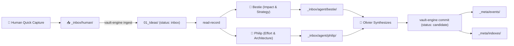

# Agentic Vault Protocol

This skill enforces strict, ultra-deterministic interaction with the autonomous Obsidian knowledge vault (`agentic-vault`).

---

## 🔒 The Non-Negotiable Invariants

1. **Zero Direct File Writes to Canonical Notes:**
   - **LLMs propose; `vault-engine` authorizes, validates, commits, and audits.**
   - Never use direct file editing tools (`replace_file_content`, `write_to_file`, `fs.writeFile`, `sed`, `echo >`) to modify canonical notes under `01_Ideas/`, `02_Projects/`, or `03_Areas/`.
   - All mutations must pass through `vault-engine commit` with optimistic concurrency control (OCC).
2. **The OCC Triangle (Read → Think → Commit):**
   - **Step 1 (Read):** Run `vault-engine read-record <id>` to retrieve the JSON envelope and current SHA-256 hash.
   - **Step 2 (Think):** Conduct model reasoning, research, or evaluation offline without holding any locks.
   - **Step 3 (Commit):** Run `vault-engine commit <id> <expected-sha> <actor> '<mutation-json>' [idempotency-key] [reason]`.
   - **Rejection on Conflict:** If another agent or human modified the note during inference, the commit is rejected with `OCC_CONFLICT`. The agent must re-read and reconcile.
3. **Strict Privilege Ceiling on Recruited Agents:**
   - Recruited subagents (`agent-bestie`, `agent-philip`, domain experts) are leaf workers.
   - They may only produce research artifacts in `_inbox/agent/<name>/`.
   - Only the orchestrator (`agent-olivier` / root orchestrator) or authorized automation may execute commits.

---

## 🛠️ CLI Command Reference (`vault-engine`)

The engine binary is located at `_meta/bin/vault-engine` inside the vault root (or in `$PATH`):

| Command | Usage | Description |
|---|---|---|
| `read-record` | `vault-engine read-record <id>` | Reads note, returns JSON + SHA-256 envelope |
| `commit` | `vault-engine commit <id> <sha> <actor> '<json>' [key] [reason]` | Atomic OCC commit with OS process flock + fsync |
| `ingest` | `vault-engine ingest <file_path>` | Ingests raw inbox note, assigns sequence ID `IDEA-YYYY-NNNNNN` |
| `validate` | `vault-engine validate <file_path>` | Validates note YAML frontmatter against JSON Schema |
| `rebuild-index` | `vault-engine rebuild-index` | Rebuilds `_meta/indexes/ideas.jsonl` and `projects.jsonl` |
| `lock` | `vault-engine lock <id> <agent> <op>` | Acquires explicit task lock |
| `unlock` | `vault-engine unlock <id>` | Releases explicit task lock |
| `validate-dag` | `vault-engine validate-dag <file>` | Validates workflow DAG acyclicity and reachability |
| `validate-agent` | `vault-engine validate-agent <manifest>` | Validates agent recruitment manifest against privilege escalation rules |

---

## 📥 Ingestion & Triage Workflow



### 1. Ingesting Raw Captures
When a note is dropped into `_inbox/human/<note>.md`:
```bash
./_meta/bin/vault-engine ingest _inbox/human/<note>.md
# Returns: Ingested note as IDEA-2026-000004
```

### 2. Triaging with Bestie & Philip
Orchestrator reads the record:
```bash
./_meta/bin/vault-engine read-record IDEA-2026-000004
```
Dispatches parallel subagents:
- **`agent-bestie`**: Evaluates problem, buyer, competitors, ROI, and proposes `impact` (1-5).
- **`agent-philip`**: Evaluates technical stack, latency bounds, dependencies, and proposes `effort` (1-5).

### 3. Committing Evaluated Candidate
Once outputs are synthesized, execute the OCC commit:
```bash
./_meta/bin/vault-engine commit IDEA-2026-000004 "<SHA256>" "agent-olivier" \
  '{"status":"candidate","impact":4,"effort":2,"confidence":4,"strategic_fit":5}' \
  "triage-2026-09-28" "synthesized bestie and philip evaluations"
```

---

## 🎯 Idea to Project Promotion Protocol

When a candidate idea (`impact >= 4`, `effort <= 2`) is approved for execution:
1. Create project folder: `02_Projects/PROJ-<slug>/Project Hub.md` conforming to `project/v1` schema.
2. Link the project ID to the idea via OCC commit:
   ```bash
   ./_meta/bin/vault-engine commit IDEA-2026-000001 "<SHA>" "agent-olivier" \
     '{"project_ids":["PROJ-monthly-close-automation"],"status":"committed"}'
   ```
3. Rebuild indexes:
   ```bash
   ./_meta/bin/vault-engine rebuild-index
   ```

---

## 🧪 Verification & Audit

- **Verification Script:** Always verify vault health by executing `bash _meta/scripts/test_e2e.sh`.
- **Event Audit Stream:** Every state change generates an immutable event log at `_meta/events/YYYY/MM/<timestamp>-<actor>.json`.
- **Schema Contracts:** Schemas live in `_meta/schemas/` (`idea-v1.json`, `project-v1.json`, `area-v1.json`, `technical-audit-v1.json`, `research-notes-v1.json`). All modifications must satisfy these contracts.
