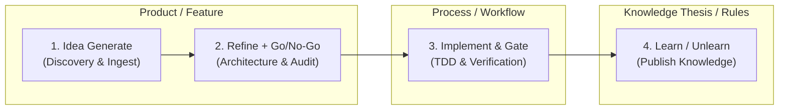

# Agentic Vault Protocol

This skill enforces strict, ultra-deterministic interaction with the autonomous Obsidian knowledge vault (`agentic-vault`).

---

## 🔒 The Non-Negotiable Invariants

1. **Zero Direct File Writes to Canonical Notes:**
   - **LLMs propose; `vault-engine` authorizes, validates, commits, and audits.**
   - Never use direct file editing tools (`replace_file_content`, `write_to_file`, `fs.writeFile`, `sed`, `echo >`) to modify canonical notes under `01_Ideas/`, `02_Projects/`, or `03_Areas/`.
   - All mutations must pass through `vault-engine commit` with optimistic concurrency control (OCC).
2. **The OCC Triangle (Read → Think → Commit):**
   - **Step 1 (Read):** Run `vault-engine read-record <id>` to retrieve the JSON envelope and current SHA-256 hash.
   - **Step 2 (Think):** Conduct model reasoning, research, or evaluation offline without holding any locks.
   - **Step 3 (Commit):** Run `vault-engine commit <id> <expected-sha> <actor> '<mutation-json>' [idempotency-key] [reason]`.
   - **Rejection on Conflict:** If another agent or human modified the note during inference, the commit is rejected with `OCC_CONFLICT`. The agent must re-read and reconcile.
3. **Strict Privilege Ceiling on Recruited Agents:**
   - Recruited subagents (`agent-bestie`, `agent-philip`, domain experts) are leaf workers.
   - They may only produce research artifacts in `_inbox/agent/<name>/`.
   - Only the orchestrator (`agent-olivier` / root orchestrator) or authorized automation may execute commits.

---

## 📁 Folder Map (one layout for every vault)

The agentic Obsidian vault and the Joy voice vault (per-user markdown files in S3, `joy-companion` F-077) use the same top-level folder names, so a note has the same path in either vault. The map follows `docs/superpowers/specs/2026-09-28-agentic-second-brain-design.md`, with `_context/` added for Joy. Rows marked *proposed* are in the spec but the engine does not create or route them yet.

| Folder | Holds | Example |
|---|---|---|
| `_inbox/` | Unsorted captures, by source: `_inbox/human/`, `_inbox/agent/<name>/`; plus `_inbox/tasks/` (unassigned tasks) and `_inbox/private/` (quarantined, never synced). The default whenever the right home is unclear. Joy's voice captures go to `_inbox/agent/joy/` (new convention for Joy, not yet enforced). | `_inbox/agent/joy/2026-10-02-call-the-bank.md` |
| `01_Ideas/` | Raw and candidate ideas | `01_Ideas/IDEA-2026-000123--dark-mode.md` |
| `02_Projects/` | Work with an end. Its tasks and decisions live inside it (`<project>/tasks/`, `<project>/decisions/`). | `02_Projects/khao-yai-trip/README.md` |
| `03_Areas/` | Ongoing responsibilities with no end date (home, health, finance). `tasks/` and `decisions/` sub-folders are *proposed*: the engine routes tasks and decisions only under `02_Projects/` today. | `03_Areas/home/grocery.md` |
| `04_Knowledge/` | Durable, reusable facts and lessons; cross-cutting decisions in `04_Knowledge/decisions/` | `04_Knowledge/decisions/` |
| `05_Daily/` | *Proposed.* One note per local calendar day; link to owned work rather than copy it | `05_Daily/2026/2026-10-02.md` |
| `06_People/` | Person records. **Disabled** until its privacy policy is enforced: do not create it. | — |
| `07_Research/` | Dated, source-bound investigations; promoted to `04_Knowledge/` by a reviewed distillation | `07_Research/sqlite-wal-scale.md` |
| `_sources/` | Original evidence. **Disabled** until its storage policy is enforced: do not create it. | — |
| `_archive/` | Retired notes, kept for history | `_archive/ideas/` |
| `_meta/` | Engine-owned: `bin/`, `schemas/`, `indexes/`, `events/`, `locks/`, `snapshots/`, `ledger/`, `workflows/`, `agents/`, `instances/`, `guards/`. Never written by hand. Agentic vault only. | `_meta/indexes/ideas.jsonl` |
| `_context/` | Joy voice vault only: `SOUL.md`, `MEMORY.md` and the pinned notes that go into the voice session's prompt | `_context/MEMORY.md` |

**Filing rules (both vaults):**

1. **Search before you create.** Add to an existing note before making a new one.
2. **Unsure where it goes → `_inbox/`.** Never invent a new top-level folder.
3. **File names you choose are lower-case kebab-case** with the `.md` extension (`khao-yai-trip.md`, not `Trip Notes.md`). Engine-assigned names (`IDEA-2026-000123--dark-mode.md`) and the fixed names `README.md`, `SOUL.md` and `MEMORY.md` are the exceptions.

**Who writes where:**

- **Agentic vault:** the invariants above apply. Canonical notes under `01_Ideas/`, `02_Projects/` and `03_Areas/` change only through `vault-engine commit`.
- **Joy voice vault:** there is no `vault-engine`. Joy writes through its own vault tools (`vault_write`, `vault_edit`, `vault_append`), which use S3 conditional writes and S3 versioning for undo. The invariants above do not apply there; the folder map and the filing rules do. Those three tools refuse paths under `_context/`: soul and memory change only through `update_soul` and `update_memory`. Joy does not enforce this map yet (tracked as `joy-companion` idea I-090), so until then a note Joy creates may still land at the vault root.

---

## 🛠️ CLI Command Reference (`vault-engine`)

The engine binary is located at `_meta/bin/vault-engine` inside the vault root (or in `$PATH`):

| Command | Usage | Description |
|---|---|---|
| `search` | `vault-engine search <query>` | Instant keyword search across knowledge, projects, and ideas |
| `read-record` | `vault-engine read-record <id>` | Universal record reader (Ideas, Projects, Areas, Knowledge) returning JSON + SHA-256 |
| `commit` | `vault-engine commit <id> <sha> <actor> '<json>' [key] [reason]` | Atomic OCC commit with OS process flock + fsync |
| `publish-knowledge` | `vault-engine publish-knowledge <file> [cat] [by]` | Transactionally validates & publishes a knowledge note with audit event |
| `ingest` | `vault-engine ingest <file_path>` | Ingests raw inbox note, assigns sequence ID `IDEA-YYYY-NNNNNN` |
| `validate` | `vault-engine validate <file_path>` | Validates note YAML frontmatter against JSON Schema |
| `rebuild-index` | `vault-engine rebuild-index` | Rebuilds `_meta/indexes/` (`ideas.jsonl`, `projects.jsonl`, `knowledge.jsonl`) |
| `lock` | `vault-engine lock <id> <agent> <op>` | Acquires explicit task lock |
| `unlock` | `vault-engine unlock <id>` | Releases explicit task lock |
| `validate-dag` | `vault-engine validate-dag <file>` | Validates workflow DAG acyclicity and reachability |
| `validate-agent` | `vault-engine validate-agent <manifest>` | Validates agent recruitment manifest against privilege escalation rules |

---

## 🔄 The Compounding Knowledge Loop (4-Phase Lifecycle)



### 1. Pre-Flight Knowledge Discovery (Before Coding)
Any agent starting work in any repository queries the vault for durable rules and theses:
```bash
vault-engine search "<topic>"
vault-engine read-record "<ID>"
```

### 2. Triage & Project Initiation
Ingest raw discoveries and promote to projects via OCC:
```bash
vault-engine ingest _inbox/human/<note>.md
vault-engine commit IDEA-2026-000004 "<SHA256>" "agent-olivier" '{"status":"candidate"}'
```

### 3. Execution & Claim Protection
Protect in-flight work with `mesh claim <path>` so concurrent agents do not collide.

### 4. Post-Flight Knowledge Compounding (Learn & Unlearn)
When an agent or thinker finishes work, captures lessons, or identifies traps:
```bash
vault-engine publish-knowledge /tmp/new-lesson.md "thesis" "agent-olivier"
```
The note is validated against `knowledge/v1`, stored in `04_Knowledge/`, logged to `_meta/events/`, and added to `_meta/indexes/knowledge.jsonl` so future agents benefit.

---

## 🧪 Verification & Audit

- **Verification Script:** Always verify vault health by executing `bash tools/vault-engine/test_e2e.sh`.
- **Event Audit Stream:** Every state change generates an immutable event log at `_meta/events/YYYY/MM/<timestamp>-<actor>.json`.
- **Schema Contracts:** Schemas live in `_meta/schemas/` (`idea-v1.json`, `project-v1.json`, `area-v1.json`, `knowledge-v1.json`, `technical-audit-v1.json`, `research-notes-v1.json`). All modifications must satisfy these contracts.

## 🔗 Linked release progress

`ps-work link PROJ-ID --vault-root PATH --repo MAIN_CHECKOUT --feature F-NNN` links
one project to one feature. Run it only as the orchestrator or an authorized
human: it reads the project SHA and commits the two link fields through
`vault-engine` OCC. The repository must be an opted-in main checkout.

`ps-work show PROJ-ID --vault-root PATH [--json]` reads the project's goal and
live release status. It never writes either source. The vault owns the project
goal and link; ps-release-workflow owns feature and release state. Missing,
invalid, or unavailable links appear as distinct states rather than cached
delivery progress. Use `--vault-engine` and `--psrw` for nonstandard installs.

A moved or deleted repo path shows `link_invalid`; re-run `ps-work link` with the new path.
