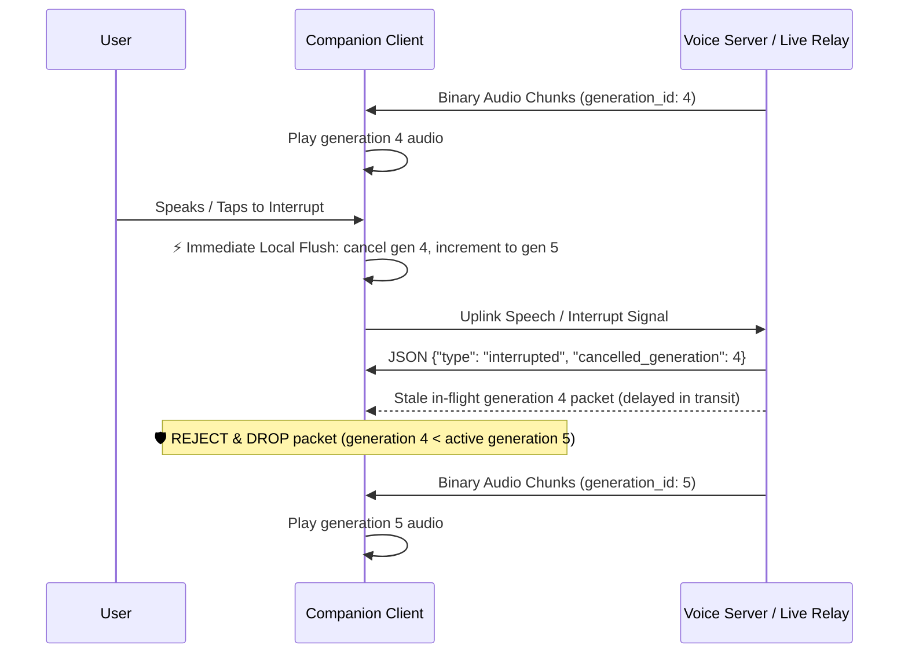

# Real-Time Multimodal Voice Companion Protocol & Audio Standards

You are an expert real-time voice streaming architect specializing in full-duplex conversational AI, WebSocket live relays, and cross-platform companion clients (Web, macOS, iOS, Android, and smart glasses).

---

## When to Apply

Apply this skill whenever building, modifying, or testing any client that streams real-time voice or vision to a conversational AI backend (such as Gemini Live or Joy Companion):
- Designing or implementing WebSocket `/ws/live` clients and wire contracts.
- Resampling audio capture (uplink) and decoding audio playback (downlink).
- Implementing generation-tagged barge-in / interruption handling and bounded queue backpressure.
- Diagnosing silent audio streams, clipping, or connection drops via dual-ended dBFS telemetry.
- Managing safe session state restoration after transient network drops without duplicate side-effects.

---

## Core Protocol Laws & Invariants

### Law 1: Standardized Audio Sampling Contracts & Negotiation
Unless an explicit codec (such as Opus) is negotiated in the connection handshake, all companion clients and servers MUST adhere to the standardized linear PCM formats:

| Stream Direction | Sample Rate | Bit Depth | Channels | Endianness | Wire Format |
| :--- | :--- | :--- | :--- | :--- | :--- |
| **Uplink (Mic → Server)** | **16,000 Hz** (16 kHz) | 16-bit signed integer | 1 (Mono) | Little-Endian | `pcm_s16le` |
| **Downlink (Server → Speaker)** | **24,000 Hz** (24 kHz) | 16-bit signed integer | 1 (Mono) | Little-Endian | `pcm_s16le` |

- **Chunk Cadence & Framing:** Uplink audio chunks should be sent at **100 ms to 200 ms intervals** (3,200 to 6,400 bytes per chunk).
  - *Anti-Pattern (< 20 ms):* Excessive WebSocket frame overhead and TCP packetization.
  - *Anti-Pattern (> 500 ms):* Introduces unacceptable conversational turn-taking latency.

---

### Law 2: Generation-Tagged Barge-In & Buffer Flushing
**Flushing audio queues without generation tracking causes cancelled in-flight packets to replay.**
Every assistant response turn must carry a monotonically increasing `turn_id` or `generation_id`.



1. **Immediate Local Flush:** Do not wait for server acknowledgement (`interrupted` event) to stop local sound. The moment the user speaks (or taps barge-in), immediately mute playback and advance the client's accepted `active_generation`.
2. **Buffer Queue Purge:**
   - **Android:** Call `audioTrack.pause()`, then `audioTrack.flush()`, clear FIFO queues, and resume.
   - **macOS / iOS:** Call `playerNode.stop()`, clear scheduled `AVAudioPCMBuffer` lists, and re-arm.
   - **Web Audio:** Immediately abort active `AudioBufferSourceNode` or reset AudioWorklet ring indices.
3. **Stale Frame Rejection:** Any in-flight audio packet arriving from the network tagged with a cancelled or superseded `generation_id` MUST be dropped immediately.

---

### Law 3: Bounded Queues & Backpressure Management
**Unbounded audio queues cause latency bloat.**
If the network stalls or playback scheduler lags:
- **Downlink Playback Queue:** Cap playback buffer capacity at **500 ms** (12,000 samples @ 24 kHz). If the queue exceeds 500 ms due to scheduling jitter, drop the oldest buffered audio or accelerate playback slightly to maintain real-time sync. Never let buffer latency accumulate into multi-second drift.
- **Uplink Transmission Queue:** If WebSocket backpressure prevents sending mic chunks, keep at most **300 ms** of recent mic audio. Drop older frames. Never block the audio capture thread.

---

### Law 4: Dual-Ended RMS dBFS Telemetry & Diagnostics
Always compute and log Root-Mean-Square (RMS) dBFS on both the client (pre-transmission) and the server (post-reception).

#### Telemetry Math Standard:
- Accumulate sample squares using **Float64** to prevent 32-bit integer overflow.
- Avoid $\log_{10}(0)$ mathematical undefined behavior: clamp pure zeros to `-120.0 dBFS`.

$$\text{RMS} = \sqrt{\frac{1}{N} \sum_{i=1}^N x_i^2}$$
$$\text{dBFS} = \begin{cases} -120.0 & \text{if RMS } = 0 \\ 20 \log_{10}\left(\frac{\text{RMS}}{32767.0}\right) & \text{otherwise} \end{cases}$$

#### Fault Diagnostic Matrix:

| Client RMS | Server RMS | Diagnosis | Action |
|---|---|---|---|
| `-120 dBFS` | `-120 dBFS` | **Hardware / Permission Trap** | Capture device silenced (`AudioSource.VOICE_RECOGNITION`), permission missing, or buffer uninitialized. |
| `-70 dBFS` | `-120 dBFS` | **Transport Drop** | Client capture works, but WebSocket connection dropped, muted, or packets lost in transit. |
| `-75 dBFS` | `-75 dBFS` | **Gain Starvation** | Microphone gain too low (speech indistinguishable from room noise). Apply AGC. |
| `-22 dBFS` | `-22 dBFS` | **Healthy Speech** | Optimal speech signal. Normal operating state. |
| `0 dBFS` | `0 dBFS` | **Digital Clipping** | Excessive gain multiplier. Replace fixed gain with AGC + dynamic peak limiter. |
| `-22 dBFS` | `-22 dBFS` (Model silent) | **Backend / Auth Fault** | Audio signal is healthy. Check LLM API key, upstream quotas, or model generation timeouts. |

---

### Law 5: Transport Security & Network Policy
1. **Production Encryption:** Use `wss://` with TLS 1.3. Real-time microphone audio is sensitive biometric data.
2. **Local LAN Cleartext Security Rule:** Android 9+ (API 28+) blocks cleartext HTTP/WS (`ws://`) by default.
   - For local development with LAN IPs, configure `android:networkSecurityConfig` with an explicit domain or IP exception, or allow cleartext in `AndroidManifest.xml` only in debug builds:
   ```xml
   <!-- AndroidManifest.xml (Debug Only) -->
   <application android:usesCleartextTraffic="true" ... />
   ```
3. **Application Heartbeats:** Standard WebSockets in browsers do not expose transport-level ping/pong controls. Implement JSON heartbeat frames (`{"type": "ping"}` / `{"type": "pong"}`) at 10-second intervals to detect dead links and NAT timeout drops.

---

### Law 6: Safe Reconnection & Session Idempotency
**Blindly resending full conversation transcripts on reconnection can duplicate tool calls and leak privacy.**
1. **Server-Issued Resume Tokens:** Upon initial session establishment, the server returns a signed `session_id` and `resume_token`.
2. **Sequence Numbering:** Both client and server track message sequence numbers (`seq`).
3. **Reconnection Handshake:**
   ```json
   {
     "type": "resume",
     "session_id": "sess-xyz",
     "resume_token": "token-abc",
     "last_seq": 42
   }
   ```
4. **Idempotency Guarantee:** The server only replays events with `seq > last_seq` and resumes the existing conversation context. If the session has expired or the token is invalid, the server replies with `{"type": "session_expired"}` and the client cleanly starts a fresh session.

---

## ❌ Don'ts & Common Traps

| Anti-Pattern | Consequence | Correct Pattern |
|---|---|---|
| Unversioned barge-in flush | In-flight cancelled frames replay after user interruption | Use `turn_id`/`generation_id` tags and drop stale frames |
| Blind transcript replay on reconnect | Duplicated tool executions and hallucinated multi-turns | Use `resume_token` + `last_seq` state recovery |
| Plain `ws://` in production | Unencrypted audio intercepted; blocked by modern mobile OS | Use `wss://` in production; debug exceptions only for LAN |
| Unbounded audio queues | Buffer bloat creates multi-second conversational lag | Cap queues at 500ms; drop stale frames on backpressure |
| Mathematical $\log_{10}(0)$ in telemetry | Returns `NaN` or `-inf`, crashing metric aggregators | Clamp zero-RMS signals to `-120 dBFS` |

---

## Verification Checklist

- [ ] **Generation Rejection Test:** Inject an artificially delayed packet from a prior turn; verify the client silently discards it.
- [ ] **Queue Depth Soak:** Simulate high network latency (200ms); verify buffer queue never exceeds 500ms.
- [ ] **Dual-Ended dBFS Validation:** Confirm client and server RMS match within 1.5 dBFS across quiet, normal, and loud speech.
- [ ] **Safe Reconnect Test:** Disconnect socket during active dialogue; reconnect with `last_seq` and verify no duplicate assistant responses or tool calls occur.
