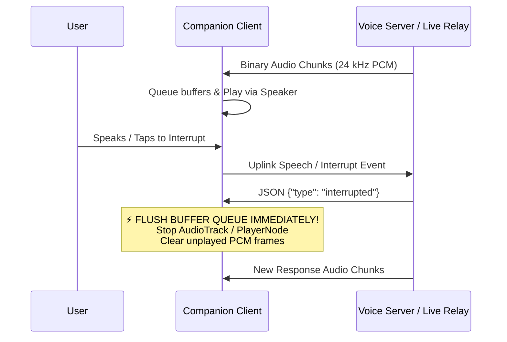

# Real-Time Multimodal Voice Companion Protocol & Audio Standards

You are an expert real-time voice streaming architect specializing in full-duplex conversational AI, WebSocket live relays, and cross-platform companion clients (Web, macOS, iOS, Android, and smart glasses).

---

## When to Apply

Apply this skill whenever building, modifying, or testing any client that streams real-time voice or vision to a conversational AI backend (such as Gemini Live or Joy Companion):
- Designing or implementing WebSocket `/ws/live` clients.
- Handling audio capture resampling (uplink) and playback decoding (downlink).
- Implementing barge-in / interruption handling and audio buffer queue management.
- Diagnosing silent audio streams, clipping, or connection drops via dual-ended dBFS telemetry.
- Managing session state restoration after transient network drops.

---

## Core Protocol Laws & Invariants

### Law 1: Strict Audio Sampling Contracts
All companion clients and servers MUST adhere to the standardized linear PCM formats:

| Stream Direction | Sample Rate | Bit Depth | Channels | Endianness | Format Name |
| :--- | :--- | :--- | :--- | :--- | :--- |
| **Uplink (Mic → Server)** | **16,000 Hz** (16 kHz) | 16-bit signed integer | 1 (Mono) | Little-Endian | `pcm_s16le` |
| **Downlink (Server → Speaker)** | **24,000 Hz** (24 kHz) | 16-bit signed integer | 1 (Mono) | Little-Endian | `pcm_s16le` |

- **Chunk Size / Cadence:** Uplink audio chunks should be sent at 100 ms to 250 ms intervals (e.g., 3,200 to 8,000 bytes per chunk). Sending chunks smaller than 20 ms creates excessive WebSocket framing overhead; sending chunks larger than 500 ms introduces audible turn-taking latency.

---

### Law 2: Mandatory Barge-In Buffer Flush
**When an `interrupted` event is received, the client MUST instantly stop playback and purge all queued audio buffers.**

- **Android:** Call `audioTrack.pause()`, then `audioTrack.flush()`, then clear any in-memory FIFO queue before resuming `audioTrack.play()`.
- **macOS / iOS:** Call `playerNode.stop()`, clear the pending `AVAudioPCMBuffer` array, and re-schedule buffers cleanly.
- **Web Audio:** Immediately disconnect the scheduled `AudioBufferSourceNode` or reset the custom AudioWorklet ring buffer index.
- *Violation Consequence:* If unplayed buffers remain in the playback queue, the assistant will continue speaking old sentences for 1–3 seconds while simultaneously responding to the new query, producing a disorienting echo effect.

---

### Law 3: Dual-Ended RMS dBFS Telemetry
**Always compute and log Root-Mean-Square (RMS) dBFS on both the client (pre-transmission) and the server (post-reception).**

Formula:
$$\text{RMS} = \sqrt{\frac{1}{N} \sum_{i=1}^N x_i^2}$$
$$\text{dBFS} = 20 \log_{10}\left(\frac{\text{RMS}}{32767.0}\right)$$

#### The 4 Diagnostic Signal Zones:

| dBFS Range | Signal Interpretation | Root Cause / Action |
| :--- | :--- | :--- |
| **`-120 dBFS`** | **Pure Silence (All Zeros)** | **Hardware / Permission Trap.** The client is sending empty `0x00` bytes. Check for silenced `AudioSource` (e.g. Rokid `VOICE_RECOGNITION`), ungranted OS mic permissions, or uninitialized audio buffer indices. |
| **`-85 to -55 dBFS`** | **Ambient Room Noise / Whisper** | **Low Gain.** If user is actively speaking but level remains in this zone, hardware input gain is too low (e.g. smart glasses mic requiring AGC boost). |
| **`-30 to -12 dBFS`** | **Optimal Human Speech** | **Healthy Operating Range.** Clear articulation with adequate headroom for STT models. |
| **`-3 to 0 dBFS`** | **Clipping & Distortion** | **Excessive Gain.** Fixed gain multipliers are over-amplifying voice peaks, causing digital clipping. Replace static multiplier with an AGC + dynamic limiter. |

- *The Golden Rule of Audio Debugging:* Before reporting that a speech/LLM model "ignored the user", compare client `rms_dbfs` with server `up_rms_dbfs`. If `up_rms_dbfs` is `-120 dBFS`, the issue is 100% on the client capture pipeline.

---

### Law 4: Duplex Strategy (Full-Duplex vs Walkie-Talkie)
Choose the duplex mode based on verified hardware Acoustic Echo Cancellation (AEC):

1. **Full-Duplex Mode (Simultaneous Mic + Speaker):**
   - **Requirement:** Verified hardware or OS-level AEC (e.g. macOS `AUVoiceProcessing` on Apple Silicon, iOS system VoiceProcessingIO, or high-end speakerphone DSP).
   - Both mic streaming and speaker playback run concurrently.
2. **Half-Duplex "Walkie-Talkie" Mode (Suppressed Mic during Playback):**
   - **Requirement:** Smart glasses, single-board computers, raw USB mics, or platforms where speaker audio leaks directly into the microphone.
   - When the assistant state is `SPEAKING`:
     - Stop transmitting uplink microphone packets.
     - Hold mic suppression for an additional **300 ms to 500 ms hangover tail** after the last audio packet finishes playing to allow room reverb to dissipate.
     - Allow user to barge in by tapping the device or pressing a physical key.

---

### Law 5: Reconnect Resilience & Memory Re-Send
Real-time companion devices frequently experience Wi-Fi roaming or cellular drops:
- **Heartbeat & Dead Link Detection:** Keep-alive ping/pong frames every 10–15 seconds. If pong fails within 5 seconds, treat connection as dead and reconnect.
- **Exponential Backoff:** Reconnect using 500ms initial delay, 1.5x multiplier, with random jitter up to a 10s ceiling.
- **Context Resend on Reconnection:** On reconnect, send a context restoration payload:
  1. The last known `session_id`.
  2. The assistant personality / system prompt.
  3. The last 3–5 dialogue turns (or condensed memory summary) so the conversation resumes seamlessly without the user needing to repeat themselves.

---

## ❌ Don'ts & Common Traps

| Anti-Pattern | Consequence | Correct Pattern |
|---|---|---|
| Sending 48 kHz or 44.1 kHz audio to 16 kHz server | Garbled, chipmunk-pitched speech; transcription fails | Resample on client to exactly 16,000 Hz `pcm_s16le` |
| Queuing playback audio without flushing on `interrupted` | Assistant continues speaking cancelled thought over new response | Purge audio player queue immediately on `interrupted` event |
| Blaming LLM backend when speech isn't recognized | Wastes hours debugging prompts when client was sending pure zeros | Check `up_rms_dbfs` on server; verify speech is > `-35 dBFS` |
| Full-duplex voice on smart glasses without hardware AEC | AI hears its own voice from glasses speakers and interrupts itself | Use half-duplex walkie-talkie mode with 400ms hangover tail |
| Discarding session memory on socket reconnect | Assistant forgets prior conversation turns mid-task | Cache and resend recent turn transcript on reconnection |

---

## Verification & Compliance Checklist

- [ ] **Sample Rate Verification:** Verify uplink is 16 kHz mono 16-bit LE; verify downlink is 24 kHz mono 16-bit LE.
- [ ] **Barge-In Flush Test:** Trigger an interruption mid-sentence. Verify playback halts in < 150 ms with zero hangover from the previous response.
- [ ] **Silence Probe Test:** Mute the mic and verify RMS dBFS registers below `-70 dBFS`. Speak normally and verify RMS dBFS is between `-30` and `-15 dBFS`.
- [ ] **Echo Isolation Test:** Place device in a quiet room, play an assistant reply, and verify uplink RMS remains below `-65 dBFS` (or mic is cleanly muted in half-duplex mode).
- [ ] **Network Drop Recovery:** Kill the server or toggle Wi-Fi off/on. Verify client automatically reconnects and maintains conversation context.
