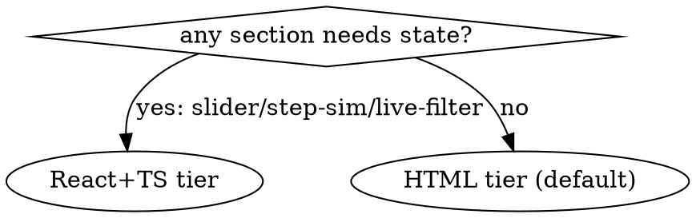

# ps-commu-explain

Build a fact-checked, visually rich explanation served from /tmp; hand over a verified URL. Scripts: `~/.claude/skills/ps-commu-explain/scripts/`, all with `--help`. ALWAYS serve via `scripts/serve.sh` — never an ad-hoc server.

## When NOT to use

- Answerable in a few sentences of chat.
- Durable document → render-spec.
- Headless/CI (no Chrome) — degrade per step 6.

## Modes

- `list` → `scripts/list.sh`. `clean` → `scripts/clean.sh` — wipes ALL apps. One app: `scripts/stop.sh <slug>`.
- Existing slug: re-serve / update (step 4) / rebuild.

## Workflow (todo per step)

1. **Analyze** — read real sources. Every claim traces to a file:line or a user answer. Gaps → AskUserQuestion. Never invent.
2. **Fact sheet** — `01-factsheet.md` in the workspace, every fact with a source ref. Nothing enters the app unless it is here.
3. **Key areas** — `02-key-areas.md`, ranked. Confirm only if ambiguous.
4. **Outline** — `03-outline.md`: tag each section from `references/visual-components.md`. Tier:

5. **Build** (REQUIRED SUB-SKILL: frontend-design) — `scripts/init.sh <slug> [--tier react]`, copy `assets/template-*`, write content. React: `npm ci` inside `app/`.
6. **Verify loop** (REQUIRED SUB-SKILL: superpowers:verification-before-completion) — React: `tsc --noEmit` + `vite build` pass. Both tiers: `scripts/serve.sh <slug> --dev`, open in Chrome, ZERO console errors, screenshot every section on cycle 1 (later: only fixed ones), compare vs outline. Browser unavailable/denied → curl + build checks, stating what went unverified. Repeat ≤5 cycles, then report defects honestly.
7. **Handoff** — React: `vite build`, then `scripts/serve.sh <slug>` (dist, 24h watchdog). Give full URL, per-section summary, `list.sh` output, cleanup hint (`clean`); offer artifact copy-out.

## Rationalizations (from baselines)

| Excuse | Reality |
|---|---|
| "I read the code, a fact sheet is overhead" | Baseline agents shipped pages invented in one tool call. The fact sheet IS the no-hallucination gate. |
| "Open it in any browser" / "Ready, it's live" | Said in baselines, unverified. Ready = Chrome load + clean console THIS cycle. |
| "I'll just python -m http.server it quickly" | Baselines exposed all of /tmp on all interfaces, forever. serve.sh: loopback, scoped doc root, 24h self-destruct. |
| "React would look more impressive" | Animation and diagrams are in the HTML tier. State or HTML. |
| "Cycle 6 will definitely fix it" | 5 cycles, then an honest defect list. Never claim unverified success. |

## Red flags — STOP

- App content with no matching fact-sheet entry
- Any hand-started server instead of scripts/serve.sh
- React without a state-requiring section
- "Ready" without a Chrome load + console read this cycle
