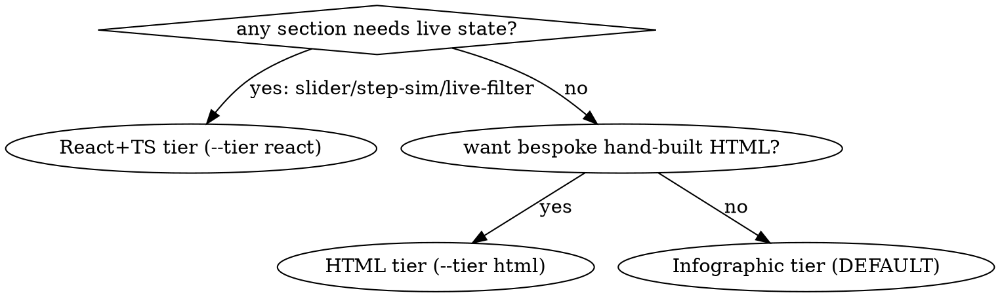

# ps-commu-explain

Build a fact-checked, visually rich explanation served from /tmp; hand over a verified URL and the reader's own answers. Scripts: `~/.claude/skills/ps-commu-explain/scripts/`, all with `--help`. ALWAYS serve via `scripts/serve.sh` — never an ad-hoc server.

## When NOT to use

- Answerable in a few sentences of chat.
- Durable document → render-spec.
- Headless/CI (no Chrome) — degrade per Stage 5, state what went unverified.

## Tiers

- **infographic (DEFAULT)** — cream, Markdown-driven explainer rendered by cherry-markdown + Mermaid + Lucide. You author `app/content.md`; you do NOT touch `app/index.html`. Component cheat-sheet ships live at `app/components.md` (served alongside). This is the default look — `init.sh <slug>` with no `--tier`.
- **html** (opt-in `--tier html`) — the classic bespoke, hand-written HTML tier. You edit `app/index.html` in place.
- **react** (opt-in `--tier react`) — interactive React+TS, for sections that need state (slider / step-sim / live-filter).



## Modes

- `list` → `scripts/list.sh`. `clean` → `scripts/clean.sh` — wipes ALL apps. One app: `scripts/stop.sh <slug>`.
- Existing slug: re-serve / update (Author stage) / rebuild.

## The six-stage chain

Each stage produces a file the next one reads. `lint.sh <slug>` is the single script that checks all four authoring files; `serve.sh` runs it automatically before binding and refuses (exit 1 + defect list) on failure. `--no-lint` skips `lint.sh` entirely — on ANY tier, there is no tier check gating it — which turns off every one of lint.sh's checks at once: fact-citation verification, forbidden-component checks, Mermaid edge-label checks, and the brief/facts/storyboard checks. It's intended for the html/react tiers' dev loops (serve.sh's own comment), not as a general-purpose escape hatch; passing it on real authored infographic content is genuinely risky, not a narrower or safer option.

| # | Stage | Output | Checked by |
|---|---|---|---|
| 1 | Brief | `00-brief.md` — exactly 3 numbered reader questions (Q1-Q3) and a section budget (integer, 4-7) | `init.sh` scaffolds it (never overwrites an existing one); `lint.sh` rejects unfilled `(...)` placeholders, a wrong count of Q1-Q3, or a missing/bad section-budget integer |
| 2 | Facts | `01-facts.md` — `F<n> \| statement \| source` rows (source: `path:line`, bare path, commit hash, or `"user said"`), gathered by a subagent | `lint.sh` rejects a bad source shape and any `F<n>` content.md cites that isn't a row here |
| 3 | Storyboard | `02-storyboard.md` — one row per planned `app/content.md` section: `section \| question (Q1-Q3) \| facts (F<n>,...)` | `lint.sh` rejects an uncovered Q1-Q3, or a row citing an `F<n>` missing from 01-facts.md |
| 4 | Author | `app/content.md` — **ships pre-filled with the shipped exemplar (cites F1-F19)**; replace it wholesale, or run `init.sh --example <slug>` to pair it with a matching filled 00-brief/01-facts/02-storyboard so it lints clean immediately. Component set v3 (cheat-sheet live at `app/components.md`) | `lint.sh` rejects removed classes (`stat-grid`, `stat-tile`, `meter`, `cat-*`, `metric-grid`, `card-grid`), unlabeled Mermaid edges, >7 nodes per diagram, and any uncited `F<n>` |
| 5 | Verify | render gate (`verify.sh`, **infographic tier only**) then reader gate (subagent, `verify.sh --dump-text` output) | both pass on infographic (html/react: a subagent Chrome load stands in for the render gate — see below), or an honest defect list — ≤5 cycles |
| 6 | Handoff | URL + the 3 questions/reader answers + re-serve command | prose |

## Subagent budgets (hard rule)

- **Facts (Stage 2):** dispatch a subagent per source area to read/grep and return `F<n> | statement | source` rows — never grep the target codebase from the main thread yourself.
- **Authoring cycles (Stage 4):** you author `content.md` in the main thread, but every check of the rendered result — Chrome load, screenshot, console read — runs in a subagent that returns ≤15 lines (status + defects, never a transcript). Screenshots are never taken inline in the main thread; this mirrors the token-economy rule that images are the biggest context burner.
- **Reader gate (Stage 5):** always a fresh subagent, given ONLY the rendered page text (`verify.sh <slug> --dump-text`) — never the brief/facts/storyboard files. Use the verbatim prompt below.
- **Cap:** ≤5 verify/fix cycles total (render + reader together). On cycle 5's failure, STOP and report the honest defect list — never continue silently or claim success.

## Verify: render gate + reader gate

`scripts/verify.sh` is **infographic-tier only** (hard-requires `app/content.md`, a `.cherry-previewer` subtree, `app/explainer.css`; `FAIL: doc not found` on html/react — there, `lint.sh` still gates Stages 1-3, but the render check becomes a subagent Chrome load — console + screenshot, ≤15 lines — and the reader gate covers whatever inline `F<n>` markup you authored). On infographic, `scripts/verify.sh <slug>` loads the served page in headless Chrome and prints 6 PASS/FAIL/SKIP asserts: Mermaid `<svg>` count == fenced ` ```mermaid ` count; no `~~CODE` placeholder leak; no raw `data-nav` text in body; zero page-origin console errors; nav-click scrollY change (permanent SKIP — a DOM dump can't dispatch clicks); served `explainer.css` has no `scroll-behavior` declared (the static regression gate for the click-to-jump root cause). Exit 0 = every non-skipped assert passed; exit 2 = no Chrome/no server, treat as SKIP never pass. `verify.sh --help` for detail.

A clean render gate is necessary, not sufficient. Get the reader gate's input with `scripts/verify.sh <slug> --dump-text` — it reuses the same `.cherry-previewer` extractor the asserts above use and prints the clean, reader-visible text to stdout (never hand-extract from `--dump-dom`: that returns duplicated toolbar/source-pane/preview copies, plus raw `data-nav` markup and unrendered ` ```mermaid ` fences). Dispatch the reader-gate subagent below with that text. It must answer the brief's 3 questions with `F<n>` citations, pulled from the page's own Receipts footer, before the page counts as done.

### Reader-gate prompt (paste verbatim, fill the brackets)

```
You are an independent reader. You have NOT seen this project's 00-brief.md, 01-facts.md,
02-storyboard.md, or any source file — only the page text below, exactly as a browser would
render it. Do not use outside knowledge, do not guess, do not infer from a file you were not given.

PAGE TEXT (from <URL>):
"""
<PASTE THE FULL RENDERED PAGE TEXT HERE>
"""

Answer these three questions using ONLY the text above:
Q1: <paste 00-brief.md's Q1>
Q2: <paste 00-brief.md's Q2>
Q3: <paste 00-brief.md's Q3>

For each: give a 1-3 sentence answer, then cite the F<n> id(s) the page itself attributes to
that claim. Never invent a citation. If the text doesn't answer a question, write UNANSWERABLE
and name what's missing.

Return exactly this, nothing else:
Q1: <answer> — F<n>[, F<n>...]
Q2: <answer> — F<n>[, F<n>...]
Q3: <answer> — F<n>[, F<n>...]
Verdict: PASS (all three answered with real citations) | FAIL (name which failed and why)
```

## Handoff

Report: the URL, the brief's 3 questions with the reader-gate's answers + citations, `list.sh` output, cleanup hint (`clean.sh` / `stop.sh <slug>`), and the re-serve command (`serve.sh <slug>`). Offer an artifact copy-out. Explainers stay under `/tmp`, never committed.

## Rationalizations (from baselines)

| Excuse | Reality |
|---|---|
| "I read the code, a fact sheet is overhead" | `lint.sh` rejects any `F<n>` *cited* with no matching row in 01-facts.md — but it does NOT require citations to exist; content with zero `F<n>` citations lints clean. The reader gate (Stage 5) is what actually fails a page that cites nothing, so both gates are needed. |
| "Console is clean, ship it" | Console errors are 1 of 6 `verify.sh` asserts, and a clean render gate still isn't a reader gate — it must independently answer the brief's 3 questions with citations. |
| "--no-lint gets past the gate" | `--no-lint` skips `lint.sh` entirely, on any tier — it turns off fact-citation checking, forbidden-component checks, Mermaid edge-label checks, and the brief/facts/storyboard checks all at once. It's meant for the html/react dev loops, not a safe way to skip the infographic chain. |
| "I'll skip 00-brief.md, the diagram speaks for itself" | `lint.sh` rejects unfilled `(...)` placeholders, a wrong count of Q1-Q3, or a missing section budget — `serve.sh` won't serve until it's clean. |
| "I'll just python -m http.server it quickly" | Baselines exposed all of /tmp on all interfaces, forever. `serve.sh`: loopback-only, scoped doc root, watchdog self-destruct. |
| "React would look more impressive" | Animation and diagrams live in the HTML tier too. State or HTML — react is opt-in, only for sections that need it. |
| "Cycle 6 will definitely fix it" | ≤5 cycles, then an honest defect list. Never claim unverified success. |
| "I'll write app/index.html fresh — faster than the template" | You drop `mermaid.min.js`; every diagram renders as raw text. `init.sh` scaffolds it — edit in place. |
| "The reader-gate subagent can peek at 01-facts.md to check its own answers" | Defeats the point — it must answer from page text alone, like a real reader, or the gate proves nothing. |

## Red flags — STOP

- `content.md` citing an `F<n>` with no matching row in `01-facts.md` after you've written your own content (lint catches this — if it didn't, lint wasn't run). A FRESH `init.sh <slug>` without `--example` legitimately shows this on your first lint/serve (pre-filled exemplar `content.md` vs. an empty `01-facts.md`) — that's real output on content you haven't replaced yet, not a lint bug; see Stage 4.
- A screenshot or Chrome check run inline in the main thread instead of a subagent
- A reader-gate subagent given the brief/facts/storyboard files, or answering from outside knowledge
- More than 5 verify/fix cycles without stopping to report defects
- `stat-grid`, `meter`, or `cat-*` classes reappearing (removed in component set v3)
- A Mermaid edge with no label, or a flowchart with more than 7 nodes
- Any hand-started server instead of `scripts/serve.sh`
- "Ready" reported without both a passing render check (`verify.sh` on infographic; a subagent Chrome load on html/react) and a PASS reader-gate verdict this cycle
