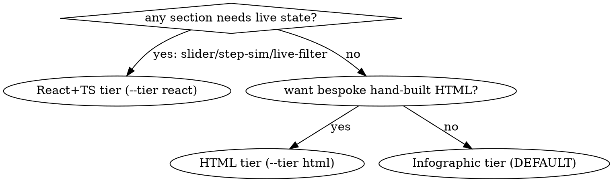

# ps-commu-explain

Build a fact-checked, visually rich explanation served from /tmp; hand over a verified URL. Scripts: `~/.claude/skills/ps-commu-explain/scripts/`, all with `--help`. ALWAYS serve via `scripts/serve.sh` — never an ad-hoc server.

## When NOT to use

- Answerable in a few sentences of chat.
- Durable document → render-spec.
- Headless/CI (no Chrome) — degrade per step 6.

## Tiers

- **infographic (DEFAULT)** — cream, Markdown-driven explainer rendered by cherry-markdown + Mermaid + Lucide. You author `app/content.md`; you do NOT touch `app/index.html`. Component cheat-sheet ships live at `app/components.md` (served alongside). This is the default look — `init.sh <slug>` with no `--tier`.
- **html** (opt-in `--tier html`) — the classic bespoke, hand-written HTML tier. You edit `app/index.html` in place.
- **react** (opt-in `--tier react`) — interactive React+TS, for sections that need state (slider / step-sim / live-filter).

## Modes

- `list` → `scripts/list.sh`. `clean` → `scripts/clean.sh` — wipes ALL apps. One app: `scripts/stop.sh <slug>`.
- Existing slug: re-serve / update (step 4) / rebuild.

## Workflow (todo per step)

1. **Analyze** — read real sources. Every claim traces to a file:line or a user answer. Gaps → AskUserQuestion. Never invent.
2. **Fact sheet** — `01-factsheet.md` in the workspace, every fact with a source ref. Nothing enters the app unless it is here.
3. **Key areas** — `02-key-areas.md`, ranked. Confirm only if ambiguous.
4. **Outline** — `03-outline.md`: tag each section. For the html/react tiers use `references/visual-components.md`; for the default infographic tier use the component blocks in `app/components.md`. Tier:



5. **Build** (REQUIRED SUB-SKILL: frontend-design) — `scripts/init.sh <slug> [--tier html|react]` scaffolds `app/` from the tier template. **Default (infographic):** you AUTHOR `app/content.md` as a cream infographic — edit `content.md`, NOT `index.html` (index.html is the fixed cherry-markdown shell; rewriting it breaks rendering). Use the component blocks documented in the live cheat-sheet at `app/components.md` (served at `?doc=components.md`): **section-head** (icon + category eyebrow), **KPI stat tiles**, **feature cards**, **`::: callout <kind>`** boxes, **numbered steps**, **comparison panels**, and colored ` ```mermaid ` diagram blocks. Structure the doc as **Overview → Sections → Summary**. Diagrams: long sequences use `flowchart LR` with 1–2-line labels; a tall `TB` chain (>5–6 nodes) overflows the viewport. **`--tier html`:** edit `app/index.html` **in place** — never write it from scratch, or you drop the diagram lib and mermaid blocks render as raw text. **`--tier react`:** `npm ci` inside `app/`.
6. **Verify loop** (REQUIRED SUB-SKILL: superpowers:verification-before-completion) — React: `tsc --noEmit` + `vite build` pass. All tiers: `scripts/serve.sh <slug> --dev`, open in Chrome, screenshot every section on cycle 1 (later: only fixed ones), compare vs outline. **Verification must confirm: ZERO console errors, Mermaid diagrams render as SVG, Lucide icons render as SVG, and no raw `~~CODE$` placeholder leak.** After each edit force a real reload — append `?v=N` or change the path; a `#hash` or same-URL nav does NOT re-fetch, so you'll verify STALE content. Browser unavailable/denied → curl + build checks, stating what went unverified. Repeat ≤5 cycles, then report defects honestly.
7. **Handoff** — React: `vite build`, then `scripts/serve.sh <slug>` (dist, 24h watchdog). The page lives at the server **root** (`http://localhost:PORT/`); the infographic tier loads `content.md` by default (no `?doc=` needed). Give full URL, per-section summary, `list.sh` output, cleanup hint (`clean`); offer artifact copy-out.

## Rationalizations (from baselines)

| Excuse | Reality |
|---|---|
| "I read the code, a fact sheet is overhead" | Baseline agents shipped pages invented in one tool call. The fact sheet IS the no-hallucination gate. |
| "Open it in any browser" / "Ready, it's live" | Said in baselines, unverified. Ready = Chrome load + clean console THIS cycle. |
| "I'll just python -m http.server it quickly" | Baselines exposed all of /tmp on all interfaces, forever. serve.sh: loopback, scoped doc root, 24h self-destruct. |
| "React would look more impressive" | Animation and diagrams are in the HTML tier. State or HTML. |
| "Cycle 6 will definitely fix it" | 5 cycles, then an honest defect list. Never claim unverified success. |
| "I'll write app/index.html fresh — faster than the template" | You drop `mermaid.min.js`; every diagram renders as raw text. init.sh scaffolds it — edit in place. |
| "Reloaded, still looks the same — must be a code bug" | A `#hash` or same-URL nav doesn't re-fetch. Bust the path (`?v=N`) before concluding anything. |

## Red flags — STOP

- App content with no matching fact-sheet entry
- Any hand-started server instead of scripts/serve.sh
- React without a state-requiring section
- "Ready" without a Chrome load + console read this cycle
- A mermaid block rendering as raw text (lib missing — you wrote `app/` from scratch)
- A `TB` diagram taller than the viewport (switch to `LR`)
- Re-verifying after an edit without busting the URL (`?v=N`)
