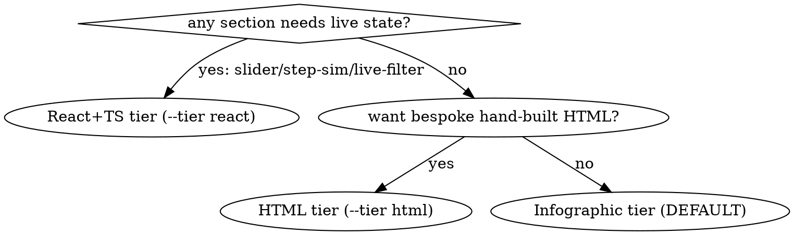

# ps-commu-explain

Build a fact-checked, visually rich explanation served from /tmp; hand over a verified URL and the reader's own answers. Scripts: `~/.claude/skills/ps-commu-explain/scripts/`, all with `--help`. ALWAYS serve via `scripts/serve.sh` — never an ad-hoc server.

## When NOT to use

- Answerable in a few sentences of chat.
- Durable document → render-spec.
- Headless/CI (no Chrome) — degrade per Stage 5, state what went unverified.

## Tiers

- **infographic (DEFAULT)** — cream, Markdown-driven explainer rendered by cherry-markdown + draw.io (pan/zoom mxGraph diagrams) + Lucide. You author `app/content.md`; you do NOT touch `app/index.html`. Components: read `app/components-index.md` first (one line per section), then `grep -n 'id="<id>"' app/components.md` for only the section you need. This is the default look — `init.sh <slug>` with no `--tier`.
- **html** (opt-in `--tier html`) — the classic bespoke, hand-written HTML tier. You edit `app/index.html` in place. Component/treatment-tag reference: `references/visual-components.md`.
- **react** (opt-in `--tier react`) — interactive React+TS, for sections that need state (slider / step-sim / live-filter). Component/treatment-tag reference: `references/visual-components.md`. Build before serving: `npm ci` in `app/` once, then `npm run build` (creates `app/dist`, which `serve.sh` hard-requires) — or `serve.sh <slug> --dev` to run `vite` directly instead (still needs `npm ci` first).


```dot
digraph tier {
  "any section needs live state?" [shape=diamond];
  "any section needs live state?" -> "React+TS tier (--tier react)" [label="yes: slider/step-sim/live-filter"];
  "any section needs live state?" -> "want bespoke hand-built HTML?" [label="no", shape=diamond];
  "want bespoke hand-built HTML?" -> "HTML tier (--tier html)" [label="yes"];
  "want bespoke hand-built HTML?" -> "Infographic tier (DEFAULT)" [label="no"];
}
```

## Modes

- `list` → `scripts/list.sh`. `clean` → `scripts/clean.sh` — wipes ALL apps. One app: `scripts/stop.sh <slug>`.
- Existing slug: re-serve / update (Author stage) / rebuild.

## The six-stage chain

Each stage produces a file the next one reads. `lint.sh <slug>` is the single script that checks all four authoring files; `serve.sh` runs it automatically before binding and refuses (exit 1 + defect list) on failure. `--no-lint` skips `lint.sh` entirely — on ANY tier, there is no tier check gating it — which turns off every one of lint.sh's checks at once: fact-citation verification, forbidden-component checks, drawio/mxGraph XML validation, and the brief/facts/storyboard checks. It's intended for the html/react tiers' dev loops (serve.sh's own comment), not as a general-purpose escape hatch; passing it on real authored infographic content is genuinely risky, not a narrower or safer option.

| # | Stage | Output | Checked by |
|---|---|---|---|
| 1 | Brief | `00-brief.md` — exactly 3 numbered reader questions (Q1-Q3), a `Reader:` line (who reads it and what they already know — default: a newcomer to this repo), and a section budget (integer, 4-7) | `init.sh` scaffolds it (never overwrites an existing one); `lint.sh` rejects unfilled `(...)` placeholders, a wrong count of Q1-Q3, a missing/empty `Reader:` line, or a missing/bad section-budget integer |
| 2 | Facts | `01-facts.md` — `F<n> \| statement \| source` rows (source: `path:line`, bare path, commit hash, or `"user said"`), gathered by a subagent | `lint.sh` rejects a bad source shape and any `F<n>` content.md cites that isn't a row here |
| 3 | Storyboard | `02-storyboard.md` — one row per planned `app/content.md` section: `section \| question (Q1-Q3) \| facts (F<n>,...)` | `lint.sh` rejects an uncovered Q1-Q3, or a row citing an `F<n>` missing from 01-facts.md |
| 4 | Author | `app/content.md` — once the storyboard lints, run `scripts/skeleton.sh <slug>`: it writes the reader-questions block, one section per storyboard row with a `TODO(Q<n>; F<n>,...): <section>` line for you to replace with cited prose, and a Receipts footer (refuses to overwrite without `--force`). Exemplar: `app/example-content.md`; `init.sh --example <slug>` uses it as content.md with a matching filled chain. **A plain `init.sh` + `serve.sh` fails lint until `skeleton.sh` has run and every `TODO(` line is filled.** Components: `app/components-index.md` | `lint.sh` rejects a missing `content.md` and any remaining `TODO(` line; it also rejects removed classes (`stat-grid`, `stat-tile`, `meter`, `cat-*`, `metric-grid`, `card-grid`), and — for each ` ```drawio ` diagram (plain mxGraph XML: `<mxGraphModel>`/`<mxfile>` → `<root>` → `<mxCell>`) — malformed XML, missing root cells, duplicate ids, unlabeled edges, >7 vertices, overlapping/out-of-bounds vertices, unescaped `<` or `&` in labels (e.g. a shell `&&` in a label must be written `&amp;&amp;`; a line break is `&lt;br&gt;` — the one allowed tag — and a double-escaped `&amp;lt;br&amp;gt;` is rejected because the reader would see a literal `<br>`), and raw hex colors (use `role=accent\|pitfall\|check` instead) |
| 5 | Verify | render gate (`verify.sh <slug>`, **infographic tier only**, main thread; the same Chrome load writes `page-text.txt`) then reader gate (`model: sonnet` subagent, prompt from `verify.sh <slug> --reader-prompt`) | both pass on infographic (html/react: a `model: haiku` subagent Chrome load stands in for the render gate — see below), or an honest defect list — ≤5 cycles |
| 6 | Handoff | `scripts/handoff.sh <slug>` output + the reader gate's answers | prose |

## Plain English (hard rule)

The reader named in `00-brief.md`'s `Reader:` line has NOT been in this conversation. Write for them, not for yourself:

- **Define before use.** Every term, acronym, script name, or ID gets a plain-words gloss on first mention — "F-037 (the zone-content feature)", "Gate 1 (the pre-ship build/test check)". Ticket ids, codenames, and internal shorthand never appear bare.
- **What and why before how.** Each section opens with one sentence a newcomer can follow — what this is and why they should care — before any mechanism.
- **Short sentences, everyday words.** One idea per sentence; no arrow-chains (`A → B → fails`) in prose; if a sentence needs two parentheticals, split it.
- **Concrete over abstract.** Show one real example (command, input, output) instead of a paragraph of description.
- The reader gate below FAILs any page that uses a term before explaining it.

## Subagent budgets (hard rule)

- **Facts (Stage 2):** dispatch a subagent per source area to read/grep and return `F<n> | statement | source` rows — never grep the target codebase from the main thread yourself.
- **Authoring cycles (Stage 4):** you author `content.md` in the main thread. The infographic render gate (`verify.sh <slug>`, ~8 PASS/FAIL lines) also runs in the main thread: a subagent would add latency and save nothing. Every html/react render check (Chrome load, screenshot, console read) runs in a `model: haiku` subagent that returns ≤15 lines. Screenshots are never taken inline in the main thread.
- **Reader gate (Stage 5):** always a fresh `model: sonnet` subagent, prompted with the output of `verify.sh <slug> --reader-prompt`. It reads only `page-text.txt`, never the brief/facts/storyboard files.
- **Cap:** ≤5 verify/fix cycles total (render + reader together). On cycle 5's failure, STOP and report the honest defect list — never continue silently or claim success.

## Verify: render gate + reader gate

- **Infographic render gate:** `scripts/verify.sh <slug>` in the main thread: one headless-Chrome load, 8 PASS/FAIL/SKIP asserts (drawio render count and non-empty shapes, no `~~CODE` leak, no raw `data-nav` text, zero page-origin console errors, nav click (permanent SKIP), no `scroll-behavior` in explainer.css, drawio pan/zoom initialized on every diagram, no literal `<br>` text). Detail: `verify.sh --help`. Exit 0 = pass; 1 = defects; 2 = no Chrome/no server (a SKIP, never a pass; the `scroll-behavior` check still runs without Chrome). The same load writes the reader-visible text to `/tmp/ps-commu/<slug>/page-text.txt`.
- **html:** verify.sh runs `html-1` (no `explainer-error` on body) and `html-2` (svg count == `.mermaid` div count); `lint.sh` runs every `.mermaid` block through `mmdc` (missing mmdc warns and skips; `EXPLAINER_STRICT_MERMAID=1` fails). **react:** verify.sh reports `FAIL: doc not found`; the render check is a `model: haiku` subagent Chrome load (console + screenshot, ≤15 lines).
- **Reader gate:** a clean render gate is necessary, not sufficient. Run `scripts/verify.sh <slug> --reader-prompt` (exit 2 = no `page-text.txt` yet: run `verify.sh <slug>` first). Its first line, `Agent model: sonnet`, is the Agent tool's `model`; paste the rest verbatim as the prompt, and never paste page text yourself. The subagent must answer Q1-Q3 with `F<n>` citations from the page's Receipts footer, list unexplained terms, and return `Verdict: PASS` before the page counts as done.

## Handoff

Run `scripts/handoff.sh <slug>`: it prints the URL, the brief's 3 questions, `list.sh` output, the cleanup hint and the re-serve command. Relay it and add the reader gate's answers with citations. Offer an artifact copy-out. Explainers stay under `/tmp`, never committed.

## Rationalizations (from baselines)

| Excuse | Reality |
|---|---|
| "I read the code, a fact sheet is overhead" | `lint.sh` rejects any `F<n>` *cited* with no matching row in 01-facts.md — but it does NOT require citations to exist; content with zero `F<n>` citations lints clean. The reader gate (Stage 5) is what actually fails a page that cites nothing, so both gates are needed. |
| "Console is clean, ship it" | Console errors are 1 of 8 `verify.sh` asserts, and a clean render gate still isn't a reader gate — it must independently answer the brief's 3 questions with citations. |
| "--no-lint gets past the gate" | `--no-lint` skips `lint.sh` entirely, on any tier — it turns off fact-citation checking, forbidden-component checks, drawio/mxGraph XML validation, and the brief/facts/storyboard checks all at once. It's meant for the html/react dev loops, not a safe way to skip the infographic chain. |
| "I'll skip 00-brief.md, the diagram speaks for itself" | `lint.sh` rejects unfilled `(...)` placeholders, a wrong count of Q1-Q3, or a missing section budget — `serve.sh` won't serve until it's clean. |
| "I'll just python -m http.server it quickly" | Baselines exposed all of /tmp on all interfaces, forever. `serve.sh`: loopback-only, scoped doc root, watchdog self-destruct. |
| "React would look more impressive" | Animation and diagrams live in the HTML tier too. State or HTML — react is opt-in, only for sections that need it. |
| "Cycle 6 will definitely fix it" | ≤5 cycles, then an honest defect list. Never claim unverified success. |
| "I'll write app/index.html fresh — faster than the template" | You drop the tier's diagram library — the pinned draw.io viewer + `cherry-setup.js` wiring (infographic) or `mermaid.min.js` (html) — and every diagram renders as raw text. `init.sh` scaffolds it — edit in place. |
| "The reader knows this project, jargon is fine" | The reader is whoever the brief's `Reader:` line names — by default a newcomer. Unexplained IDs and codenames FAIL the reader gate. |
| "The reader-gate subagent can peek at 01-facts.md to check its own answers" | Defeats the point — it must answer from page text alone, like a real reader, or the gate proves nothing. |

## Red flags — STOP

- `content.md` still holding a `TODO(` line, or citing an `F<n>` with no matching row in `01-facts.md` (lint catches both; if it didn't, lint wasn't run)
- A screenshot, or an html/react Chrome check, run inline in the main thread instead of a `model: haiku` subagent (the infographic `verify.sh` text run is the one main-thread Chrome check)
- A reader-gate subagent given the brief/facts/storyboard files, or answering from outside knowledge
- More than 5 verify/fix cycles without stopping to report defects
- `stat-grid`, `meter`, or `cat-*` classes reappearing (removed in component set v3)
- A term, ID, or codename used before it is explained in plain words
- A literal `<br>` visible on the rendered page (verify.sh assert 8)
- A drawio edge with no label, a diagram with more than 7 vertices, or a raw hex color in a cell style instead of a `role=accent\|pitfall\|check` token
- Any hand-started server instead of `scripts/serve.sh`
- "Ready" reported without both a passing render check (`verify.sh` on infographic; a `model: haiku` subagent Chrome load on html/react) and a PASS reader-gate verdict this cycle
