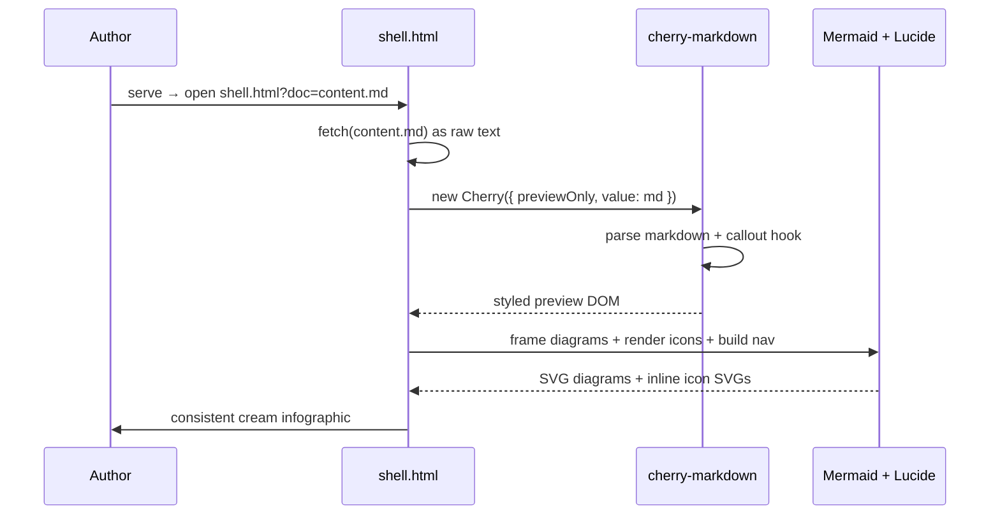

<div class="reader-questions" data-nav-title="Components" data-nav-sub="gallery">
  <div class="rq-kicker"><i data-lucide="help-circle"></i> This gallery answers</div>
  <div class="rq-list">
    <div class="rq-q"><span class="rq-num">1</span><span class="rq-text">What blocks make up the v3 component set, and what does each look like rendered?</span></div>
    <div class="rq-q"><span class="rq-num">2</span><span class="rq-text">What order should they appear in on a real explainer?</span></div>
    <div class="rq-q"><span class="rq-num">3</span><span class="rq-text">What does <code>lint.sh</code> reject, and why does a labeled mechanism diagram matter?</span></div>
  </div>
</div>

<div class="section-head bookend" data-nav="Overview" data-nav-icon="compass" id="overview">
  <span class="icon-chip lg"><i data-lucide="compass"></i></span>
  <div class="sh-text">
    <span class="sh-kicker">Start here</span>
    <div class="sh-title">The component set — v3</div>
  </div>
</div>

Copy the fenced source, paste it into your `.md`, edit the copy. Each entry shows the exact syntax followed by the live rendered result — all on the cream infographic theme. The blocks below are ordered the way a real explainer should use them: open with the **questions** you're answering, show the **mechanism**, back it with **claims**, name the **failure mode**, prove the **improvement**, then close with **receipts**. Every block takes the single structural accent; only `pitfall` and `check` carry their reserved hues.

<div class="section-head" data-nav="Section header" data-nav-icon="heading" id="sectionhead">
  <span class="icon-chip lg"><i data-lucide="heading"></i></span>
  <div class="sh-text">
    <span class="sh-kicker">Structure</span>
    <div class="sh-title">Section header</div>
  </div>
</div>

Carries a Lucide icon chip, a kicker, and a title — and feeds the sticky nav. The `data-nav` and `data-nav-icon` attributes drive the navigation entry. Add `bookend` for the distinct Overview / Summary bands.

```html
<div class="section-head" data-nav="System" data-nav-icon="boxes">
  <span class="icon-chip lg"><i data-lucide="boxes"></i></span>
  <div class="sh-text">
    <span class="sh-kicker">Section A · label</span>
    <div class="sh-title">System overview</div>
  </div>
</div>
```

<div class="section-head" data-nav="Reader questions" data-nav-icon="help-circle" id="readerquestions">
  <span class="icon-chip lg"><i data-lucide="help-circle"></i></span>
  <div class="sh-text">
    <span class="sh-kicker">1 · open with the chain</span>
    <div class="sh-title">Reader questions</div>
  </div>
</div>

The top-of-page box. Three numbered questions — verbatim from `00-brief.md`'s own Q1-Q3 — telling the reader exactly what this explainer will answer before they commit to reading it. It also carries `data-nav-title` / `data-nav-sub`, the attributes the sticky nav reads for its brand row (this replaced `.hero` as the page's top-level component).

```html
<div class="reader-questions" data-nav-title="My Explainer" data-nav-sub="v3">
  <div class="rq-kicker"><i data-lucide="help-circle"></i> This explainer answers</div>
  <div class="rq-list">
    <div class="rq-q"><span class="rq-num">1</span><span class="rq-text">What is it?</span></div>
    <div class="rq-q"><span class="rq-num">2</span><span class="rq-text">Why does it matter?</span></div>
    <div class="rq-q"><span class="rq-num">3</span><span class="rq-text">How would I check it myself?</span></div>
  </div>
</div>
```

<div class="gallery-item">
  <div class="gallery-label">rendered</div>
  <div class="gallery-body">
    <div class="reader-questions" style="margin:0">
      <div class="rq-kicker"><i data-lucide="help-circle"></i> This explainer answers</div>
      <div class="rq-list">
        <div class="rq-q"><span class="rq-num">1</span><span class="rq-text">What changed in the component set?</span></div>
        <div class="rq-q"><span class="rq-num">2</span><span class="rq-text">Why were the old marketing-style blocks removed?</span></div>
        <div class="rq-q"><span class="rq-num">3</span><span class="rq-text">How do I verify a diagram will pass <code>lint.sh</code>?</span></div>
      </div>
    </div>
  </div>
</div>

<div class="section-head" data-nav="Mechanism diagrams" data-nav-icon="git-branch" id="mechanism">
  <span class="icon-chip lg"><i data-lucide="git-branch"></i></span>
  <div class="sh-text">
    <span class="sh-kicker">2 · show how it works</span>
    <div class="sh-title">Mermaid, schematic &amp; the labeled-edge rule</div>
  </div>
</div>

Any fenced code block tagged <code>mermaid</code> becomes a themed light SVG: cream nodes, accent strokes. Mark a node `class N pitfall` or `class N check` to use a reserved hue; the classDefs are injected automatically. `scripts/lint.sh` enforces the mechanism-diagram rule mechanically, not just by convention — for every flowchart it checks:

- **Every edge is labeled.** `A --> B` with no text says nothing about what moves along it; `lint.sh` reports it as `flowchart diagram edge 'A --> B' has no label`. Write `A -->|renders| B` or `A -- renders --> B` instead — a labeled arrow names the payload, not just the direction.
- **At most 7 nodes per diagram.** A mechanism worth drawing is a small number of real moving parts; past 7 nodes, split it into two diagrams or simplify.
- **`sequenceDiagram` arrows carry text after the colon** (`A->>B: fetch(url)`, not `A->>B:`).

<div class="gallery-item">
  <div class="gallery-label">GOOD — every edge labeled, 5 nodes, passes <code>lint.sh</code></div>
  <div class="gallery-body">



  </div>
</div>

<div class="wrong-without">
  <span class="ww-ico"><i data-lucide="triangle-alert"></i></span>
  <div class="ww-body">
    <div class="ww-title">BAD — two edges, two independent rejections</div>
    <p>Below are the two offending lines, not a runnable diagram (this page never feeds a bare <code>flowchart</code>/<code>graph</code> keyword to a fence — cherry-setup.js content-sniffs <em>any</em> fenced block that opens with one and hands it to Mermaid, live example or not, so an inert bad-example diagram would render as a broken error box instead of teaching anything).</p>
  </div>
</div>

```text
Author --> System        ← no label: says nothing about what moves along it
System --> end           ← 'end' is a reserved keyword, never a valid node id
```

`lint.sh` reports both independently: an unlabeled edge, and a reserved word used as a node id (Mermaid keywords are case-sensitive — `end` closes a subgraph and can never be an id; `End` would be fine). The fix is the same move as the GOOD example above: name what's on the wire, and never reuse a keyword.

A monospace **schematic** block for file trees (whitespace preserved):

```html
<div class="schematic">explainer-kit/
├── theme.css        ← the lock
├── explainer.css    ← components
└── cherry-setup.js  ← engine + mermaid + icons</div>
```

<div class="gallery-item">
  <div class="gallery-label">rendered</div>
  <div class="gallery-body">
    <div class="schematic" style="margin:0">explainer-kit/
├── theme.css        ← the lock
├── explainer.css    ← components
└── cherry-setup.js  ← engine + mermaid + icons</div>
  </div>
</div>

<div class="section-head" data-nav="Worked example" data-nav-icon="flask-conical" id="workedexample">
  <span class="icon-chip lg"><i data-lucide="flask-conical"></i></span>
  <div class="sh-text">
    <span class="sh-kicker">2b · make it concrete</span>
    <div class="sh-title">Worked example</div>
  </div>
</div>

One real input → mechanism → output walkthrough, sitting next to the diagram so the abstract mechanism has one concrete run to point at.

```html
<div class="worked-example">
  <div class="we-label"><i data-lucide="flask-conical"></i> Worked example</div>
  <div class="we-flow">
    <div class="we-stage"><span class="we-stage-k">Input</span><div class="we-stage-v">content.md</div></div>
    <i class="we-arrow" data-lucide="arrow-right"></i>
    <div class="we-stage"><span class="we-stage-k">Mechanism</span><div class="we-stage-v">lint.sh scan</div></div>
    <i class="we-arrow" data-lucide="arrow-right"></i>
    <div class="we-stage"><span class="we-stage-k">Output</span><div class="we-stage-v">pass / fail defects</div></div>
  </div>
  <p>One sentence tying the concrete run back to the mechanism explained above.</p>
</div>
```

<div class="gallery-item">
  <div class="gallery-label">rendered</div>
  <div class="gallery-body">
    <div class="worked-example" style="margin:0">
      <div class="we-label"><i data-lucide="flask-conical"></i> Worked example</div>
      <div class="we-flow">
        <div class="we-stage"><span class="we-stage-k">Input</span><div class="we-stage-v">app/content.md</div></div>
        <i class="we-arrow" data-lucide="arrow-right"></i>
        <div class="we-stage"><span class="we-stage-k">Mechanism</span><div class="we-stage-v">forbidden-class + mermaid scan</div></div>
        <i class="we-arrow" data-lucide="arrow-right"></i>
        <div class="we-stage"><span class="we-stage-k">Output</span><div class="we-stage-v">one defect line per problem</div></div>
      </div>
      <p>Run <code>scripts/lint.sh &lt;slug&gt;</code> against a workspace and read its defect lines — that's this mechanism, live.</p>
    </div>
  </div>
</div>

<div class="section-head" data-nav="Claims" data-nav-icon="badge-check" id="claims">
  <span class="icon-chip lg"><i data-lucide="badge-check"></i></span>
  <div class="sh-text">
    <span class="sh-kicker">3 · back it with a citation</span>
    <div class="sh-title">Claim card</div>
  </div>
</div>

A claim, its `F<n>` citation and source, and a "check it" line telling the reader exactly how to verify it themselves. The `F<n>` badge must cite a fact that actually exists in `01-facts.md` — `lint.sh` checks that every `F<n>` mentioned in `app/content.md` resolves.

```html
<div class="claim-card">
  <div class="claim-text">The claim, stated plainly.</div>
  <div class="claim-meta"><span class="claim-fact">F3</span><span class="claim-source">lint.sh:186</span></div>
  <div class="claim-check"><i data-lucide="search"></i> Check it: run <code>grep -n forbidden_exact scripts/lint.sh</code></div>
</div>
```

<div class="gallery-item">
  <div class="gallery-label">rendered</div>
  <div class="gallery-body">
    <div class="claim-card" style="margin:0">
      <div class="claim-text"><code>lint.sh</code> rejects five exact forbidden classes plus any <code>cat-*</code> prefix.</div>
      <div class="claim-meta"><span class="claim-fact">F3</span><span class="claim-source">scripts/lint.sh:186</span></div>
      <div class="claim-check"><i data-lucide="search"></i> Check it: run <code>grep -n forbidden_exact scripts/lint.sh</code></div>
    </div>
  </div>
</div>

<div class="section-head" data-nav="Wrong without" data-nav-icon="triangle-alert" id="wrongwithout">
  <span class="icon-chip lg"><i data-lucide="triangle-alert"></i></span>
  <div class="sh-text">
    <span class="sh-kicker">4 · name the failure mode</span>
    <div class="sh-title">Wrong, without this</div>
  </div>
</div>

What breaks if the mechanism above is skipped. Always the reserved `--pitfall` hue — this is the one component that never varies its color, because naming the failure mode IS the pitfall case.

```html
<div class="wrong-without">
  <span class="ww-ico"><i data-lucide="triangle-alert"></i></span>
  <div class="ww-body">
    <div class="ww-title">Wrong, without this</div>
    <p>What goes wrong if you skip the step above.</p>
  </div>
</div>
```

<div class="gallery-item">
  <div class="gallery-label">rendered</div>
  <div class="gallery-body">
    <div class="wrong-without" style="margin:0">
      <span class="ww-ico"><i data-lucide="triangle-alert"></i></span>
      <div class="ww-body">
        <div class="ww-title">Wrong, without this</div>
        <p>Skip the labeled-edge rule and a diagram of unlabeled arrows ships — three nouns connected by lines that say nothing about what moves between them.</p>
      </div>
    </div>
  </div>
</div>

<div class="section-head" data-nav="Before / after" data-nav-icon="columns-2" id="beforeafter">
  <span class="icon-chip lg"><i data-lucide="columns-2"></i></span>
  <div class="sh-text">
    <span class="sh-kicker">5 · prove the improvement</span>
    <div class="sh-title">Before / after</div>
  </div>
</div>

Two panels, real values — not a percentage meter. Say what the number actually was, and what it actually is now.

```html
<div class="before-after">
  <div class="ba-panel">
    <span class="ba-label">Before</span>
    <div class="ba-value">142ms</div>
    <p>What this state means.</p>
  </div>
  <i class="ba-arrow" data-lucide="arrow-right"></i>
  <div class="ba-panel">
    <span class="ba-label">After</span>
    <div class="ba-value">9ms</div>
    <p>What changed and why.</p>
  </div>
</div>
```

<div class="gallery-item">
  <div class="gallery-label">rendered</div>
  <div class="gallery-body">
    <div class="before-after" style="margin:0">
      <div class="ba-panel">
        <span class="ba-label">Before</span>
        <div class="ba-value">4 regex passes</div>
        <p>Round 1-3 of the flowchart lint: split the block by independent regexes.</p>
      </div>
      <i class="ba-arrow" data-lucide="arrow-right"></i>
      <div class="ba-panel">
        <span class="ba-label">After</span>
        <div class="ba-value">1 scanner</div>
        <p>Round 4: a single left-to-right pass mirroring Mermaid's own grammar.</p>
      </div>
    </div>
  </div>
</div>

Two-up panels also work for a plain this-vs-that comparison (not a numeric before/after):

```html
<div class="compare">
  <div class="compare-panel">
    <div class="cmp-head"><span class="icon-chip sm"><i data-lucide="check-check"></i></span> This way</div>
    <div class="cmp-body"><ul><li>Point one.</li></ul></div>
  </div>
</div>
```

<div class="gallery-item">
  <div class="gallery-label">rendered</div>
  <div class="gallery-body">
    <div class="compare" style="margin:0">
      <div class="compare-panel"><div class="cmp-head"><span class="icon-chip sm"><i data-lucide="check-check"></i></span> The token way</div><div class="cmp-body"><ul><li>One source of truth.</li><li>No drift.</li></ul></div></div>
      <div class="compare-panel"><div class="cmp-head"><span class="icon-chip sm"><i data-lucide="x"></i></span> One-off HTML</div><div class="cmp-body"><ul><li>Every doc reinvents.</li><li>Styles drift.</li></ul></div></div>
    </div>
  </div>
</div>

<div class="section-head" data-nav="Callouts" data-nav-icon="message-square" id="callouts">
  <span class="icon-chip lg"><i data-lucide="message-square"></i></span>
  <div class="sh-text">
    <span class="sh-kicker">Content</span>
    <div class="sh-title">Callouts — three kinds</div>
  </div>
</div>

Author with the terse `::: callout <kind>` shorthand (Markdown allowed inside). Kinds: `note` (accent — context, pointers), `pitfall` (reserved red — what goes wrong), `check` (reserved green — what is verified). Any other kind, or none, renders as `note`.

```text
::: callout pitfall
**Heads up.** Markdown *works* inside the body.
:::
```

<div class="gallery-item">
  <div class="gallery-label">rendered — all three kinds</div>
  <div class="gallery-body">

::: callout note
**note** — context and pointers, in the structural accent.
:::

::: callout pitfall
**pitfall** — what goes wrong if you skip a step. Reserved hue.
:::

::: callout check
**check** — what you can verify, and how. Reserved hue.
:::

  </div>
</div>

<div class="section-head" data-nav="Steps" data-nav-icon="list-checks" id="steps">
  <span class="icon-chip lg"><i data-lucide="list-checks"></i></span>
  <div class="sh-text">
    <span class="sh-kicker">Flow</span>
    <div class="sh-title">Steps / timeline</div>
  </div>
</div>

Numbered colored circles with connectors, each with an icon and title. Great for an authoring or setup flow.

```html
<div class="steps">
  <div class="step">
    <span class="step-num">1</span>
    <div class="step-body">
      <div class="step-title"><i data-lucide="copy"></i> Copy the template</div>
      <p>Run <code>./new.sh my-topic</code>.</p>
    </div>
  </div>
</div>
```

<div class="gallery-item">
  <div class="gallery-label">rendered</div>
  <div class="gallery-body">
    <div class="steps" style="margin:0">
      <div class="step"><span class="step-num">1</span><div class="step-body"><div class="step-title"><i data-lucide="copy"></i> Copy</div><p>Clone the template into a fresh file.</p></div></div>
      <div class="step"><span class="step-num">2</span><div class="step-body"><div class="step-title"><i data-lucide="pencil"></i> Write</div><p>Edit the Markdown, drop in components.</p></div></div>
      <div class="step"><span class="step-num">3</span><div class="step-body"><div class="step-title"><i data-lucide="eye"></i> View</div><p>Serve and open — refresh to iterate.</p></div></div>
    </div>
  </div>
</div>

<div class="section-head" data-nav="Badges" data-nav-icon="gauge" id="badges">
  <span class="icon-chip lg"><i data-lucide="gauge"></i></span>
  <div class="sh-text">
    <span class="sh-kicker">Data</span>
    <div class="sh-title">Badges &amp; legend</div>
  </div>
</div>

Status pills with dots, and a color key for a diagram's classes.

```html
<span class="badge"><span class="dot"></span> passing</span>
<div class="legend">
  <span class="legend-item"><span class="legend-swatch"></span> input</span>
</div>
```

<div class="gallery-item">
  <div class="gallery-label">rendered</div>
  <div class="gallery-body">
    <p><span class="badge"><span class="dot"></span> passing</span> <span class="badge"><span class="dot"></span> in review</span> <span class="badge"><span class="dot"></span> blocked</span></p>
    <div class="legend" style="margin-top:1rem">
      <span class="legend-item"><span class="legend-swatch"></span> input</span>
      <span class="legend-item"><span class="legend-swatch"></span> system</span>
      <span class="legend-item"><span class="legend-swatch"></span> host</span>
      <span class="legend-item"><span class="legend-swatch"></span> output</span>
    </div>
  </div>
</div>

Inline **topic chips**, kept as a purely optional, non-forbidden utility (not part of the chain — use for a skimmable keyword row if a doc wants one):

<div class="chip-row"><span class="topic-chip">design-system</span><span class="topic-chip">mermaid</span><span class="topic-chip">cherry-markdown</span></div>

<div class="section-head bookend" data-nav="Receipts" data-nav-icon="receipt" id="receipts">
  <span class="icon-chip lg"><i data-lucide="receipt"></i></span>
  <div class="sh-text">
    <span class="sh-kicker">6 · close the chain</span>
    <div class="sh-title">Receipts</div>
  </div>
</div>

The footer. A flat list of every `F<n>` citation used above and its source — so a skeptical reader can jump straight to checking any of them, in one place, without hunting back through the page.

```html
<div class="receipts">
  <div class="receipts-label"><i data-lucide="receipt"></i> Receipts</div>
  <ul class="receipts-list">
    <li><span class="receipts-fact">F1</span> lint.sh:186</li>
    <li><span class="receipts-fact">F2</span> verify.sh:8</li>
  </ul>
</div>
```

<div class="gallery-item">
  <div class="gallery-label">rendered</div>
  <div class="gallery-body">
    <div class="receipts" style="margin:0">
      <div class="receipts-label"><i data-lucide="receipt"></i> Receipts</div>
      <ul class="receipts-list">
        <li><span class="receipts-fact">F1</span> scripts/lint.sh:186 — the forbidden-class set</li>
        <li><span class="receipts-fact">F2</span> scripts/lint.sh:20-35 — the flowchart scanner rules</li>
        <li><span class="receipts-fact">F3</span> scripts/verify.sh:8-19 — the render-gate asserts</li>
      </ul>
    </div>
  </div>
</div>

Standard Markdown — tables, quotes and detail — still styles automatically into the theme:

| Token | Purpose |
|---|---|
| `--accent` | the one structural hue |
| `--pitfall` | reserved: what goes wrong |
| `--check` | reserved: what is verified |

> The best build step is the one that isn't there.

<details>
<summary>Collapsible detail — good for asides and FAQs</summary>

Hidden content, revealed on click. Styled on-theme with a warm card surface.

</details>

::: callout check
That's the full v3 kit. Copy any block above into your own `.md` and reload. See `content.md` — it IS the worked v3 exemplar, cites F1-F19, and is what `init.sh --example` scaffolds a fresh workspace with.
:::
