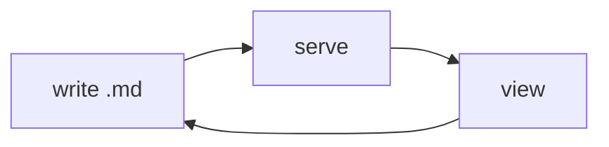

<div class="hero" data-nav-title="Components" data-nav-sub="gallery">
  <div class="eyebrow"><i data-lucide="shapes"></i> Explainer Kit · component gallery</div>
  <div class="title">Every block, its syntax, and how it <span class="hl">renders</span>.</div>
  <div class="lede">
    Copy the fenced source, paste it into your <code>.md</code>, edit the copy. Each entry shows the exact syntax followed by the live rendered result — all on the cream infographic theme.
  </div>
</div>

<div class="section-head bookend cat-coral" data-nav="Overview" data-cat="coral" data-nav-icon="compass" id="overview">
  <span class="icon-chip lg"><i data-lucide="compass"></i></span>
  <div class="sh-text">
    <span class="sh-kicker">Start here</span>
    <div class="sh-title">The component set</div>
  </div>
</div>

Eleven building blocks cover almost every explainer. Author them as plain HTML-in-Markdown (or, for callouts, the terse `::: callout` shorthand). Every one is color-coded through a `cat-*` class.

<div class="section-head cat-teal" data-nav="Section header" data-cat="teal" data-nav-icon="heading" id="sectionhead">
  <span class="icon-chip lg"><i data-lucide="heading"></i></span>
  <div class="sh-text">
    <span class="sh-kicker">Structure</span>
    <div class="sh-title">Section header</div>
  </div>
</div>

Carries a Lucide icon chip, a kicker, and a title — and feeds the sticky nav. The `data-nav`, `data-cat`, and `data-nav-icon` attributes drive the navigation entry. Add `bookend` for the distinct Overview / Summary bands.

```html
<div class="section-head cat-teal" data-nav="System" data-cat="teal" data-nav-icon="boxes">
  <span class="icon-chip lg"><i data-lucide="boxes"></i></span>
  <div class="sh-text">
    <span class="sh-kicker">Section A · label</span>
    <div class="sh-title">System overview</div>
  </div>
</div>
```

<div class="section-head cat-magenta" data-nav="Hero" data-cat="magenta" data-nav-icon="megaphone" id="hero">
  <span class="icon-chip lg"><i data-lucide="megaphone"></i></span>
  <div class="sh-text">
    <span class="sh-kicker">Structure</span>
    <div class="sh-title">Hero</div>
  </div>
</div>

The title block at the top of an explainer: eyebrow · title · lede. Set `data-nav-title` / `data-nav-sub` to label the nav brand.

<div class="gallery-item">
  <div class="gallery-label">rendered</div>
  <div class="gallery-body">
    <div class="hero" style="margin:0">
      <div class="eyebrow"><i data-lucide="palette"></i> Section · label</div>
      <div class="title">The <span class="hl">headline</span> of your explainer.</div>
      <div class="lede">One or two sentences of framing that set up what follows.</div>
    </div>
  </div>
</div>

<div class="section-head cat-blue" data-nav="Stat tiles" data-cat="blue" data-nav-icon="chart-column" id="stats">
  <span class="icon-chip lg"><i data-lucide="chart-column"></i></span>
  <div class="sh-text">
    <span class="sh-kicker">Data</span>
    <div class="sh-title">KPI / stat tiles</div>
  </div>
</div>

The infographic centerpiece: a color-coded card with a big tabular number, an icon chip, a delta pill, a label and an optional sub-line.

```html
<div class="stat-grid">
  <div class="stat-tile cat-teal">
    <div class="stat-head"><span class="icon-chip"><i data-lucide="zap"></i></span><span class="stat-delta"><i data-lucide="arrow-down"></i> zero</span></div>
    <div class="stat-value">0</div>
    <div class="stat-label">build steps</div>
    <div class="stat-sub">just serve the folder</div>
  </div>
</div>
```

<div class="gallery-item">
  <div class="gallery-label">rendered</div>
  <div class="gallery-body">
    <div class="stat-grid" style="margin:0">
      <div class="stat-tile cat-coral"><div class="stat-head"><span class="icon-chip"><i data-lucide="package"></i></span><span class="stat-delta"><i data-lucide="check"></i> lean</span></div><div class="stat-value">5</div><div class="stat-label">files</div><div class="stat-sub">one job each</div></div>
      <div class="stat-tile cat-teal"><div class="stat-head"><span class="icon-chip"><i data-lucide="zap"></i></span><span class="stat-delta"><i data-lucide="arrow-down"></i> zero</span></div><div class="stat-value">0</div><div class="stat-label">build steps</div><div class="stat-sub">just serve</div></div>
      <div class="stat-tile cat-blue"><div class="stat-head"><span class="icon-chip"><i data-lucide="timer"></i></span><span class="stat-delta"><i data-lucide="trending-up"></i> fast</span></div><div class="stat-value">30<span class="unit">s</span></div><div class="stat-label">to live</div><div class="stat-sub">copy · edit</div></div>
      <div class="stat-tile cat-magenta"><div class="stat-head"><span class="icon-chip"><i data-lucide="target"></i></span><span class="stat-delta"><i data-lucide="lock"></i> locked</span></div><div class="stat-value">1</div><div class="stat-label">source</div><div class="stat-sub">of truth</div></div>
    </div>
  </div>
</div>

<div class="section-head cat-violet" data-nav="Feature cards" data-cat="violet" data-nav-icon="layout-grid" id="cards">
  <span class="icon-chip lg"><i data-lucide="layout-grid"></i></span>
  <div class="sh-text">
    <span class="sh-kicker">Content</span>
    <div class="sh-title">Feature cards</div>
  </div>
</div>

Icon chip + title + text, with a colored top accent and hover lift. Recolor with any `cat-*` class.

```html
<div class="card-grid">
  <div class="card cat-coral">
    <span class="icon-chip lg"><i data-lucide="feather"></i></span>
    <div class="card-title">Write plain Markdown</div>
    <p>Author in Markdown. No framework, no bundler.</p>
  </div>
</div>
```

<div class="gallery-item">
  <div class="gallery-label">rendered</div>
  <div class="gallery-body">
    <div class="card-grid" style="margin:0">
      <div class="card cat-coral"><span class="icon-chip lg"><i data-lucide="feather"></i></span><div class="card-title">Write Markdown</div><p>No framework, no bundler — just text and a few tags.</p></div>
      <div class="card cat-teal"><span class="icon-chip lg"><i data-lucide="palette"></i></span><div class="card-title">Inherit the look</div><p>Every value is a token. Change one, update all.</p></div>
      <div class="card cat-blue"><span class="icon-chip lg"><i data-lucide="refresh-cw"></i></span><div class="card-title">Refresh to iterate</div><p>Serve the folder, reload the tab. Done.</p></div>
    </div>
  </div>
</div>

<div class="section-head cat-amber" data-nav="Callouts" data-cat="amber" data-nav-icon="message-square" id="callouts">
  <span class="icon-chip lg"><i data-lucide="message-square"></i></span>
  <div class="sh-text">
    <span class="sh-kicker">Content</span>
    <div class="sh-title">Callouts — seven kinds</div>
  </div>
</div>

Author with the terse `::: callout <kind>` shorthand (Markdown allowed inside), or write the `<div class="callout ...">` directly. Each kind gets a color-coded icon chip.

```text
::: callout warn
**Heads up.** Markdown *works* inside the body.
:::
```

<div class="gallery-item">
  <div class="gallery-label">rendered — all seven kinds</div>
  <div class="gallery-body">

::: callout info
**info** — neutral context and pointers.
:::

::: callout warn
**warn** — something to watch out for.
:::

::: callout success
**success** — a good outcome or a passing check.
:::

::: callout danger
**danger** — a real risk or a blocker.
:::

::: callout idea
**idea** — an insight worth highlighting.
:::

::: callout metric
**metric** — a measured result in prose form.
:::

::: callout action
**action** — a next step the reader should take.
:::

  </div>
</div>

<div class="section-head cat-coral" data-nav="Steps" data-cat="coral" data-nav-icon="list-checks" id="steps">
  <span class="icon-chip lg"><i data-lucide="list-checks"></i></span>
  <div class="sh-text">
    <span class="sh-kicker">Flow</span>
    <div class="sh-title">Steps / timeline</div>
  </div>
</div>

Numbered colored circles with connectors, each with an icon and title. Great for an authoring or setup flow.

```html
<div class="steps">
  <div class="step cat-coral">
    <span class="step-num">1</span>
    <div class="step-body">
      <div class="step-title"><i data-lucide="copy"></i> Copy the template</div>
      <p>Run <code>./new.sh my-topic</code>.</p>
    </div>
  </div>
</div>
```

<div class="gallery-item">
  <div class="gallery-label">rendered</div>
  <div class="gallery-body">
    <div class="steps" style="margin:0">
      <div class="step cat-coral"><span class="step-num">1</span><div class="step-body"><div class="step-title"><i data-lucide="copy"></i> Copy</div><p>Clone the template into a fresh file.</p></div></div>
      <div class="step cat-teal"><span class="step-num">2</span><div class="step-body"><div class="step-title"><i data-lucide="pencil"></i> Write</div><p>Edit the Markdown, drop in components.</p></div></div>
      <div class="step cat-blue"><span class="step-num">3</span><div class="step-body"><div class="step-title"><i data-lucide="eye"></i> View</div><p>Serve and open — refresh to iterate.</p></div></div>
    </div>
  </div>
</div>

<div class="section-head cat-teal" data-nav="Compare" data-cat="teal" data-nav-icon="columns-2" id="compare">
  <span class="icon-chip lg"><i data-lucide="columns-2"></i></span>
  <div class="sh-text">
    <span class="sh-kicker">Content</span>
    <div class="sh-title">Comparison panels</div>
  </div>
</div>

Two-up panels with colored headers — for before/after or this-vs-that.

```html
<div class="compare">
  <div class="compare-panel cat-teal">
    <div class="cmp-head"><span class="icon-chip sm"><i data-lucide="check-check"></i></span> This way</div>
    <div class="cmp-body"><ul><li>Point one.</li></ul></div>
  </div>
</div>
```

<div class="gallery-item">
  <div class="gallery-label">rendered</div>
  <div class="gallery-body">
    <div class="compare" style="margin:0">
      <div class="compare-panel cat-teal"><div class="cmp-head"><span class="icon-chip sm"><i data-lucide="check-check"></i></span> The token way</div><div class="cmp-body"><ul><li>One source of truth.</li><li>No drift.</li></ul></div></div>
      <div class="compare-panel cat-coral"><div class="cmp-head"><span class="icon-chip sm"><i data-lucide="x"></i></span> One-off HTML</div><div class="cmp-body"><ul><li>Every doc reinvents.</li><li>Styles drift.</li></ul></div></div>
    </div>
  </div>
</div>

<div class="section-head cat-magenta" data-nav="Badges &amp; meters" data-cat="magenta" data-nav-icon="gauge" id="badges">
  <span class="icon-chip lg"><i data-lucide="gauge"></i></span>
  <div class="sh-text">
    <span class="sh-kicker">Data</span>
    <div class="sh-title">Badges, meters &amp; legend</div>
  </div>
</div>

Status pills with dots, labeled progress meters, and a color key.

```html
<span class="badge cat-teal"><span class="dot"></span> passing</span>
<div class="meter cat-blue">
  <div class="meter-label"><span>Coverage</span><span class="meter-val">90%</span></div>
  <div class="meter-track"><div class="meter-fill" style="width:90%"></div></div>
</div>
```

<div class="gallery-item">
  <div class="gallery-label">rendered</div>
  <div class="gallery-body">
    <p><span class="badge cat-teal"><span class="dot"></span> passing</span> <span class="badge cat-amber"><span class="dot"></span> in review</span> <span class="badge cat-coral"><span class="dot"></span> blocked</span></p>
    <div class="meter cat-teal"><div class="meter-label"><span>Consistency</span><span class="meter-val">100%</span></div><div class="meter-track"><div class="meter-fill" style="width:100%"></div></div></div>
    <div class="meter cat-blue"><div class="meter-label"><span>Time saved</span><span class="meter-val">90%</span></div><div class="meter-track"><div class="meter-fill" style="width:90%"></div></div></div>
    <div class="legend" style="margin-top:1rem">
      <span class="legend-item cat-coral"><span class="legend-swatch"></span> input</span>
      <span class="legend-item cat-teal"><span class="legend-swatch"></span> system</span>
      <span class="legend-item cat-blue"><span class="legend-swatch"></span> host</span>
      <span class="legend-item cat-magenta"><span class="legend-swatch"></span> output</span>
    </div>
  </div>
</div>

<div class="section-head cat-blue" data-nav="Diagrams" data-cat="blue" data-nav-icon="git-branch" id="mermaid">
  <span class="icon-chip lg"><i data-lucide="git-branch"></i></span>
  <div class="sh-text">
    <span class="sh-kicker">Structure</span>
    <div class="sh-title">Mermaid, schematic &amp; chips</div>
  </div>
</div>

Any fenced ` ```mermaid ` block becomes a themed light SVG with vivid category nodes. Use `class N coral` (etc.) to color nodes; the classDefs are injected automatically.

<div class="gallery-item">
  <div class="gallery-label">rendered — flowchart</div>
  <div class="gallery-body">



  </div>
</div>

A monospace **schematic** block for file trees (whitespace preserved), and inline **topic chips**:

<div class="schematic" style="margin-bottom:1rem">explainer-kit/
├── theme.css        ← the lock
├── explainer.css    ← components
└── cherry-setup.js  ← engine + mermaid + icons</div>

<div class="chip-row"><span class="topic-chip">design-system</span><span class="topic-chip">mermaid</span><span class="topic-chip">cherry-markdown</span></div>

<div class="section-head bookend cat-coral" data-nav="Summary" data-cat="coral" data-nav-icon="flag" id="summary">
  <span class="icon-chip lg"><i data-lucide="flag"></i></span>
  <div class="sh-text">
    <span class="sh-kicker">Wrap up</span>
    <div class="sh-title">Tables, quotes &amp; detail</div>
  </div>
</div>

Standard Markdown — styled automatically into the theme.

| Token | Purpose |
|---|---|
| `--coral` | the lead category color |
| `--maxw` | reading measure (~1120px) |
| `--radius` | card corner (18px) |

> The best build step is the one that isn't there.

<details>
<summary>Collapsible detail — good for asides and FAQs</summary>

Hidden content, revealed on click. Styled on-theme with a warm card surface.

</details>

::: callout action
That's the full kit. Copy any block above into your own `.md`, recolor with a `cat-*` class, and reload. See `content.md` for a worked end-to-end example.
:::
