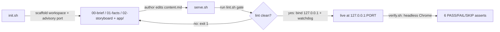

  
<i data-lucide="help-circle"></i> This explainer answers

  

    
1What actually happens when I run <code>init.sh &lt;slug&gt;</code> and then <code>serve.sh &lt;slug&gt;</code>?

    
2Why does <code>serve.sh</code> sometimes refuse to serve, and what has to be true for it to pass?

    
3How does <code>verify.sh</code> prove the page is really rendering, not just that a server responded?

  

init.shserve.shlint.shverify.shheadless-chrome

  <i data-lucide="compass"></i>
  

    Start here
    
How a Markdown file becomes a verified local URL

  

This page describes the exact mechanism it went through to reach your browser. `ps-commu-explain` is always served through `scripts/serve.sh` — never an ad-hoc server (F1) — and its default look is the infographic tier: run `init.sh <slug>` with no `--tier` flag and you get a cream, Markdown-driven explainer rendered by cherry-markdown, Mermaid and Lucide (F2). Nothing below is invented: every fact traces to a real line in `SKILL.md` or `scripts/`, and every one of them is listed in the Receipts footer.

  <i data-lucide="git-branch"></i>
  

    1 · how it works
    
Two scripts, one lifecycle

  

`init.sh` first rejects any slug that isn't kebab-case (F3), then scaffolds a fresh workspace: the authoring-chain docs — `00-brief.md`, `01-facts.md`, `02-storyboard.md` — land in the workspace root, sibling to `app/`, so they are never served to a reader (F4). It also probes ports 7700–7799 with `lsof` for an advisory candidate (F5), and only sweeps a workspace that has sat idle more than 3 days *and* has no live, marker-verified server (F7). `serve.sh` then takes over: it runs the lint gate detailed in Claims below, and its own bind attempt is the one that actually matters — on failure it walks forward to the next port, up to 7799 (F6).

/tmp/ps-commu/&lt;slug&gt;/
├── meta.json           ← slug, tier, port, pid, started_at
├── 00-brief.md         ← 3 reader questions + section budget
├── 01-facts.md         ← F&lt;n&gt; rows, source = path:line
├── 02-storyboard.md    ← section → question → facts
├── server.log
└── app/                ← the ONLY served directory (docroot)
    ├── content.md
    ├── index.html
    ├── explainer.css
    └── components.md

  <i data-lucide="flask-conical"></i>
  

    2 · make it concrete
    
The lint gate and the render gate, run for real

  

  
<i data-lucide="flask-conical"></i> Worked example — the lint gate

  

    
Input
scripts/serve.sh how-serve-works

    <i class="we-arrow" data-lucide="arrow-right"></i>
    
Mechanism
scripts/lint.sh authoring-chain gate

    <i class="we-arrow" data-lucide="arrow-right"></i>
    
Output
exit 1 + defect lines, or a live URL

  

  
Point <code>serve.sh</code> at a workspace whose <code>00-brief.md</code> still has an unfilled <code>Q1: (...)</code> and it refuses before a single byte is served by default. There is a documented escape hatch — <code>--no-lint</code>, meant for the html/react tiers' dev loops, not for skipping this check — but using it prints a visible warning; it is not a silent bypass (F8).

  
<i data-lucide="flask-conical"></i> Worked example — the render gate

  

    
Input
scripts/verify.sh how-serve-works

    <i class="we-arrow" data-lucide="arrow-right"></i>
    
Mechanism
headless Chrome --dump-dom, 6 asserts

    <i class="we-arrow" data-lucide="arrow-right"></i>
    
Output
one PASS/FAIL/SKIP line per assert

  

  
Assert 1 counts rendered Mermaid SVG elements against the fenced <code>mermaid</code> blocks in this very doc (F13); if Chrome isn't installed the whole run exits 2 — SKIP, never a silent pass (F15).

  <i data-lucide="badge-check"></i>
  

    3 · back it with a citation
    
What the gates actually check

  

  
serve.sh refuses to serve a workspace until its authoring chain (00-brief.md, 01-facts.md, 02-storyboard.md) passes scripts/lint.sh.

  
F8scripts/serve.sh:44

  
<i data-lucide="search"></i> Check it: run <code>grep -n "lint failed for" scripts/serve.sh</code>

  
Every server serve.sh starts binds 127.0.0.1 only — never an interface reachable off the machine.

  
F9scripts/serve.sh:12

  
<i data-lucide="search"></i> Check it: run <code>grep -n "bind 127.0.0.1" scripts/serve.sh</code>

  
A live server is only ever killed if its own process command line contains the workspace path — never an unverified PID.

  
F10scripts/common.sh:13

  
<i data-lucide="search"></i> Check it: run <code>grep -n pid_has_marker -A4 scripts/common.sh</code>

  
lint.sh rejects five exact stale-CSS class names, plus any class prefixed cat-, in app/content.md.

  
F16scripts/lint.sh:186

  
<i data-lucide="search"></i> Check it: run <code>grep -n forbidden_exact scripts/lint.sh</code>

  
Every unlabeled Mermaid flowchart edge in app/content.md is reported as its own lint defect, not just the first one found.

  
F17scripts/lint.sh:597

  
<i data-lucide="search"></i> Check it: run <code>grep -n "has no label" scripts/lint.sh</code>

  
A single Mermaid flowchart may declare at most 7 nodes — the diagram in the Mechanism section above stops at 6 for exactly this reason.

  
F18scripts/lint.sh:604

  
<i data-lucide="search"></i> Check it: run <code>grep -n "max 7" scripts/lint.sh</code>

  <i data-lucide="triangle-alert"></i>
  

    4 · name the failure mode
    
What breaks if these gates are skipped

  

  <i data-lucide="triangle-alert"></i>
  

    
Wrong, without the lint gate

    
Skip scripts/lint.sh and a page with an invented fact that cites nothing real, or a diagram full of unlabeled arrows, ships anyway — the exact hallucination-and-mystery-diagram failure mode the whole authoring chain exists to catch before a reader ever sees it.

  

  <i data-lucide="triangle-alert"></i>
  

    
Wrong, without the marker check

    
A bare <code>kill $pid</code> on an unverified PID can kill an unrelated process that happened to reuse that PID after the original server exited. pid_has_marker checks the live process's own command line for the workspace path first, so a stale or recycled PID is never touched.

  

  <i data-lucide="columns-2"></i>
  

    5 · prove the improvement
    
An ad-hoc server vs. serve.sh

  

  

    Before
    
python -m http.server

    
Hand-started, by habit. Binds every interface, has no scoped docroot, and never stops on its own — it exposes all of /tmp on the network, forever, until someone remembers to kill it.

  

  <i class="ba-arrow" data-lucide="arrow-right"></i>
  

    After
    
scripts/serve.sh

    
Binds 127.0.0.1 only, serves just the workspace's app/ directory, and self-destructs after its keep-alive TTL — 24h by default.

  

That's the difference between an ad-hoc server (F19) and the one this skill mandates (F1): loopback-only binding (F9) with a watchdog that eventually cleans up after itself (F11).

  <i data-lucide="receipt"></i>
  

    6 · close the chain
    
Every citation on this page

  

  
<i data-lucide="receipt"></i> Receipts

  <ul class="receipts-list">
    <li>F1 SKILL.md:8 — always serve via scripts/serve.sh</li>
    <li>F2 SKILL.md:18 — infographic is the default tier</li>
    <li>F3 scripts/init.sh:39 — kebab-case slug validation</li>
    <li>F4 scripts/init.sh:82 — authoring docs never served</li>
    <li>F5 scripts/init.sh:100 — advisory port probe, 7700-7799</li>
    <li>F6 scripts/serve.sh:14 — the real bind is authoritative</li>
    <li>F7 scripts/init.sh:59 — 3-day sweep, live servers spared</li>
    <li>F8 scripts/serve.sh:44 — lint gate refusal</li>
    <li>F9 scripts/serve.sh:12 — loopback-only bind</li>
    <li>F10 scripts/common.sh:13 — marker-verified kill</li>
    <li>F11 scripts/serve.sh:136 — self-destruct watchdog</li>
    <li>F12 scripts/verify.sh:4 — headless Chrome dump-dom</li>
    <li>F13 scripts/verify.sh:158 — Mermaid svg-count assert</li>
    <li>F14 scripts/verify.sh:198 — scroll-behavior regression gate</li>
    <li>F15 scripts/verify.sh:54 — no-Chrome SKIP, never a pass</li>
    <li>F16 scripts/lint.sh:186 — forbidden CSS classes</li>
    <li>F17 scripts/lint.sh:597 — unlabeled edge, per-edge defect</li>
    <li>F18 scripts/lint.sh:604 — 7-node flowchart cap</li>
    <li>F19 SKILL.md:54 — the ad-hoc server it replaced</li>
  </ul>

::: callout check
Every claim above cites a real line in this skill's own source. Run the `grep` in any "Check it" line yourself — that's the point of the chain.
:::

Why doesn't this page just say "trust me"?

Because the whole point of the authoring chain — `00-brief.md` → `01-facts.md` → `02-storyboard.md` → `app/content.md` — is that nothing enters a page unless it traces to a real fact first. This page is the chain explaining itself, which only works if it holds itself to its own rule.

