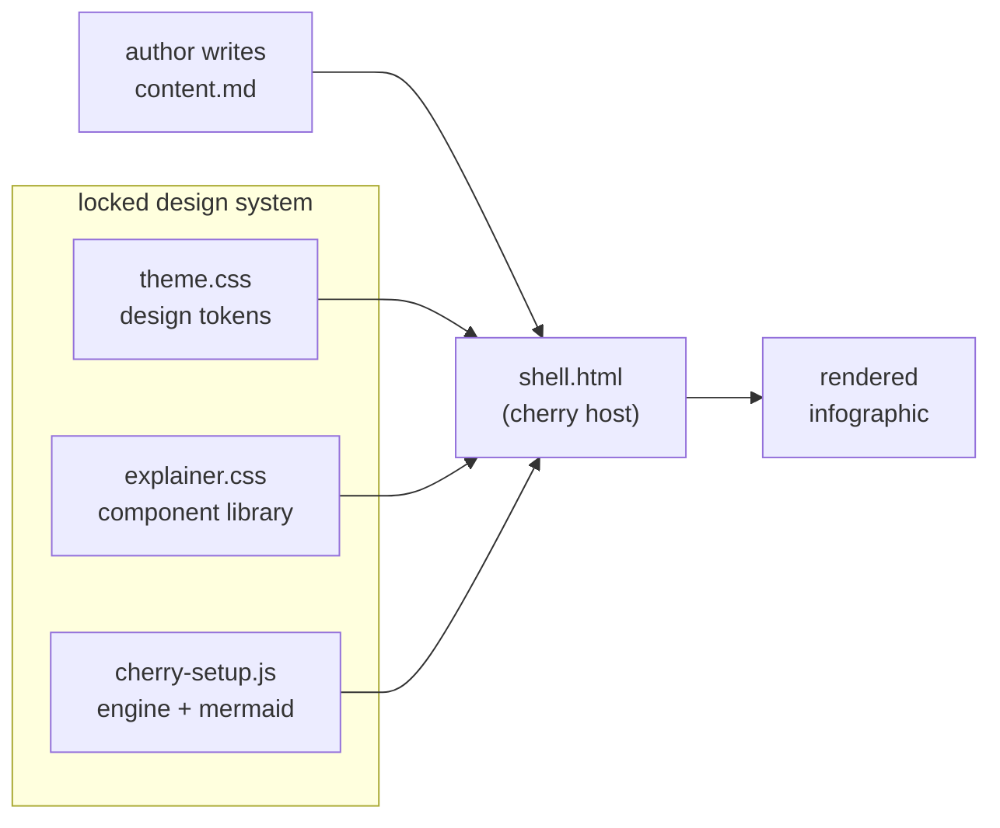
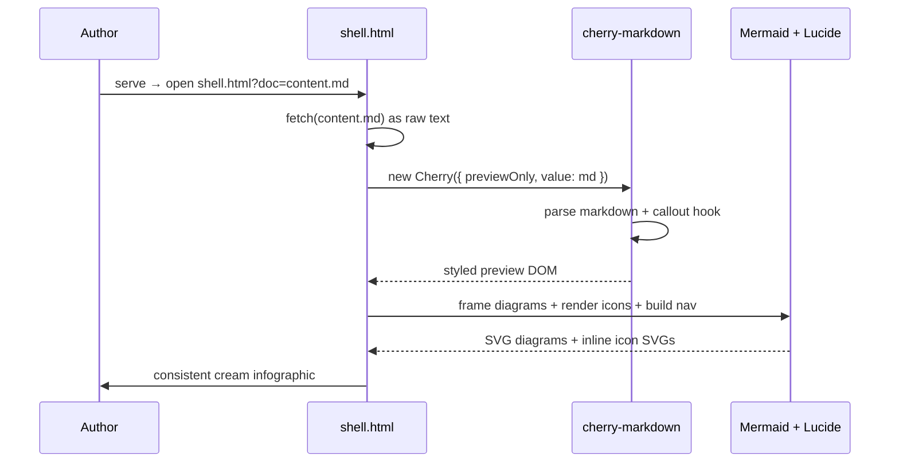

<div class="hero" data-nav-title="Explainer Kit" data-nav-sub="v2 · infographic">
  <div class="eyebrow"><i data-lucide="palette"></i> Explainer Kit · v2</div>
  <div class="title">Markdown in. A designed <span class="hl">infographic</span> out. No build step.</div>
  <div class="lede">A copy-and-fill template that turns one Markdown file into a consistent, diagram-rich, color-coded explainer — rendered live in the browser by <strong>cherry-markdown</strong> and <strong>Mermaid</strong>, styled by a single locked design-token theme.</div>
</div>

<div class="chip-row"><span class="topic-chip">visual-explainers</span><span class="topic-chip">cherry-markdown</span><span class="topic-chip">mermaid</span><span class="topic-chip">design-system</span><span class="topic-chip">cream-theme</span></div>

<div class="section-head bookend cat-coral" data-nav="Overview" data-cat="coral" data-nav-icon="compass" id="overview">
  <span class="icon-chip lg"><i data-lucide="compass"></i></span>
  <div class="sh-text">
    <span class="sh-kicker">Start here</span>
    <div class="sh-title">Overview — the whole kit at a glance</div>
  </div>
</div>

The kit is five small files that never change their look, plus one Markdown file that carries the words. Everything that could drift between explainers lives in **one token file, and nowhere else**. Here is where it lands:

<div class="stat-grid">
  <div class="stat-tile cat-coral">
    <div class="stat-head"><span class="icon-chip"><i data-lucide="package"></i></span><span class="stat-delta"><i data-lucide="check"></i> lean</span></div>
    <div class="stat-value">5</div>
    <div class="stat-label">files in the kit</div>
    <div class="stat-sub">tokens · components · engine · shell · content</div>
  </div>
  <div class="stat-tile cat-teal">
    <div class="stat-head"><span class="icon-chip"><i data-lucide="zap"></i></span><span class="stat-delta"><i data-lucide="arrow-down"></i> zero</span></div>
    <div class="stat-value">0</div>
    <div class="stat-label">build steps</div>
    <div class="stat-sub">just serve the folder</div>
  </div>
  <div class="stat-tile cat-blue">
    <div class="stat-head"><span class="icon-chip"><i data-lucide="timer"></i></span><span class="stat-delta"><i data-lucide="trending-up"></i> fast</span></div>
    <div class="stat-value">30<span class="unit">s</span></div>
    <div class="stat-label">idea → live page</div>
    <div class="stat-sub">copy · edit · refresh</div>
  </div>
  <div class="stat-tile cat-magenta">
    <div class="stat-head"><span class="icon-chip"><i data-lucide="target"></i></span><span class="stat-delta"><i data-lucide="lock"></i> locked</span></div>
    <div class="stat-value">1</div>
    <div class="stat-label">source of truth</div>
    <div class="stat-sub">one token file for all style</div>
  </div>
</div>

### Why it exists

Explaining a spec today means hand-rolling CSS in yet another one-off file, or running a heavyweight build. Both are slow, and neither is *consistent*. This kit fixes that with three moves:

<div class="card-grid">
  <div class="card cat-coral">
    <span class="icon-chip lg"><i data-lucide="feather"></i></span>
    <div class="card-title">Write plain Markdown</div>
    <p>Author in Markdown, drop in a few component blocks. No framework, no bundler, no JSX — just text and a handful of tags.</p>
  </div>
  <div class="card cat-teal">
    <span class="icon-chip lg"><i data-lucide="palette"></i></span>
    <div class="card-title">Inherit the look</div>
    <p>Every color, size and font is a <code>var(--token)</code>. Change the token, every explainer updates. Consistency comes for free.</p>
  </div>
  <div class="card cat-blue">
    <span class="icon-chip lg"><i data-lucide="refresh-cw"></i></span>
    <div class="card-title">Refresh to iterate</div>
    <p>The browser does the rest. Serve the folder, reload the tab, and the explainer is already done. No watch process, no rebuild.</p>
  </div>
</div>

::: callout idea
Every explainer you produce looks like it came from the same studio — because it did. The design system is a lock, not a suggestion.
:::

<div class="section-head cat-teal" data-nav="System overview" data-cat="teal" data-nav-icon="boxes" id="system">
  <span class="icon-chip lg"><i data-lucide="boxes"></i></span>
  <div class="sh-text">
    <span class="sh-kicker">Section A · architecture</span>
    <div class="sh-title">System overview</div>
  </div>
</div>

Five small files, each with one job, communicating only through CSS custom properties and the Cherry config. The colored **locked design system** cluster is the whole point: swap the content, keep the look.



<div class="legend">
  <span class="legend-item cat-coral"><span class="legend-swatch"></span> author input</span>
  <span class="legend-item cat-teal"><span class="legend-swatch"></span> locked system</span>
  <span class="legend-item cat-blue"><span class="legend-swatch"></span> host</span>
  <span class="legend-item cat-magenta"><span class="legend-swatch"></span> output</span>
</div>

<div class="section-head cat-blue" data-nav="Data flow" data-cat="blue" data-nav-icon="git-branch" id="dataflow">
  <span class="icon-chip lg"><i data-lucide="git-branch"></i></span>
  <div class="sh-text">
    <span class="sh-kicker">Section B · the render path</span>
    <div class="sh-title">Data flow</div>
  </div>
</div>

No server-side rendering, no pre-processing. `shell.html` fetches your Markdown as raw text and hands it to Cherry; a post-render pass upgrades fenced `mermaid` blocks into themed SVG and injects the line icons.



::: callout info
Diagrams render through the **post-render** path (Path B): Cherry emits fenced `mermaid` as ordinary code blocks, then `cherry-setup.js` calls `mermaid.run()` over them with the locked light `themeVariables` and the category `classDef` palette.
:::

<div class="section-head cat-violet" data-nav="The moving parts" data-cat="violet" data-nav-icon="layers" id="parts">
  <span class="icon-chip lg"><i data-lucide="layers"></i></span>
  <div class="sh-text">
    <span class="sh-kicker">Section C · anatomy</span>
    <div class="sh-title">The moving parts</div>
  </div>
</div>

<div class="schematic">
explainer-kit/
├── theme.css        ← design tokens ONLY — the lock
├── explainer.css    ← component classes, built on tokens
├── cherry-setup.js  ← Cherry config + mermaid + icons + nav
├── shell.html       ← host: loads deps, fetches ?doc=, renders
└── content.md       ← this file — a worked example
</div>

### One token file, two payoffs

<div class="compare">
  <div class="compare-panel cat-teal">
    <div class="cmp-head"><span class="icon-chip sm"><i data-lucide="check-check"></i></span> Consistency for free</div>
    <div class="cmp-body">
      <ul>
        <li>Every color, size, and font is a <code>var(--token)</code>.</li>
        <li>Change one token → every explainer updates.</li>
        <li>No per-doc CSS to drift out of sync.</li>
      </ul>
    </div>
  </div>
  <div class="compare-panel cat-amber">
    <div class="cmp-head"><span class="icon-chip sm"><i data-lucide="shield-alert"></i></span> The one rule</div>
    <div class="cmp-body">
      <ul>
        <li>Raw hex or px may appear <em>only</em> in <code>theme.css</code>.</li>
        <li>A stray color in <code>explainer.css</code> is a bug.</li>
        <li>Promote it to a token — no exceptions.</li>
      </ul>
    </div>
  </div>
</div>

<div class="section-head cat-amber" data-nav="Authoring flow" data-cat="amber" data-nav-icon="list-checks" id="authoring">
  <span class="icon-chip lg"><i data-lucide="list-checks"></i></span>
  <div class="sh-text">
    <span class="sh-kicker">Section D · workflow</span>
    <div class="sh-title">Authoring flow</div>
  </div>
</div>

Four steps from blank to shared. Every step is a refresh away from the last.

<div class="steps">
  <div class="step cat-coral">
    <span class="step-num">1</span>
    <div class="step-body">
      <div class="step-title"><i data-lucide="copy"></i> Copy the template</div>
      <p>Run <code>./new.sh my-topic</code> to clone <code>content.md</code> into a fresh <code>my-topic.md</code>.</p>
    </div>
  </div>
  <div class="step cat-amber">
    <span class="step-num">2</span>
    <div class="step-body">
      <div class="step-title"><i data-lucide="pencil"></i> Write the copy</div>
      <p>Edit the Markdown. Drop in section headers, KPI tiles, cards, callouts and diagrams from the gallery.</p>
    </div>
  </div>
  <div class="step cat-teal">
    <span class="step-num">3</span>
    <div class="step-body">
      <div class="step-title"><i data-lucide="server"></i> Serve the folder</div>
      <p>Run <code>./serve.sh</code>. The kit must be served over HTTP — never opened as a bare <code>file://</code> URL.</p>
    </div>
  </div>
  <div class="step cat-blue">
    <span class="step-num">4</span>
    <div class="step-body">
      <div class="step-title"><i data-lucide="eye"></i> View &amp; iterate</div>
      <p>Open <code>shell.html?doc=my-topic.md</code>. Refresh to iterate; share the folder when it's done.</p>
    </div>
  </div>
</div>

> The best build step is the one that isn't there. Serve the folder, refresh the tab, and the explainer is already done.

<div class="section-head cat-magenta" data-nav="Results" data-cat="magenta" data-nav-icon="chart-column" id="results">
  <span class="icon-chip lg"><i data-lucide="chart-column"></i></span>
  <div class="sh-text">
    <span class="sh-kicker">Section E · impact</span>
    <div class="sh-title">Results at a glance</div>
  </div>
</div>

Where the design lock actually pays off — measured against the old one-off-HTML habit.

<div class="row three">
  <div class="meter cat-teal">
    <div class="meter-label"><span>Look consistency</span><span class="meter-val">100%</span></div>
    <div class="meter-track"><div class="meter-fill" style="width:100%"></div></div>
  </div>
  <div class="meter cat-blue">
    <div class="meter-label"><span>Time saved vs one-off</span><span class="meter-val">~90%</span></div>
    <div class="meter-track"><div class="meter-fill" style="width:90%"></div></div>
  </div>
  <div class="meter cat-magenta">
    <div class="meter-label"><span>Style drift</span><span class="meter-val">0%</span></div>
    <div class="meter-track"><div class="meter-fill" style="width:4%"></div></div>
  </div>
</div>

| Component | What it's for | Syntax |
|---|---|---|
| Section header | Icon chip + kicker + title, feeds the nav | `<div class="section-head" data-nav="…">` |
| KPI / stat tile | Big tabular number, icon, delta | `<div class="stat-grid">…` |
| Feature card | Icon chip + title + text | `<div class="card-grid">…` |
| Callout | Flagged note — 7 color-coded kinds | `::: callout warn` |
| Steps | Numbered timeline for a flow | `<div class="steps">…` |
| Compare | Two-up before/after panels | `<div class="compare">…` |
| Mermaid | System / data-flow / state diagrams | fenced ` ```mermaid ` |

::: callout metric
Across a dozen explainers the whole visual system is defined **once**. Every number on this page is tabular-figured JetBrains Mono, so columns of stats line up to the pixel.
:::

<div class="section-head bookend cat-coral" data-nav="Summary" data-cat="coral" data-nav-icon="flag" id="summary">
  <span class="icon-chip lg"><i data-lucide="flag"></i></span>
  <div class="sh-text">
    <span class="sh-kicker">Wrap up</span>
    <div class="sh-title">Summary &amp; next step</div>
  </div>
</div>

The kit trades a build pipeline for a single design lock. You write Markdown; the tokens, components, engine and shell turn it into a colorful, diagram-rich, on-theme infographic that reads the same every time.

<div class="card-grid">
  <div class="card cat-teal">
    <span class="icon-chip lg"><i data-lucide="check-check"></i></span>
    <div class="card-title">One look, every doc</div>
    <p>The locked token file means no explainer ever drifts. Swap content freely.</p>
  </div>
  <div class="card cat-blue">
    <span class="icon-chip lg"><i data-lucide="rocket"></i></span>
    <div class="card-title">Zero-build speed</div>
    <p>Idea to live page in about thirty seconds. Refresh is the whole toolchain.</p>
  </div>
  <div class="card cat-magenta">
    <span class="icon-chip lg"><i data-lucide="book-open"></i></span>
    <div class="card-title">A full component kit</div>
    <p>Tiles, cards, callouts, steps, compares, diagrams — all in <code>components.md</code>.</p>
  </div>
</div>

::: callout action
**Ready to make your own?** Run `./new.sh <slug>`, edit the copy, and reload the printed URL. Read `README.md` first — this kit must be **served**, never opened as `file://`.
:::

<details>
<summary>Why not React / an interactive tier?</summary>

That's a deliberate non-goal. This kit is for static, diagram-rich explainers with light nav. When you genuinely need sliders or simulators, reach for the heavier `ps-commu-explain` path instead. Keeping this kit static is what makes it 30-seconds-fast.

</details>
