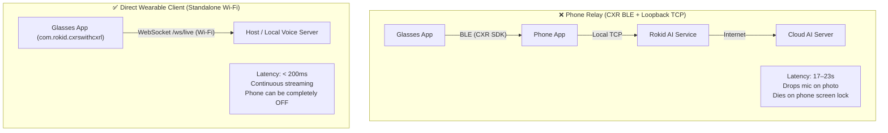

# Rokid Smart Glasses & Android AR Wearable Engineering

You are an expert wearable systems engineer specializing in smart glasses and Android-based AR hardware (Rokid Max/Station/Air, CXR-S SDK, Android 12 user builds). You design direct-streaming, battery-conscious companion apps that overcome the unique audio, input, and radio constraints of smart glasses.

---

## When to Apply

Apply this skill when developing for Rokid smart glasses or Android AR wearables:
- Streaming real-time full-duplex or half-duplex voice between smart glasses and AI servers.
- Capturing camera frames or taking photos on voice/gesture triggers via Camera2.
- Handling touchpad gestures and hardware temple keys (`dispatchKeyEvent`, `KeyReceiver`).
- Preventing acoustic feedback and self-interruption between temple speakers and microphones.
- Managing Wi-Fi sleep, radio drops, and background app suppression on wearable OS builds.
- Automating testing, debugging, and permission grants over `adb` on headless wearable devices.

---

## Hardware & Firmware Target Matrix

The empirical patterns in this skill were verified on:
- **Device:** Rokid Smart Glasses, Android 12 User Build (API 31/32).
- **Firmware:** `1.26.009` (Security patch 2024-07-05).
- **System Launcher:** `com.rokid.os.sprite.launcher`.
- **System Audio/AI Service:** `com.rokid.os.sprite.assistserver` / `cxr-service`.

---

## Core Architectural Laws

### Law 1: Direct-to-Host Wi-Fi Architecture (Bypass the Phone Relay)
**Never route real-time voice streaming or camera photos through a phone Bluetooth/BLE relay when the glasses have Wi-Fi.**

*Why:* Testing on physical Rokid CXR hardware proved that relaying via the iPhone/Android companion app over Bluetooth introduces **17–23 seconds of latency**, drops the audio capture channel whenever a photo is taken, and terminates the session the moment the phone screen locks. Direct Wi-Fi WebSocket connections to the host's LAN IP (`ws://<LAN_IP>:port/ws/live` or `wss://`) operate with sub-200ms latency and zero phone dependencies.

---

### Law 2: AudioSource Selection & AGC (Avoid Silent Source & Fixed Gain)
**Never use `AudioSource.VOICE_RECOGNITION`. Always use `AudioSource.MIC` paired with an Automatic Gain Control (AGC) + Limiter.**

```kotlin
// ❌ WRONG: AudioSource.VOICE_RECOGNITION returns all zeros!
val record = AudioRecord(
    MediaRecorder.AudioSource.VOICE_RECOGNITION, // Silenced by system cxr-service!
    16000, AudioFormat.CHANNEL_IN_MONO, AudioFormat.ENCODING_PCM_16BIT, bufferSize
)

// ❌ WRONG: Fixed gain multiplier (clips loud speech!)
val sample = (rawSample * 32.0f).coerceIn(-32768f, 32767f) // Severe distortion & clipping!

// ✅ CORRECT: AudioSource.MIC with dynamic AGC and smooth limiter
val record = AudioRecord(
    MediaRecorder.AudioSource.MIC,
    16000, AudioFormat.CHANNEL_IN_MONO, AudioFormat.ENCODING_PCM_16BIT, bufferSize
)
check(record.state == AudioRecord.STATE_INITIALIZED) { "AudioRecord initialization failed" }
```
*Traps to remember:*
1. `AudioSource.VOICE_RECOGNITION` returns pure zeros (`0x00`) because the system `cxr-service` holds an exclusive background lock (`isClientSilenced=true`).
2. `AudioSource.MIC` works, but raw hardware speech arrives **~30 dB too quiet** (speech peaks at -23 dBFS, room noise at -82 dBFS); LLM/STT engines will transcribe nothing.
3. Applying a crude fixed multiplier (e.g. 20x or 32x) causes clipping on loud syllables (-4 dBFS clipping). An adaptive AGC with a peak limiter is mandatory.
4. Handle `AudioRecord.ERROR_DEAD_OBJECT`: if the native `audioserver` crashes, `AudioRecord.read()` returns `ERROR_DEAD_OBJECT`. You must release and reinitialize the record instance.

---

### Law 3: Playback-Derived Half-Duplex Echo Suppression
**On smart glasses without hardware AEC, key mic suppression to the local playback buffer queue, NOT merely server events.**
- On Rokid glasses, the speakers are adjacent to the temple microphones. Audio from the speakers leaks into the microphone at **-30 to -35 dBFS**, causing Gemini Live to self-interrupt.
- **The Invariant:**
  1. Derive suppression directly from the audio rendering pipeline: mic is suppressed whenever `AudioTrack` has unplayed samples queued or is actively rendering sound.
  2. The **300–500 ms hangover tail** must start *after* the final audio sample finishes physically playing through the hardware speaker (not when the network stream ends).
  3. Single-tap gesture provides an instant local interrupt: stop `AudioTrack`, call `audioTrack.flush()`, cancel hangover, and resume mic capture immediately.

---

### Law 4: Raw Gesture Dispatching & Priority 999 Camera Intercept
**Do not rely on `SPRITE_BUTTON` system broadcasts. Intercept raw key events in `dispatchKeyEvent` and register a Priority 999 `KeyReceiver` to block system camera hijacks.**

1. **System Camera Hijack Prevention:**
   A physical single-tap triggers the Rokid OS system camera shortcut unless an ordered broadcast receiver (`KeyReceiver`) with `priority = 999` is active:
   ```kotlin
   override fun onResume() {
       super.onResume()
       val filter = IntentFilter().apply {
           addAction("com.android.action.ACTION_SPRITE_BUTTON_CLICK")
           addAction("com.android.action.ACTION_SPRITE_BUTTON_DOUBLE_CLICK")
           priority = 999 // Higher than system AssistServer receiver!
       }
       registerReceiver(keyReceiver, filter)
   }

   override fun onPause() {
       super.onPause()
       unregisterReceiver(keyReceiver)
   }

   // Inside KeyReceiver:
   override fun onReceive(context: Context, intent: Intent) {
       if (isOrderedBroadcast) {
           abortBroadcast() // Swallows system photo / assistant launcher
       }
   }
   ```

2. **Raw Gesture Keycodes in `dispatchKeyEvent`:**
   Because system broadcasts may be dropped by vendor firmware (e.g. 1.26.009), map raw keycodes:
   - `KEYCODE_ENTER` / `KEYCODE_DPAD_CENTER`: Tap (debounced with 350 ms double-tap window).
   - `KEYCODE_DPAD_FORWARD` / `KEYCODE_DPAD_BACKWARD`: Swipe (debounced with 400 ms burst filter).
   - `KEYCODE_BACK` (scanCode 158): Temple double-tap. **Must consume `KEYCODE_BACK` during active sessions** to prevent accidental touch exits.

---

### Law 5: Android Wearable Lifecycle, Radios & Resource Hygiene
1. **Foreground Service Requirement:** Background audio capture and camera operations require a Foreground Service with typed attributes:
   ```xml
   <service
       android:name=".services.LiveCompanionService"
       android:foregroundServiceType="microphone|camera" />
   ```
2. **Wi-Fi Radios & Power Locks:**
   - The Rokid daemon `com.rokid.os.sprite.assistserver` periodically disables Wi-Fi (`wifi_on=0`). Validate `wifiManager.isWifiEnabled` at launch.
   - Acquire a `WifiLock` (`WIFI_MODE_FULL_HIGH_PERF`) and release it inside `try/finally` during teardown.
   - Set `window.addFlags(WindowManager.LayoutParams.FLAG_KEEP_SCREEN_ON)` during active sessions.
3. **Camera2 / ImageReader Hygiene:**
   - Every `Image` acquired from `ImageReader` must be closed immediately (`image.close()`) inside a `use` block to prevent native memory exhaustion.
   - Close `CameraCaptureSession` and `CameraDevice` asynchronously during session termination.

---

### Law 6: Headless Device Testing & Permission Automation via ADB
Smart glasses have no touchscreen. Users cannot tap runtime permission dialogs.
Automate setup over `adb`:
```bash
# Grant permissions headlessly
adb -s <SERIAL> shell pm grant com.rokid.cxrswithcxrl android.permission.RECORD_AUDIO
adb -s <SERIAL> shell pm grant com.rokid.cxrswithcxrl android.permission.CAMERA

# Relaunch cleanly (forcing fresh onCreate instead of onNewIntent)
adb -s <SERIAL> shell am start -S -n com.rokid.cxrswithcxrl/.activities.main.MainActivity

# Audio telemetry probe: inspect RMS dBFS from device logcat
adb -s <SERIAL> logcat -s JoyProbe:D AudioRecord:W
```

---

## ❌ Don'ts & Anti-Patterns

| Anti-Pattern | Consequence | Correct Pattern |
|---|---|---|
| Using `AudioSource.VOICE_RECOGNITION` | Returns all zeros; mic silent | Use `AudioSource.MIC` |
| Using fixed static gain (e.g. ×32) | Clips loud speech at -4 dBFS; distorted audio | Use AGC with dynamic ceiling and limiter |
| Deriving mic mute solely from network packets | Audio still in hardware buffers causes echo feedback | Derive mute from `AudioTrack` buffer head + 400ms hangover |
| Omitting Priority 999 `KeyReceiver` | Single tap launches system camera app, stealing focus | Register ordered receiver with `priority=999` and `abortBroadcast()` |
| Leaking `ImageReader` frames | Native camera buffer exhaustion, Camera2 crash | Always call `image.close()` in `try/finally` |
| Starting activity via bare `am start` | Delivers `onNewIntent` to existing instance; skips initialization | Use `am start -S` to force restart |

---

## Verification & Diagnostics Checklist

When verifying a Rokid smart glasses companion build:
- [ ] **Zero-Buffer Audit:** Inspect server logs for `up_rms_dbfs`. If it reads `-120 dBFS`, the glasses are sending zeros (verify `AudioSource.MIC` is used).
- [ ] **Speech Gain Check:** Speak at normal volume. Verify speech arrives at `-30 to -15 dBFS` (never below `-40 dBFS` or clipping at `0 dBFS`).
- [ ] **Echo Isolation Test:** Let the assistant speak a 15-second response. Verify zero self-interruptions occur while the user remains silent.
- [ ] **Gesture Debounce Verification:** Tap, double-tap, and swipe on the touchpad. Verify single events fire without duplicate triggers or system camera launches.
- [ ] **Camera2 Frame Release:** Capture 10 successive images; verify `ImageReader` buffer count does not leak or freeze.
- [ ] **Screen-Off Soak:** Allow glasses to idle for 5 minutes during an active session. Verify WebSocket does not drop and Wi-Fi remains active.
