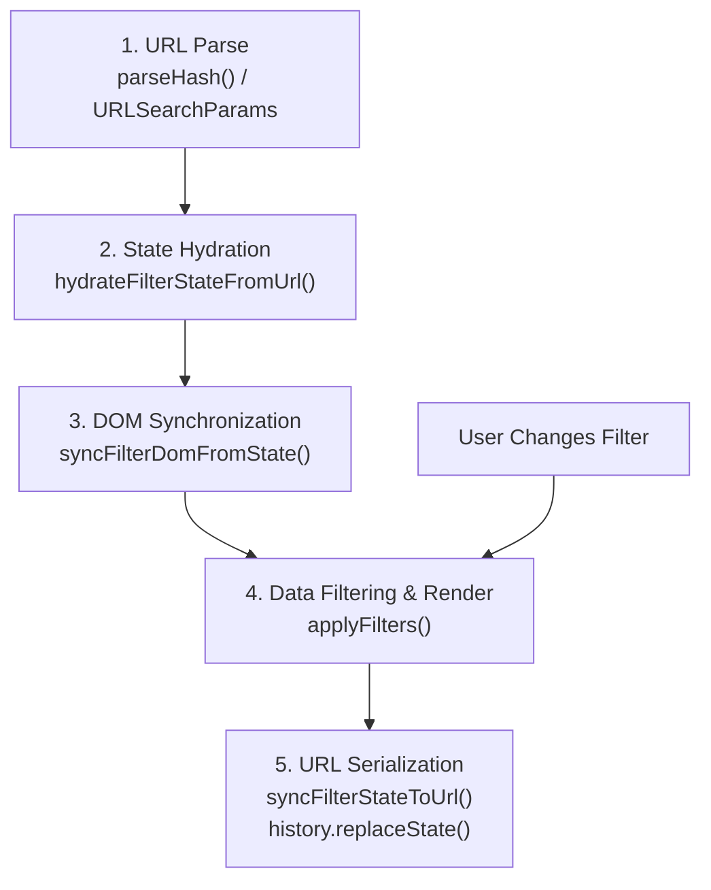

# URL-as-State & Reload Resilience Skill

## Purpose & Core Law

In any data platform, screener, analytical dashboard, or search application:

> **The URL is the single source of truth for all data selection state.**
> Ephemeral memory (JavaScript variables, component state) may only store transient visual animations (e.g. tooltip hovering, drawer sliding open/closed).
> **Any parameter that determines WHAT data is loaded, filtered, sorted, or paginated MUST be addressable in the URL.**

### The 4 Violations of Ephemeral State
1. **Reload Destroys Work**: When a user hits refresh (`F5` / `Cmd+R`), filters vanish.
2. **Deep Linking Fails**: Users cannot bookmark or share a filtered view with teammates.
3. **Browser History Breaks**: Back and Forward buttons cannot traverse filter revisions.
4. **Automated Testing Escapes**: Tests pass by clicking in memory, but production breaks on user navigation.

---

## The 5-Phase State Synchronization Lifecycle

### Phase 1: URL Parse
Parse both URL query strings (`window.location.search`) and hash-appended query strings (e.g. `#screener?country=US&q=AAPL`).

### Phase 2: State Hydration
Hydrate all active filter parameters before fetching data or applying filters:
- Jurisdiction / Market: `country=US`, `market=SET`
- Text Search: `q=apple`
- Discrete Filters: `moat=wide`, `jitta=wonderful`, `stages=GROWTH,MATURE`
- Continuous Ranges: `min_pe=10&max_pe=25`, `min_mos=20`
- Sorting & Pagination: `sort=pe&order=desc&page=2`

### Phase 3: DOM Synchronization
Ensure all input elements, toggle buttons, multi-select pills, and active badges reflect the hydrated state immediately:
- `.value` set on `<input>`
- `.active` class toggled on matching `<button>`
- Selected dropdown labels and flag emojis updated

### Phase 4: Data Filtering
Filter the data set against the hydrated state and render the view/table.

### Phase 5: URL Serialization
Whenever filters, sorting, or pagination change, serialize the new state:
- Use `history.replaceState(null, '', targetUrl)` for filter tweaks and search typing (avoids polluting browser history on every keystroke).
- Use `history.pushState(null, '', targetUrl)` only for discrete tab/route transitions.
- Mirror active query string to `sessionStorage` as a fast secondary recovery layer.

---

## Anti-Patterns to Avoid

- ❌ **Storing filters only in component state**: `let currentFilter = 'US';` without URL binding.
- ❌ **Testing only clicks in E2E**: Asserting that a button click shows results without asserting `await page.reload()` in tests.
- ❌ **Clogging history with `pushState` on keystroke**: Every letter typed in a search box creating a back-button entry.
- ❌ **Resetting state on tab change**: Forgetting to preserve `#screener?<query>` when switching between tabs.

---

## Mandatory Verification Gate (Unfabricable Assertion)

Every PR or feature introducing filters, searches, or views MUST include a Playwright/Cypress E2E test verifying:
1. User applies filter.
2. URL updates with parameters.
3. `await page.reload()`.
4. URL parameters remain intact.
5. DOM inputs/buttons remain in the active state.
6. Rendered rows/data remain filtered identically to before the reload.
